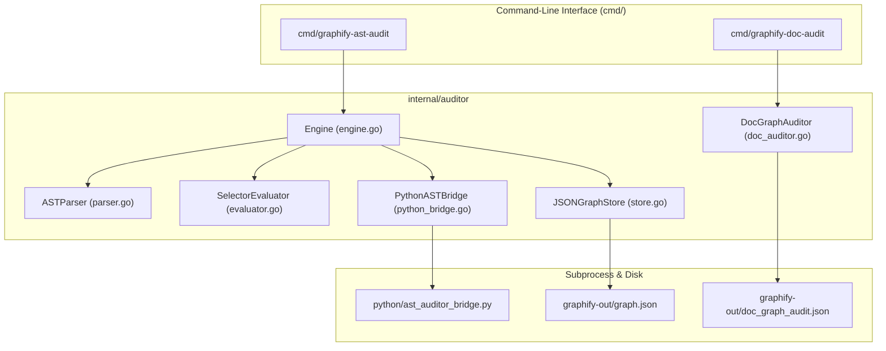

# Graphify Knowledge Graph Auditing Subsystem

`gautama-graph` is the core AST verification and documentation integrity engine for Gautama Social. It provides deterministic code relationship validation for Go and Python source files and comprehensive Markdown link graph auditing to ensure accurate, robust knowledge graphs (`graphify-out/graph.json` and `graphify-out/doc_graph_audit.json`).

---

## 📌 Overview & Purpose

Automated knowledge graph extractors often generate heuristic or unverified relationship candidates between source files and symbols, resulting in **phantom edges** (relationships that do not exist in the actual AST). Additionally, fast-paced documentation workflows can introduce **broken relative links** and **orphan documentation files** (documents with degree 0).

`gautama-graph` solves these problems by providing:
1. **Deterministic AST Code Auditing**: Parses Go (`go/ast`) and Python (`ast` module) source files to verify that candidate function calls, method invocations, and selector expressions actually exist in code, pruning phantom relationships from the graph.
2. **Markdown Documentation Graph Auditing**: Scans all workspace Markdown files, resolves relative link paths against disk targets, identifies dead links, and calculates node connectivity degrees to flag orphaned documents.
3. **Atomic Graph Persistence**: Updates knowledge graph artifacts atomically using temporary files and safe renames to prevent corruption.
4. **Security Boundary Enforcement**: Ensures all file resolution operations stay strictly within the workspace root, mitigating directory traversal attacks.

---

## 🏛️ Architecture & Components



### Subsystem Breakdown

| Component | Source File | Description |
| :--- | :--- | :--- |
| **Engine** | `internal/auditor/engine.go` | Orchestrates the AST audit pipeline: processes candidate edges from `graphify-out/graph.json`, routes by file extension (`.go` vs `.py`), and applies provenance metadata. |
| **AST Parser** | `internal/auditor/parser.go` | Parses Go source files into `*ast.File` and `*token.FileSet` structures with workspace path boundary checks. |
| **Selector Evaluator** | `internal/auditor/evaluator.go` | Traverses the Go AST using `ast.Inspect` to match function calls and selector expressions (`ast.SelectorExpr`, `ast.CallExpr`) against source and target symbols. |
| **Python Bridge** | `internal/auditor/python_bridge.go` | IPC bridge streaming candidate relationships to `python/ast_auditor_bridge.py` via subprocess `stdin`/`stdout` for Python AST evaluation. |
| **Graph Store** | `internal/auditor/store.go` | Thread-safe graph persistence layer that annotates graph links with provenance status and confidence scores, removing pruned phantoms. |
| **Doc Graph Auditor** | `internal/auditor/doc_auditor.go` | Scans workspace `.md` documents, strips code blocks, validates relative link targets against disk, computes in/out degrees, and identifies orphans. |
| **Type Definitions** | `internal/auditor/types.go` | Core domain models (`CandidateEdge`, `AuditedEdge`, `ASTAuditReport`, `GraphData`, `Config`, `ASTParser`, `SelectorEvaluator`). |

---

## 🏷️ Provenance & Confidence Model

When auditing relationships, edges are classified into three provenance categories:

| Provenance Status | Confidence | Description | Action |
| :--- | :---: | :--- | :--- |
| `EXTRACTED_AST` | `1.0` | Exact AST match confirmed (e.g. `ast.SelectorExpr` or `ast.CallExpr`). | Retained in graph |
| `INFERRED_HEURISTIC` | `0.5` | Fallback or non-analyzable relationship (e.g. unparsed dynamic calls). | Retained with lower confidence |
| `PRUNED_PHANTOM` | `0.0` | Target symbol not found in source file AST or invalid syntax/file. | Pruned from output links |

---

## 🛠️ CLI Utilities & Usage

### 1. Knowledge Graph Query & Navigation (`cmd/gautama-graph`)

Performs scoped, token-optimized knowledge graph queries, pathfinding, and node inspection:

```bash
# Query the knowledge graph with a natural language question
make graphify-query Q="How does the AST auditor work?"
# Or directly: go run ./cmd/gautama-graph query "How does the AST auditor work?"

# Find the shortest call/dependency path between two symbols
make graphify-path A="Engine" B="ASTParser"
# Or directly: go run ./cmd/gautama-graph path "Engine" "ASTParser"

# Explain a specific node or architectural concept
make graphify-explain C="DocGraphAuditor"
# Or directly: go run ./cmd/gautama-graph explain "DocGraphAuditor"
```

---

### 2. AST Code Relationship Auditor (`cmd/graphify-ast-audit`)

Audits candidate code edges in `graphify-out/graph.json` against actual Go and Python AST structures.

```bash
# Run AST audit with default settings
go run cmd/graphify-ast-audit/main.go

# Run AST audit with custom workspace and graph location
go run cmd/graphify-ast-audit/main.go --workspace /path/to/workspace --graph /path/to/graph.json

# Run AST audit in strict mode (fails with non-zero exit code if phantoms are pruned)
go run cmd/graphify-ast-audit/main.go --strict

# Run AST audit with verbose output (prints detailed edge provenance)
go run cmd/graphify-ast-audit/main.go --verbose
```

#### CLI Flags
- `--workspace <string>`: Path to workspace root directory (defaults to current working directory).
- `--graph <string>`: Path to `graph.json` file (defaults to `graphify-out/graph.json`).
- `--strict <bool>`: Exit with non-zero code if any phantom edges are pruned (default: `false`).
- `--verbose <bool>`: Enable detailed candidate edge provenance logging (default: `false`).

---

### 3. Markdown Documentation Graph Auditor (`cmd/graphify-doc-audit`)

Audits the structural integrity of documentation across the workspace.

```bash
# Run documentation audit
go run cmd/graphify-doc-audit/main.go

# Run documentation audit in strict mode (fails if orphans or broken links exist)
go run cmd/graphify-doc-audit/main.go --strict
```

#### CLI Flags
- `--workspace <string>`: Path to workspace root directory (defaults to current working directory).
- `--strict <bool>`: Exit with non-zero code if orphan documents (degree == 0) or broken relative links are detected (default: `false`).

#### Output Diagnostic
Generates `graphify-out/doc_graph_audit.json` containing:
- `total_doc_nodes` and `total_doc_edges`
- `orphan_count` and list of `orphan_nodes`
- `broken_link_count` and detailed `broken_links` with source file, link target, and error reason
- Per-node connectivity metrics (`in_degree`, `out_degree`, `is_orphan`, `outbound_links`)

---

## 💻 Programmatic Go API Usage

### Example 1: Auditing Code Relationships in Go

```go
package main

import (
	"context"
	"fmt"
	"log"
	"time"

	"github.com/jameshawkins-art/gautama-graph/internal/auditor"
)

func main() {
	cfg := auditor.Config{
		WorkspaceRootPath: ".",
		AuditorTimeout:    30 * time.Second,
		MinConfidence:     0.8,
		MaxASTDepth:       50,
	}

	engine := auditor.NewDefaultEngine(cfg)
	report, err := engine.AuditGraphFile(context.Background(), "graphify-out/graph.json", false)
	if err != nil {
		log.Fatalf("AST audit failed: %v", err)
	}

	fmt.Printf("Audit completed in %v:\n", report.Duration)
	fmt.Printf("  Total Edges     : %d\n", report.TotalEdges)
	fmt.Printf("  Verified AST    : %d\n", report.VerifiedASTCount)
	fmt.Printf("  Pruned Phantoms : %d\n", report.PrunedPhantomCount)
}
```

### Example 2: Auditing Documentation Graph Integrity

```go
package main

import (
	"context"
	"fmt"
	"log"

	"github.com/jameshawkins-art/gautama-graph/internal/auditor"
)

func main() {
	docAuditor := auditor.NewDocGraphAuditor(".")
	report, err := docAuditor.AuditDocGraph(context.Background())
	if err != nil {
		log.Fatalf("Doc audit failed: %v", err)
	}

	fmt.Printf("Doc Audit Summary:\n")
	fmt.Printf("  Total Documents : %d\n", report.TotalDocNodes)
	fmt.Printf("  Total Links     : %d\n", report.TotalDocEdges)
	fmt.Printf("  Orphan Docs     : %d\n", report.OrphanCount)
	fmt.Printf("  Broken Links    : %d\n", report.BrokenLinkCount)
}
```

---

## 🔄 Master Synchronization Pipeline

To synchronize and audit the full knowledge graph across extraction, AST validation, and doc auditing, use the master script:

```bash
./scripts/graphify_sync.sh
```

Pipeline execution sequence:
1. `graphify update .` — Base Graphify extraction and community detection.
2. `go run cmd/graphify-ast-audit/main.go` — Go and Python AST code relationship auditing (prunes phantoms).
3. `go run cmd/graphify-doc-audit/main.go` — Markdown documentation graph validation (detects dead links and orphans).

---

## 🔒 Security & Robustness Guarantees

- **Path Traversal Defense**: All path operations pass through `ValidatePathBoundary` and `filepath.Abs` boundary assertions, preventing reads or escapes outside `workspaceRoot`.
- **Bounded Timeouts**: AST parsing and subprocess calls are bounded by context timeouts (`AuditorTimeout` and 15s subprocess limit).
- **Atomic File Writing**: Graph updates use temp file writes followed by `os.Rename` to guarantee write atomicity and prevent partial JSON corruption.
- **Fail-Safe Parsing**: Syntax errors or unparseable source files gracefully fail to `PRUNED_PHANTOM` or `INFERRED_HEURISTIC` status without interrupting pipeline execution.

---

## 🧪 Testing

Run all unit and integration tests across the workspace:

```bash
make test
# Or directly: GOWORK=off go test -v -race ./...
```

Test coverage includes:
- Go AST parsing and selector expression evaluation
- Python AST bridge subprocess invocation
- Path traversal security validation
- Full graph file auditing and atomic persistence
- Doc graph parser, orphan node detection, and broken link identification
- Knowledge graph query, path, and explain execution

---

## 🏷️ Release & Tagging Strategy

`gautama-graph` follows [Semantic Versioning (SemVer)](https://semver.org/) for all release artifacts, tags, and public API interfaces (`vMAJOR.MINOR.PATCH`).

### Tagging Workflow

Releases and deployment milestones are tagged directly in Git and pushed to origin:

```bash
git tag v1.6.2 && git push origin v1.6.2
```

### Pre-Release Verification Gates

Before creating and pushing any release tag, ensure all automated quality gates pass:

1. **Unit & Race Test Suite**:
   ```bash
   make test
   # Runs: GOWORK=off go test -v -race ./...
   ```
2. **AST Code Audit & Provenance Verification**:
   ```bash
   make audit-ast
   # Audits candidate edges against actual Go/Python ASTs
   ```
3. **Markdown Documentation Link & Topology Audit**:
   ```bash
   make audit-docs
   # Validates all workspace Markdown links and verifies zero broken relative references
   ```
4. **Git Working Tree Cleanliness**:
   ```bash
   git status
   # Ensure all changes are committed and working tree is clean
   ```

### Versioning Conventions

- **Patch Releases (`v1.6.x`)**: Backward-compatible bug fixes, minor internal optimizations, and documentation fixes.
- **Minor Releases (`v1.x.0`)**: Backward-compatible new features, CLI subcommands (`query`, `path`, `explain`), or AST auditor enhancements.
- **Major Releases (`vX.0.0`)**: Breaking public API changes in `internal/auditor/types.go` or storage contracts.

### Tag Inspection & Listing

```bash
# View existing tags sorted by semantic version
git tag --sort=-v:refname

# Verify the current tag on HEAD
git describe --tags --exact-match
```

---

## 🔗 Related Documentation
- [Product & Architecture Roadmap](./docs/roadmap/roadmap.md)
- [Graphify System Rules](./.agents/rules/graphify.md)
- [Encapsulated Graphify Binary Runner Blueprint](./docs/specs/001-encapsulated-graphify-binary-runner-architecture-blueprint.md)
- [Consumer Graphify Query Infrastructure Blueprint](./docs/specs/006-consumer-graphify-query-infrastructure-architecture-blueprint.md)
