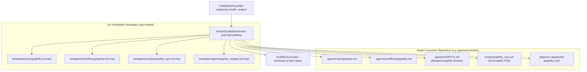

# Feature Roadmap Item 005: Antigravity Environment Scaffolder & Knowledge Setup CLI

- **Sequence Code**: `005`
- **Document Status**: `🟢 COMPLETED V1.5.0`
- **Milestone Target**: `Milestone 5 (V1.5.0)`
- **Persona Drivers & Gatekeepers**:
  - Lead AI Workflow Architect & Governor ([@nexus.md](../../.agents/personas/nexus.md))
  - Feature Engineer ([@feature-engineer.md](../../.agents/personas/feature-engineer.md))
  - Security & Compliance Auditor ([@security-auditor.md](../../.agents/personas/security-auditor.md))
  - Regression & Test Automation Guard ([@regression-tester.md](../../.agents/personas/regression-tester.md))

---

## 1. Executive Summary & Strategic Objective

### Problem Statement
When a developer or repository (e.g. `gautama-studios`, `gautama-social`, `dragons-breath`) adopts `github.com/jameshawkins-art/gautama-graph`, there is currently no automated command to initialize the project environment. 

Consumers must manually:
1. Create and populate `.agents/rules/graphify.md` (mandatory Graphify discovery rules and token optimization standards).
2. Create and configure `.agents/workflows/graphify.md` (knowledge graph extraction and navigation workflow).
3. Inject Graphify configuration and slash command declarations into `.agents/AGENTS.md`.
4. Copy and configure master synchronization scripts (`scripts/graphify_sync.sh`) or `Makefile` targets (`audit`, `audit-ast`, `audit-docs`, `graphify-update`).
5. Configure `.gitignore` to ignore cached graph binaries (`.gautama-graph/bin/`) and build outputs (`graphify-out/`).

This manual setup causes configuration drift, broken relative documentation links, missing AST rules, and high setup friction across consumer repositories.

### Strategic Solution & Target Architecture
Architect and implement a turnkey **Antigravity Environment Scaffolder & Setup CLI** (`internal/scaffold/`, `cmd/gautama-graph antigravity install --project`) that:
1. **Embedded Assets & Templates (`//go:embed`)**:
   - Embeds production-grade Antigravity 2.0 template assets into the `gautama-graph` binary using Go's `embed.FS`.
   - Includes `.agents/rules/graphify.md`, `.agents/workflows/graphify.md`, `.agents/AGENTS.md` snippets, `scripts/graphify_sync.sh`, and `Makefile` integration helpers.
2. **Single-Command CLI Invocations**:
   - `gautama-graph antigravity install --project` (and `graphify antigravity install --project` wrapper).
   - Scaffolds all necessary `.agents/` directories and files into the current workspace.
   - Flags supported: `--workspace <path>`, `--force` (overwrite existing files), `--dry-run` (preview planned file creations), `--minimal` (rules and workflows only).
3. **Safe, Non-Destructive Scaffolding**:
   - Inspects target files before writing; never overwrites existing custom personas, rules, or workflows unless `--force` is explicitly provided.
   - Merges entries into existing `.gitignore` and `.agents/AGENTS.md` without duplicating or corrupting user configurations.
4. **Zero-Trust Boundary Confinement**:
   - Validates that all target installation directories and files remain strictly confined within the target workspace root (`ValidatePathBoundary`).

---

## 2. Subsystem / Engine Component Matrix

| Subsystem Component | Package / Path | Primary Responsibilities | Graphify Knowledge Graph Mapping |
| :--- | :--- | :--- | :--- |
| **Scaffolder Engine** | `internal/scaffold/scaffolder.go` | Manages template parsing, file creation, manifest merging, and `.gitignore` patching | Environment scaffolding service |
| **Embedded Templates** | `internal/scaffold/templates/` | Bundles official Antigravity 2.0 rules, workflows, scripts, and manifests via `embed.FS` | Embedded template filesystem |
| **Domain Contracts** | `internal/scaffold/types.go` | Defines `ScaffoldPlan`, `ScaffoldAction`, `ScaffoldOptions`, and `ScaffolderService` | Domain contracts and interfaces |
| **CLI Subcommand** | `cmd/gautama-graph/antigravity.go` | Implements `antigravity install --project`, `--dry-run`, `--force`, and `--workspace` | CLI subcommand handler |
| **Scaffolder Test Suite** | `internal/scaffold/scaffolder_test.go` | Tests idempotent installation, file merging, dry-run previews, and boundary safety | Test and regression harness |

---

## 3. Phased Master Task Matrix

| Task Code | Title & Description | Driver Persona | Priority | Est. Effort | Target SDLC Phase | Status |
| :--- | :--- | :--- | :---: | :---: | :---: | :---: |
| **005.1** | **Scaffolding Domain Contracts & Options**: Define `ScaffolderService`, `ScaffoldPlan`, `ScaffoldAction`, and `ScaffoldOptions` in `internal/scaffold/types.go`. | `@feature-engineer.md` | P0 | 1.0 Day | Phase 1 & 2 | `(🔴 NOT STARTED)` |
| **005.2** | **Official Antigravity 2.0 Templates**: Create embedded template assets (`templates/rules/graphify.md.tmpl`, `templates/workflows/graphify.md.tmpl`, `templates/scripts/graphify_sync.sh.tmpl`) using Go `embed.FS`. | `@nexus.md`, `@feature-engineer.md` | P0 | 1.0 Day | Phase 2 & 3 | `(🔴 NOT STARTED)` |
| **005.3** | **Scaffolder Engine & File Merger**: Implement `internal/scaffold/scaffolder.go` with safe directory creation, two-phase atomic file writes, non-destructive file merging (`.gitignore`, `AGENTS.md`), and permission preservation (`0755` for scripts). | `@feature-engineer.md`, `@security-auditor.md` | P0 | 2.0 Days | Phase 3 | `(🔴 NOT STARTED)` |
| **005.4** | **CLI Subcommand Integration**: Wire `gautama-graph antigravity install --project` into `cmd/gautama-graph/main.go` and `cmd/gautama-graph/antigravity.go` with `--dry-run`, `--force`, and `--workspace` flags. | `@feature-engineer.md` | P0 | 1.0 Day | Phase 3 | `(🔴 NOT STARTED)` |
| **005.5** | **Automated Environment Verification**: Add post-installation verification asserting that scaffolded files pass `ValidatePathBoundary`, markdown link validation, and syntax parsing. | `@regression-tester.md` | P0 | 1.0 Day | Phase 3 & 4 | `(🔴 NOT STARTED)` |
| **005.6** | **Regression, Boundary Safety & SQA Verification**: Build comprehensive table-driven tests in `scaffolder_test.go` asserting zero data races (`-race`), clean dry-run previews, boundary safety, and $\ge 85\%$ coverage. | `@regression-tester.md`, `@security-auditor.md` | P0 | 1.5 Days | Phase 4, 5, 6 | `(🔴 NOT STARTED)` |

---

## 4. Definition of Done (DoD)

To achieve formal product release sign-off for **Item 005 (V1.5.0)**:
1. **Turnkey Installation**: Running `gautama-graph antigravity install --project` inside any empty or existing workspace scaffolds all required `.agents/rules/graphify.md`, `.agents/workflows/graphify.md`, `scripts/graphify_sync.sh`, and `.gitignore` entries with zero manual intervention.
2. **Idempotence & Safety**: Re-running the command without `--force` must detect existing files, skip them safely, and report status without altering user edits.
3. **Dry-Run Preview**: Passing `--dry-run` accurately displays all planned file creations and directory structures without modifying disk.
4. **Boundary Security**: All path creations strictly enforce `ValidatePathBoundary`, rejecting any path traversal outside the target workspace.
5. **Deterministic Testing**: `GOWORK=off go test -v -race ./...` passes 100% with $\ge 85\%$ statement coverage on `internal/scaffold`.
6. **Master Knowledge Graph Synchronization**: Master synchronization `./scripts/graphify_sync.sh` completes cleanly with 0 errors.
