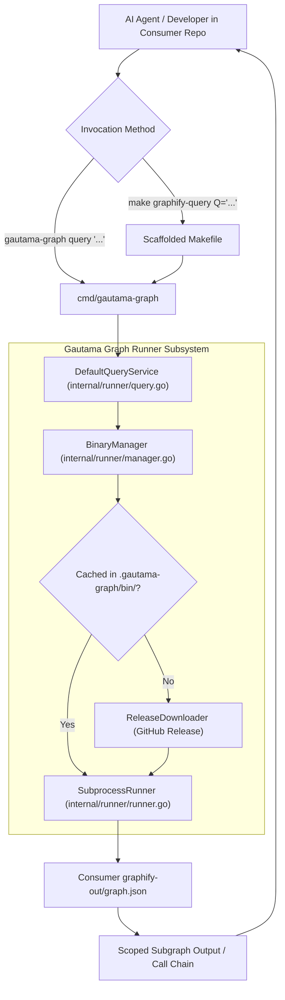

# Feature Roadmap Item 006: Consumer Graphify Query Infrastructure & Unified Agent Routing

- **Sequence Code**: `006`
- **Document Status**: `🟢 COMPLETED V1.7.0`
- **Milestone Target**: `Milestone 6 (V1.7.0)`
- **Persona Drivers & Gatekeepers**:
  - Lead AI Workflow Architect & Governor ([nexus.md](../../.agents/personas/nexus.md))
  - Feature Engineer ([feature-engineer.md](../../.agents/personas/feature-engineer.md))
  - Security & Compliance Auditor ([security-auditor.md](../../.agents/personas/security-auditor.md))
  - Regression & Test Automation Guard ([regression-tester.md](../../.agents/personas/regression-tester.md))

---

## 1. Executive Summary & Strategic Objective

### Problem Statement
When a consumer repository (such as `gautama-studios`, `gautama-social`, or `the-dancing-pony-v2-mzihqk`) initializes or updates its Antigravity AI agent infrastructure via `gautama-graph antigravity install --project`, a critical capability gap exists:

1. **No Query Target in Scaffolded Makefile**:
   The scaffolded `Makefile` (`internal/scaffold/templates/Makefile`) provides targets for updating the graph (`graphify-update`), running AST audits (`audit-ast`), auditing documentation links (`audit-docs`), and auto-remediating links (`audit-remediate`). However, it provides **zero targets to query the knowledge graph** (e.g. `graphify-query`, `graphify-path`, `graphify-explain`).
2. **Missing CLI Query Subcommands in `cmd/gautama-graph`**:
   The unified CLI binary `cmd/gautama-graph` only handles the master 4-stage pipeline and the `antigravity`/`init` scaffolding commands. It lacks `query`, `path`, and `explain` subcommands.
3. **Broken Host Dependency Assumptions in Agent Rules & Skills**:
   The agent rules (`.agents/rules/graphify.md`), workflows (`.agents/workflows/graphify.md`), personas (`.agents/personas/nexus.md`), skills (`.agents/skills/graphify/SKILL.md`), and prompt templates instruct AI agents to execute raw `graphify query "<concept>"`, `graphify path "<A>" "<B>"`, or `graphify explain "<concept>"`. Because consumers do not have `graphify` globally installed on their host system or Python virtual environment (the entire value of Item 001 was eliminating host Python/pip/uv dependencies via an encapsulated binary cache), these commands immediately fail on consumer machines.
4. **Token Bloat & Context Rot**:
   When graph queries fail due to missing commands or missing targets, AI agents fall back to scanning raw source files and issuing broad `ripgrep` commands. This causes immediate context window exhaustion, high API latency, and degraded reasoning quality across consumer projects.

### Strategic Solution & Target Architecture
Architect and deliver a unified, zero-host-dependency **Consumer Graphify Query Infrastructure & Unified Agent Routing Engine** across `cmd/gautama-graph`, `internal/runner`, `internal/scaffold`, and all workspace agent assets:

1. **First-Class CLI Query Subcommands in `cmd/gautama-graph`**:
   - Implement `gautama-graph query "<question>" [flags]` with support for traversal options (`--dfs`, `--budget <tokens>`, `--workspace <dir>`, `--json`).
   - Implement `gautama-graph path "<nodeA>" "<nodeB>" [flags]` for shortest-path relationship resolution between two symbols.
   - Implement `gautama-graph explain "<concept>" [flags]` for scoped symbol and neighborhood explanations.
   - Leverage `internal/runner.BinaryManager` to automatically resolve, cache, and invoke the encapsulated Graphify binary in headless mode, streaming output cleanly to `os.Stdout` and `os.Stderr` with zero zombie process risk.
2. **Dedicated Runner Query Engine (`internal/runner/query.go`)**:
   - Define a formal `QueryService` interface in `internal/runner/types.go`.
   - Implement argument validation, zero-trust sanitization, working directory resolution, and deterministic error reporting when `graphify-out/graph.json` has not yet been built.
3. **Scaffolded Makefile Query Targets**:
   - Update `internal/scaffold/templates/Makefile` and the root `Makefile` with standardized, ergonomic make targets:
     - `make graphify-query Q="<question>"`
     - `make graphify-path A="<symbol1>" B="<symbol2>"`
     - `make graphify-explain C="<concept>"`
4. **Comprehensive Agent Routing Alignment**:
   - Update all agent rules (`.agents/rules/graphify.md`, `internal/scaffold/templates/rules/graphify.md`), workflows, personas, skills (`.agents/skills/graphify/SKILL.md`), and prompt templates (`sdlc-step*.md`, `bug-step*.md`, `roadmap-item.md`, `dead-code-audit.md`, etc.) to instruct and enforce graph querying exclusively through `gautama-graph` / `make graphify-query`.
5. **Turnkey Scaffolding Distribution**:
   - Ensure `gautama-graph antigravity install --project` deploys the updated `Makefile`, rules, and workflows idempotently into any target consumer repository.

---

## 2. Subsystem / Engine Component Matrix

| Subsystem Component | Package / Path | Primary Responsibilities | Graphify Knowledge Graph Mapping |
| :--- | :--- | :--- | :--- |
| **CLI Query Subcommands** | `cmd/gautama-graph/query.go` | Parses `query`, `path`, and `explain` subcommands, flags (`--dfs`, `--budget`, `--workspace`), and streams output | CLI query entrypoints |
| **CLI Command Router** | `cmd/gautama-graph/main.go` | Dispatches CLI arguments to pipeline, antigravity scaffolder, or query subcommands | Master CLI orchestrator |
| **Query Engine Service** | `internal/runner/query.go` | Orchestrates query validation, binary invocation, output streaming, and error handling | Encapsulated query service |
| **Runner Domain Contracts** | `internal/runner/types.go` | Declares `QueryService`, `QueryOptions`, and `QueryResult` interfaces and types | Runner domain contracts |
| **Consumer Makefile Template** | `internal/scaffold/templates/Makefile` | Defines `graphify-query`, `graphify-path`, and `graphify-explain` targets for consumer repos | Embedded scaffold templates |
| **Root Makefile** | `Makefile` | Adds matching `graphify-query`, `graphify-path`, and `graphify-explain` targets in root workspace | Root build and test targets |
| **Scaffolded Agent Rules** | `internal/scaffold/templates/rules/graphify.md` | Directs consumer agents to query graphify via `gautama-graph` and `make graphify-query` | Scaffolded rule assets |
| **Scaffolded Agent Workflows** | `internal/scaffold/templates/workflows/graphify.md` | Documents discovery commands, parameters, and query flags for consumer agents | Scaffolded workflow assets |
| **Scaffolded Prompts & Personas** | `internal/scaffold/templates/prompts/`, `personas/` | Standardizes all prompt templates and nexus persona on `gautama-graph query` | Prompt ops and governance |
| **Root Agent Governance** | `.agents/rules/`, `.agents/workflows/`, `.agents/personas/`, `.agents/skills/graphify/` | Updates root gautama-graph agent system to use unified query routing | Workspace agent governance |
| **Scaffolder Engine & Tests** | `internal/scaffold/scaffolder.go`, `scaffolder_test.go` | Ensures updated templates are verified, embedded, and scaffolded idempotently | Scaffolder service and tests |

---

## 3. Phased Master Task Matrix

| Task Code | Title & Description | Driver Persona | Priority | Est. Effort | Target SDLC Phase | Status |
| :--- | :--- | :--- | :--- | :---: | :---: | :---: |
| **006.1** | **Query Service Domain Contracts & Runner Engine**: Define `QueryService`, `QueryOptions`, and `PathOptions` in `internal/runner/types.go`. Implement `DefaultQueryService` in `internal/runner/query.go` with argument sanitization, binary discovery via `BinaryManager`, and stream execution via `SubprocessRunner`. | [feature-engineer.md](../../.agents/personas/feature-engineer.md) | P0 | 1.0 Day | Phase 1 & 2 | `(🟢 COMPLETED V1.7.0)` |
| **006.2** | **CLI Query Subcommands Integration**: Implement `cmd/gautama-graph/query.go` and update `cmd/gautama-graph/main.go` to handle `query`, `path`, and `explain` subcommands, including parameter parsing, workspace resolution, and user-friendly error formatting when `graphify-out/` is missing. | [feature-engineer.md](../../.agents/personas/feature-engineer.md) | P0 | 1.0 Day | Phase 3 | `(🟢 COMPLETED V1.7.0)` |
| **006.3** | **Scaffold Makefile & Root Makefile Targets**: Update `internal/scaffold/templates/Makefile` and the root `Makefile` to include `graphify-query` (`Q="..."`), `graphify-path` (`A="..." B="..."`), and `graphify-explain` (`C="..."`) with proper parameter validation and help outputs. | [feature-engineer.md](../../.agents/personas/feature-engineer.md) | P0 | 0.5 Days | Phase 3 | `(🟢 COMPLETED V1.7.0)` |
| **006.4** | **Scaffolding Template Synchronization**: Update `internal/scaffold/templates/rules/graphify.md`, `internal/scaffold/templates/workflows/graphify.md`, `internal/scaffold/templates/personas/nexus.md`, `internal/scaffold/templates/agents/agents_snippet.md`, and all `internal/scaffold/templates/prompts/*.md` files to route all graph discovery through `gautama-graph query` and `make graphify-query`. | [nexus.md](../../.agents/personas/nexus.md), [feature-engineer.md](../../.agents/personas/feature-engineer.md) | P0 | 1.0 Day | Phase 3 | `(🟢 COMPLETED V1.7.0)` |
| **006.5** | **Root Workspace Governance & Skill Alignment**: Update `.agents/rules/graphify.md`, `.agents/workflows/graphify.md`, `.agents/personas/nexus.md`, `.agents/personas/feature-engineer.md`, `.agents/skills/graphify/SKILL.md`, and `docs/prompts/*.md` to eliminate raw Python/unmanaged graphify references in favor of `gautama-graph query`. | [nexus.md](../../.agents/personas/nexus.md), [feature-engineer.md](../../.agents/personas/feature-engineer.md) | P0 | 1.0 Day | Phase 3 | `(🟢 COMPLETED V1.7.0)` |
| **006.6** | **TDD Regression, Boundary Security & Scaffolder Verification**: Author table-driven unit and integration tests in `internal/runner/query_test.go`, `cmd/gautama-graph/query_test.go`, and update `internal/scaffold/scaffolder_test.go` to assert that all scaffolded Makefiles and rules contain query targets, boundary containment is preserved, and test coverage exceeds $\ge 85\%$. | [regression-tester.md](../../.agents/personas/regression-tester.md), [security-auditor.md](../../.agents/personas/security-auditor.md) | P0 | 1.5 Days | Phase 4, 5, 6 | `(🟢 COMPLETED V1.7.0)` |

---

## 4. Definition of Done (DoD)

To achieve formal product release sign-off for **Item 006 (V1.7.0)**:
1. **Direct CLI Subcommand Execution**: Executing `gautama-graph query "<query>"`, `gautama-graph path "<A>" "<B>"`, and `gautama-graph explain "<concept>"` successfully locates/downloads the encapsulated Graphify binary, queries `graphify-out/graph.json`, and outputs the scoped subgraph to stdout.
2. **Consumer Makefile Ergonomics**: Running `make graphify-query Q="<query>"`, `make graphify-path A="<nodeA>" B="<nodeB>"`, and `make graphify-explain C="<concept>"` succeeds in both the Gautama Graph root workspace and in any consumer repository initialized with `gautama-graph antigravity install --project`.
3. **Missing Graph Guidance**: If `graphify-out/graph.json` is missing, running a query displays a helpful error informing the user to execute `make graphify-update` or `gautama-graph` first.
4. **Scaffolding Idempotence & Verification**: The updated `Makefile`, rules, workflows, and prompts are verified by `internal/scaffold/scaffolder_test.go` to install cleanly into consumer workspaces without breaking existing customizations or introducing broken markdown links.
5. **Unified Governance Alignment**: Zero instances of raw, unmanaged `graphify query` or deprecated Python setup scripts remain in active `.agents/rules/`, `.agents/workflows/`, `.agents/personas/`, `.agents/skills/`, or prompt templates.
6. **Deterministic Testing & Coverage**: `GOWORK=off go test -v -race ./...` passes 100% with $\ge 85\%$ statement coverage across `internal/runner` and `cmd/gautama-graph`.
7. **Master Knowledge Graph Synchronization**: Master synchronization `./scripts/graphify_sync.sh` completes cleanly with 0 phantom edge or doc link errors.
