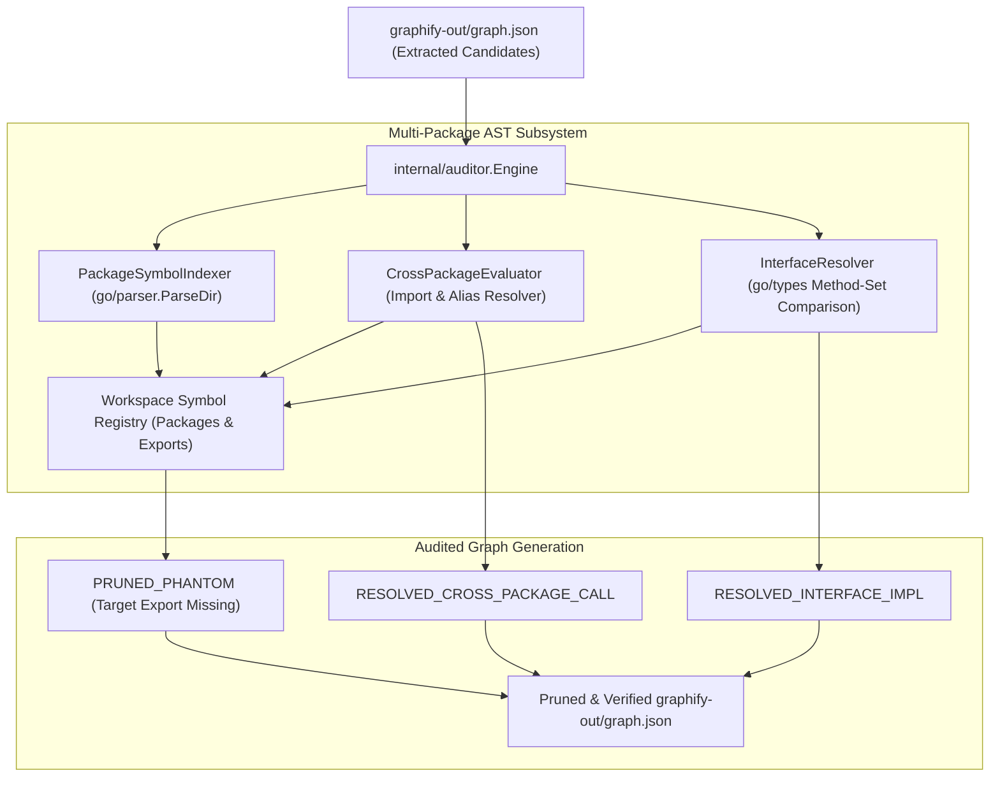

# Feature Roadmap Item 002: Deep AST Multi-Package Import & Interface Implementation Resolution (🟢 COMPLETED V1.2.0)

- **Sequence Code**: `002`
- **Document Status**: `🟢 COMPLETED V1.2.0`
- **Milestone Target**: `Milestone 2 (V1.2.0)`
- **Persona Drivers & Gatekeepers**:
  - Lead AI Workflow Architect & Governor ([@nexus.md](../../.agents/personas/nexus.md))
  - Feature Engineer ([@feature-engineer.md](../../.agents/personas/feature-engineer.md))
  - Security & Compliance Auditor ([@security-auditor.md](../../.agents/personas/security-auditor.md))
  - Regression & Test Automation Guard ([@regression-tester.md](../../.agents/personas/regression-tester.md))

---

## 1. Executive Summary & Strategic Objective

### Problem Statement
Currently, the AST relationship auditor (`internal/auditor/evaluator.go`) operates primarily on single-file AST parsing scopes (`ast.Inspect`). While this effectively eliminates phantom calls within the same source file, it has critical blind spots in real-world multi-package Go projects:
1. **Cross-Package Call Resolution**: When source code in Package A invokes an exported function or constructor from Package B (`import "pkg/b"; b.NewService()`), single-file lexical inspection cannot resolve whether `b.NewService` exists in the target package's exported symbol table, nor can it trace imported package aliases (`import svc "pkg/b/v2"`).
2. **Interface Implementation & Polymorphism**: In Go, interfaces are satisfied implicitly without explicit `implements` keywords. When a caller interacts with an interface (`runner.ReleaseDownloader`), single-file AST inspection cannot identify concrete structs (`DefaultReleaseDownloader`) implementing those method signatures across packages. Consequently, valid polymorphism edges generated during heuristic extraction are either left unclassified or incorrectly flagged as phantoms.
3. **Multi-File Package Scope**: Symbols defined in sibling files within the same package directory (e.g. `types.go` declaring a struct instantiated in `engine.go`) are checked file-by-file rather than compiled as a unified package compilation unit (`ast.Package`).

### Strategic Solution & Target Architecture
Architect and implement a **Deep AST Multi-Package Import & Interface Implementation Resolution Subsystem** inside `internal/auditor/` that:
1. **Workspace Package Symbol Indexer (`internal/auditor/indexer.go`)**:
   - Parses complete package compilation units via `go/parser.ParseDir` across the entire workspace root.
   - Builds a global workspace symbol registry mapping `(PackagePath, Struct/Interface/Function/Method)`.
2. **Deterministic Interface Implementation Resolver (`internal/auditor/resolver.go`)**:
   - Uses Go's `go/types` / method set comparison to verify implicit interface satisfaction (`types.Implements(concrete, iface)`).
   - Generates deterministic cross-package edges connecting interface definitions to concrete implementation structs.
3. **Cross-Package Selector & Import Evaluator (`internal/auditor/cross_package.go`)**:
   - Resolves all file import specifications, handling standard imports, local aliases, and dot-imports (`import . "..."`).
   - Validates call expressions against target package symbol tables and attributes exact AST line/column locations.
4. **Enhanced Provenance Taxonomy**:
   - Extends edge metadata with new high-confidence provenance classifications:
     - `RESOLVED_CROSS_PACKAGE_CALL`: Verified cross-package function/method invocation.
     - `RESOLVED_INTERFACE_IMPL`: Verified struct-to-interface polymorphic implementation edge.

---

## 2. Subsystem / Engine Component Matrix

| Subsystem Component | Package / Path | Primary Responsibilities | Graphify Knowledge Graph Mapping |
| :--- | :--- | :--- | :--- |
| **Package Symbol Indexer** | `internal/auditor/indexer.go` | Scans workspace directories, parses `ast.Package` units, indexes exported types, methods, functions | Subsystem indexer connecting package nodes |
| **Interface Resolver** | `internal/auditor/resolver.go` | Evaluates method sets, checks interface satisfaction (`types.Implements`), maps polymorphic dispatch | Deep AST type evaluator |
| **Cross-Package Evaluator** | `internal/auditor/cross_package.go` | Evaluates selector expressions across imported packages, resolves aliases and dot imports | AST selector engine extension |
| **Auditor Domain Models** | `internal/auditor/types.go` | Data models for `PackageSymbolTable`, `InterfaceBinding`, `ProvenanceTag` | Core domain type definitions |
| **AST Engine Orchestrator** | `internal/auditor/engine.go` | Orchestrates single-file, multi-package, and interface auditing pipelines | Master AST verification engine |
| **Two-Phase Store** | `internal/auditor/store.go` | Atomically persists updated edge classifications and provenance metadata | Atomic graph persistence store |

---

## 3. Phased Master Task Matrix

| Task Code | Title & Description | Driver Persona | Priority | Est. Effort | Target SDLC Phase | Status |
| :--- | :--- | :--- | :---: | :---: | :---: | :---: |
| **002.1** | **Workspace Package Symbol Indexer**: Implement `internal/auditor/indexer.go` to traverse workspace directories, parse `ast.Package` ASTs via `go/parser.ParseDir`, and construct a multi-package exported symbol registry. | `@feature-engineer.md` | P0 | 2.0 Days | Phase 1 & 2 | `(🟢 COMPLETED)` |
| **002.2** | **Cross-Package Import & Selector Evaluator**: Implement `internal/auditor/cross_package.go` to parse file import blocks, resolve package aliases (`import foo "pkg/bar"`), and verify cross-package selector call chains. | `@feature-engineer.md` | P0 | 1.5 Days | Phase 2 & 3 | `(🟢 COMPLETED)` |
| **002.3** | **Implicit Interface Implementation Resolver**: Implement `internal/auditor/resolver.go` utilizing `go/types` method set analysis to calculate and prove interface satisfaction (`types.Implements`) across all workspace packages. | `@feature-engineer.md` | P0 | 2.0 Days | Phase 3 | `(🟢 COMPLETED)` |
| **002.4** | **Provenance Taxonomy & Store Serialization**: Extend `EdgeProvenance` with `RESOLVED_CROSS_PACKAGE_CALL` and `RESOLVED_INTERFACE_IMPL`, updating atomic JSON graph serialization in `internal/auditor/store.go`. | `@feature-engineer.md` | P0 | 1.0 Day | Phase 3 | `(🟢 COMPLETED)` |
| **002.5** | **Table-Driven Multi-Package Test Suite**: Design synthetic multi-package workspace test fixtures in `internal/auditor/` verifying cross-package calls, cyclic package imports, and complex interface hierarchies. | `@regression-tester.md` | P0 | 1.5 Days | Phase 4 | `(🟢 COMPLETED)` |
| **002.6** | **Pre-Release Security & AST Precision Audit**: Verify zero memory leaks, assert workspace boundary containment on all parsed directories, and certify $\ge 85\%$ test coverage across new components. | `@security-auditor.md`, `@nexus.md` | P0 | 1.0 Day | Phase 5 & 6 | `(🟢 COMPLETED)` |

---

## 4. Definition of Done (DoD) & Acceptance Criteria

To achieve release readiness and complete SDLC sign-off for Item 002, all the following criteria must be fulfilled:

1. **Multi-Package Symbol Resolution**:
   - Calls across package boundaries (e.g. `runner.NewDefaultReleaseDownloader`) are deterministically verified against the target package's exported AST declarations.
   - Package aliases (`import rnr "internal/runner"`) and dot-imports are correctly resolved to the target package symbol table.
2. **Deterministic Interface Satisfaction**:
   - Concrete structs implementing all methods of an interface (whether in the same package or across packages) are verified via `go/types` method set comparison.
   - Verified implementation relationships receive the provenance tag `RESOLVED_INTERFACE_IMPL`.
3. **Elimination of False Positive Phantom Pruning**:
   - Legitimate cross-package and polymorphic calls are no longer pruned as phantom edges during Stage 3 AST auditing.
4. **Hermetic Security & Performance**:
   - Directory parsing enforces strict workspace boundary containment (`ValidatePathBoundary`).
   - AST caching ensures multi-package parsing adds less than 150ms of overhead for repositories up to 50,000 LOC.
5. **SQA & Race Condition Gate**:
   - `GOWORK=off go test -v -race ./...` passes with 0 race conditions.
   - Statement coverage on new packages/files in `internal/auditor/` reaches $\ge 85\%$.
