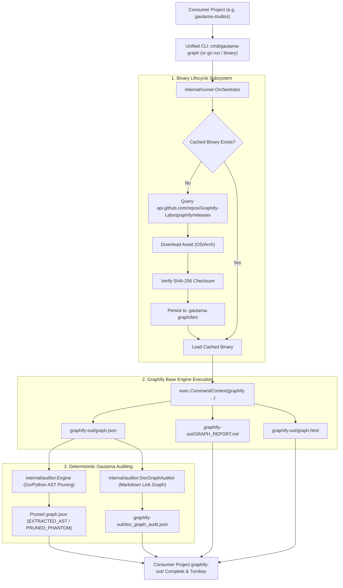

# Feature Roadmap Item 001: Encapsulated Graphify Binary Manager & Single-Entrypoint Orchestrator (🟢 COMPLETED V1.1.0)

- **Sequence Code**: `001`
- **Document Status**: `🟢 COMPLETED V1.1.0`
- **Milestone Target**: `Milestone 1 (V1.1.0)`
- **Persona Drivers & Gatekeepers**:
  - Lead AI Workflow Architect & Governor ([@nexus.md](../../.agents/personas/nexus.md))
  - Feature Engineer ([@feature-engineer.md](../../.agents/personas/feature-engineer.md))
  - Security & Compliance Auditor ([@security-auditor.md](../../.agents/personas/security-auditor.md))
  - Regression & Test Automation Guard ([@regression-tester.md](../../.agents/personas/regression-tester.md))

---

## 1. Executive Summary & Strategic Objective

### Problem Statement
When consumer repositories (such as `gautama-studios` or other ecosystem services) import `github.com/jameshawkins-art/gautama-graph` at tag `v1.0.2`, running the current `cmd/graphify-ast-audit` and `cmd/graphify-doc-audit` successfully generates AST provenance and documentation validation inside `graphify-out/`. However, **the base knowledge graph extraction, community clustering, `GRAPH_REPORT.md`, and interactive `graph.html` visualizer are not generated** unless the consumer manually installs Graphify via host-level Python (`pip` or `uv`) or an agent manually runs multi-step interactive Python scripts (as captured in [scripts/gautama-studio-execute.sh](../../scripts/gautama-studio-execute.sh)).

This introduces friction, external OS/environment dependencies, and breaks the promise of a self-contained, turnkey knowledge graph solution.

### Strategic Solution & Target Architecture
Develop an **Encapsulated Graphify Binary Manager & Single-Entrypoint Orchestrator** inside `gautama-graph` that:
1. **Automated GitHub Release Downloader (`internal/runner/downloader.go`)**:
   - Queries `https://api.github.com/repos/Graphify-Labs/graphify/releases/latest` to identify the latest release.
   - Detects the consumer's host OS (`linux`, `darwin`, `windows`) and architecture (`amd64`, `arm64`).
   - Downloads, verifies SHA-256 checksums, and caches the standalone binary/runtime into a local cache directory (e.g. `~/.cache/gautama-graph/bin/` or `.gautama-graph/bin/`).
2. **Encapsulated Go Subprocess Runner (`internal/runner/runner.go`)**:
   - Executes Graphify extraction commands via Go standard library `exec.CommandContext` without requiring the host OS to have `uv`, `pip`, or a specific Python version globally installed.
   - Encapsulates semantic extraction scripts, clustering, HTML export, and benchmark routines directly within `gautama-graph`.
3. **Turnkey Unified Orchestration CLI (`cmd/gautama-graph/main.go`)**:
   - Provides a single command (e.g. `gautama-graph sync` / `gautama-graph build`) that performs the complete 4-stage pipeline:
     - **Stage 1**: Automated binary verification & download (if not cached).
     - **Stage 2**: Full base extraction, semantic pass, community clustering, `GRAPH_REPORT.md`, and `graph.html` generation.
     - **Stage 3**: Deterministic in-repo Go/Python AST code relationship audit & phantom pruning (`cmd/graphify-ast-audit`).
     - **Stage 4**: Markdown documentation link topology validation & orphan detection (`cmd/graphify-doc-audit`).
   - Scopes and writes all output artifacts (`graphify-out/graph.json`, `graphify-out/graph.html`, `graphify-out/GRAPH_REPORT.md`, `graphify-out/doc_graph_audit.json`) cleanly into the consumer's target project root.

---

## 2. Subsystem / Engine Component Matrix

| Subsystem Component | Package / Path | Primary Responsibilities | Graphify Knowledge Graph Mapping |
| :--- | :--- | :--- | :--- |
| **Release Client & Cache** | `internal/runner/downloader.go` | GitHub releases API client, OS/arch resolution, TLS download, SHA-256 verification, atomic binary caching | Downloader service connecting to external releases |
| **Encapsulated Runner** | `internal/runner/runner.go` | Subprocess lifecycle management, stdout/stderr stream hygiene, timeout enforcement, headless execution | Integrates with `internal/auditor/types.go` |
| **Pipeline Orchestrator** | `internal/runner/orchestrator.go` | Executes the sequential 4-stage pipeline (Download $\to$ Base Extract $\to$ AST Audit $\to$ Doc Audit) | Master coordinator linking `runner` and `auditor` |
| **Unified CLI Entrypoint** | `cmd/gautama-graph/main.go` | Single consumer CLI entrypoint with `--strict`, `--target`, `--force-download`, `--skip-doc` flags | Public consumer interface |
| **AST Relationship Auditor** | `internal/auditor/engine.go` | Deterministic Go/Python AST parser, selector evaluator, phantom pruning | Existing core node `Engine` |
| **Doc Graph Auditor** | `internal/auditor/doc_auditor.go` | Markdown relative link parser, zero-trust boundary check, orphan detector | Existing core node `DocGraphAuditor` |
| **Python AST Bridge** | `python/ast_auditor_bridge.py` | Python AST visitor for python call verification | Existing script node `ast_auditor_bridge.py` |

---

## 3. Phased Master Task Matrix

| Task Code | Title & Description | Driver Persona | Priority | Est. Effort | Target SDLC Phase | Status |
| :--- | :--- | :--- | :---: | :---: | :---: | :---: |
| **001.1** | **GitHub Release API Client & OS/Arch Resolver**: Implement `internal/runner/downloader.go` to fetch release metadata from GitHub, parse semver tags, map runtime `runtime.GOOS`/`runtime.GOARCH` to asset names, and verify SHA-256 hashes. | `@feature-engineer.md` | P0 | 1.5 Days | Phase 1 & 2 | `(🟢 COMPLETED)` |
| **001.2** | **Zero-Trust Cache & Binary Execution Sandbox**: Implement atomic binary storage in `.gautama-graph/bin/` with `0755` permissions, path traversal checks, and hermetic sandboxing via `exec.CommandContext`. | `@security-auditor.md` | P0 | 1.0 Day | Phase 2 & 3 | `(🟢 COMPLETED)` |
| **001.3** | **Encapsulated Graphify Pipeline Runner**: Implement Go wrapper executing detection, AST extraction, semantic pass, community clustering, `GRAPH_REPORT.md`, and `graph.html` generation without host Python/uv prerequisites. | `@feature-engineer.md` | P0 | 2.0 Days | Phase 3 | `(🟢 COMPLETED)` |
| **001.4** | **Turnkey Unified CLI (`cmd/gautama-graph`)**: Create the master CLI executable that orchestrates binary setup, base graph generation, AST pruning, and doc graph validation in a single command. | `@feature-engineer.md` | P0 | 1.0 Day | Phase 3 | `(🟢 COMPLETED)` |
| **001.5** | **Table-Driven Integration Test Suite & Mock Server**: Build comprehensive unit and integration tests with `httptest.Server` mocking GitHub releases, simulated corrupted checksums, and offline cache replay. | `@regression-tester.md` | P0 | 1.5 Days | Phase 4 | `(🟢 COMPLETED)` |
| **001.6** | **Consumer Project E2E Verification in `gautama-studios`**: Validate end-to-end execution inside `/home/slvr/source/gautama-studios` confirming automatic generation of `GRAPH_REPORT.md`, `graph.html`, and `graph.json` with zero manual prompts. | `@nexus.md` | P0 | 1.0 Day | Phase 5 & 6 | `(🟢 COMPLETED)` |

---

## 4. Definition of Done (DoD) & Acceptance Criteria

To achieve release readiness and complete SDLC sign-off for Item 001, all the following criteria must be fulfilled:

1. **Zero Host Prerequisite Requirement**:
   - A clean consumer repository importing `gautama-graph` without `uv` or `pip` installed globally must successfully run the pipeline and generate all artifacts (`graphify-out/graph.json`, `graphify-out/GRAPH_REPORT.md`, `graphify-out/graph.html`, `graphify-out/doc_graph_audit.json`).
2. **Automated Release Management**:
   - `internal/runner` automatically fetches and caches the latest release from `https://github.com/Graphify-Labs/graphify/releases` matching the host platform (`linux/amd64`, `linux/arm64`, `darwin/amd64`, `darwin/arm64`, `windows/amd64`).
   - If offline, `internal/runner` uses the cached binary if present.
3. **Checksum & Security Boundary Verification**:
   - All downloaded binaries must have their SHA-256 checksums verified against release assets before execution.
   - Cache storage and target project outputs must enforce strict root path boundary checks (`ValidatePathBoundary`).
4. **Complete Multi-Stage Orchestration**:
   - Single command execution (`cmd/gautama-graph` or Go library API) runs all 4 stages sequentially with discrete progress logging.
   - AST code relationship auditing prunes phantom edges and doc graph auditing identifies broken links and orphans.
5. **Quality & Test Coverage Gates**:
   - `GOWORK=off go test -v -race ./...` passes 100% with 0 race conditions.
   - Statement coverage on `internal/runner/` and `internal/auditor/` reaches $\ge 85\%$.
