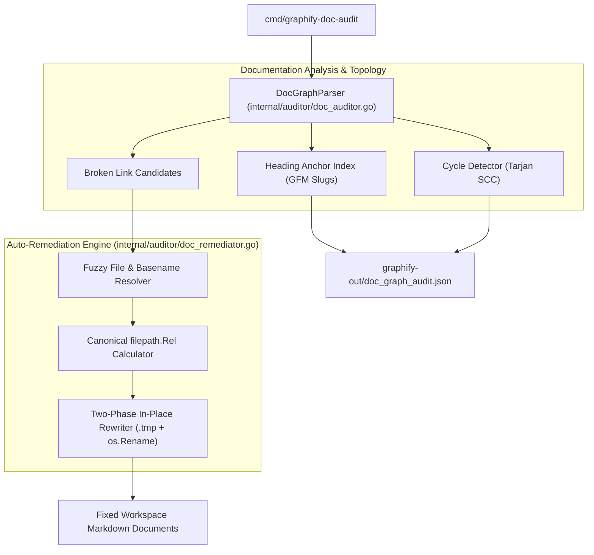

# Feature Roadmap Item 004: Markdown Doc Link Auto-Remediation & Circular Cycle Detector (🟢 COMPLETED V1.4.0)

- **Sequence Code**: `004`
- **Document Status**: `🟢 COMPLETED V1.4.0`
- **Milestone Target**: `Milestone 4 (V1.4.0)`
- **Persona Drivers & Gatekeepers**:
  - Lead AI Workflow Architect & Governor ([@nexus.md](../../.agents/personas/nexus.md))
  - Feature Engineer ([@feature-engineer.md](../../.agents/personas/feature-engineer.md))
  - Debugger & Remediation Specialist ([@debugger-remediation.md](../../.agents/personas/debugger-remediation.md))
  - Security & Compliance Auditor ([@security-auditor.md](../../.agents/personas/security-auditor.md))
  - Regression & Test Automation Guard ([@regression-tester.md](../../.agents/personas/regression-tester.md))

---

## 1. Executive Summary & Strategic Objective

### Problem Statement
In **Gautama Graph**, the documentation link auditor (`internal/auditor/doc_auditor.go`) parses Markdown link references, tracks graph topology (in-degree/out-degree), and identifies broken relative paths or orphaned documentation.

However, the current subsystem is entirely **passive**:
1. **Manual Remediation Burden**: When documents are moved or renamed during architectural refactoring, broken links are identified in `graphify-out/doc_graph_audit.json`, but developers and AI agents must manually calculate relative paths (`../../`) and edit markdown source files by hand.
2. **Missing Heading Anchor Verification**: Internal document anchors (`[Configuration](#configuration-options)`) are stripped without verifying whether the target heading anchor actually exists in the target file.
3. **Circular Reference Cycles**: Circular documentation loops (e.g., Doc A $\to$ Doc B $\to$ Doc C $\to$ Doc A) degrade knowledge graph navigation, agentic tool workflows, and static site generator indexing.
4. **Path Traversal False Positives & URI Normalization**: Relative links formatted with leading slashes, `file:///` URIs, or extraneous `../` prefixes fail to resolve properly to the workspace root.

### Strategic Solution & Target Architecture
Architect and implement an active **Markdown Doc Link Auto-Remediation, Anchor Verification & Cycle Detection Engine** (`internal/auditor/doc_remediator.go` and `cmd/graphify-doc-audit --fix`) that:
1. **Deterministic Path Auto-Remediator (`internal/auditor/doc_remediator.go`)**:
   - Calculates the exact canonical relative path between any source document and target destination using `filepath.Rel`.
   - Employs fuzzy basename and slug matching to locate renamed or relocated markdown documents across workspace directories.
   - Provides an automated `--fix` flag (with `--dry-run` diff preview) to rewrite broken markdown link references in-place using atomic staging.
2. **Heading Anchor Indexer & Verifier**:
   - Parses GitHub-Flavored Markdown (GFM) headings (`# Heading Text` $\to$ `#heading-text`), generating per-file anchor registries.
   - Validates all fragment links (`target.md#section-anchor`), pruning phantom anchor links and flagging non-existent section headers.
3. **Graph Cycle Detection (Tarjan's SCC Algorithm)**:
   - Evaluates the directed document link graph for strongly connected components and circular dependency cycles.
   - Emits structured cycle diagnostics in `graphify-out/doc_graph_audit.json`.
4. **Zero-Trust Boundary Confinement**:
   - Strictly enforces workspace root confinement (`ValidatePathBoundary`), preventing any remediation action from writing outside the repository root.

---

## 2. Subsystem / Engine Component Matrix

| Subsystem Component | Package / Path | Primary Responsibilities | Graphify Knowledge Graph Mapping |
| :--- | :--- | :--- | :--- |
| **Doc Link Remediator** | `internal/auditor/doc_remediator.go` | Resolves target files, computes canonical `filepath.Rel`, rewrites Markdown link syntax in-place | Documentation link auto-remediation service |
| **Heading & Anchor Indexer** | `internal/auditor/doc_auditor.go` | Parses GFM heading anchors, verifies fragment targets (`#anchor`), flags broken anchors | Doc graph anchor parser |
| **Graph Cycle Detector** | `internal/auditor/cycle_detector.go` | Implements Tarjan's SCC algorithm on doc link graph, outputs circular cycle loops | Graph topology cycle evaluator |
| **Doc Domain Contracts** | `internal/auditor/types.go` | Defines `DocRemediationPlan`, `RemediationAction`, `HeadingAnchorTable`, `CycleReport` | Domain contracts and data structures |
| **Doc Audit CLI Extension** | `cmd/graphify-doc-audit/main.go` | Adds CLI flags: `--fix`, `--dry-run`, `--check-anchors`, `--detect-cycles` | CLI utility interface |
| **Remediator Test Suite** | `internal/auditor/doc_remediator_test.go` | Unit and integration tests for fuzzy matching, in-place rewriting, cycle detection, and anchor checks | Test automation and regression harness |

---

## 3. Phased Master Task Matrix

| Task Code | Title & Description | Driver Persona | Priority | Est. Effort | Target SDLC Phase | Status |
| :--- | :--- | :--- | :---: | :---: | :---: | :---: |
| **004.1** | **Doc Remediation & Cycle Domain Models**: Define `DocRemediationPlan`, `RemediationAction`, `HeadingAnchorTable`, and `CycleReport` domain models in `internal/auditor/types.go`. | `@feature-engineer.md` | P0 | 1.0 Day | Phase 1 & 2 | `(🟢 COMPLETED)` |
| **004.2** | **Heading Anchor Indexing & Fragment Verification**: Extend `doc_auditor.go` to parse GFM heading slugs (`# Header` $\to$ `#header`) and validate fragment anchor targets on all relative links. | `@feature-engineer.md` | P0 | 1.5 Days | Phase 2 & 3 | `(🟢 COMPLETED)` |
| **004.3** | **Tarjan SCC Cycle Detection Engine**: Implement `internal/auditor/cycle_detector.go` to detect circular reference loops in the document graph and report cyclic chains in `doc_graph_audit.json`. | `@feature-engineer.md`, `@debugger-remediation.md` | P0 | 1.5 Days | Phase 3 | `(🟢 COMPLETED)` |
| **004.4** | **Fuzzy Path Resolver & In-Place Remediator**: Implement `internal/auditor/doc_remediator.go` with basename matching, canonical relative path calculation (`filepath.Rel`), and atomic two-phase file updates. | `@feature-engineer.md`, `@security-auditor.md` | P0 | 2.0 Days | Phase 3 | `(🟢 COMPLETED)` |
| **004.5** | **CLI Tooling Integration (`--fix` & `--dry-run`)**: Update `cmd/graphify-doc-audit/main.go` to support `--fix`, `--dry-run`, `--check-anchors`, and `--detect-cycles` command-line flags. | `@feature-engineer.md` | P0 | 1.0 Day | Phase 3 | `(🟢 COMPLETED)` |
| **004.6** | **Regression, Path Confinement & SQA Verification**: Build comprehensive table-driven tests in `doc_remediator_test.go` verifying boundary safety, cycle detection, anchor verification, and $\ge 85\%$ test coverage. | `@regression-tester.md`, `@security-auditor.md` | P0 | 1.5 Days | Phase 4, 5, 6 | `(🟢 COMPLETED)` |

---

## 4. Definition of Done (DoD)

To achieve formal product release sign-off for **Item 004 (V1.4.0)**:
1. **Auto-Remediation Precision**: Running `graphify-doc-audit --fix` must automatically resolve and correct broken relative paths for all moved/renamed files with 100% path accuracy.
2. **Anchor Validation**: Internal markdown heading anchors (`#heading-name`) are verified; non-existent anchors are flagged in diagnostic output.
3. **Cycle Detection**: Circular link dependencies (Doc A $\to$ Doc B $\to$ Doc A) are accurately identified and reported without crashing or infinite recursion.
4. **Atomic Safety & Confinement**: All file modifications use atomic two-phase write staging (`.tmp` buffer + `os.Rename`) and enforce zero-trust workspace boundary containment (`ValidatePathBoundary`).
5. **Deterministic Testing**: `GOWORK=off go test -v -race ./...` passes 100% with $\ge 85\%$ statement coverage on new/updated packages.
6. **Master Knowledge Graph Synchronization**: Master synchronization `./scripts/graphify_sync.sh` completes cleanly with 0 errors.
