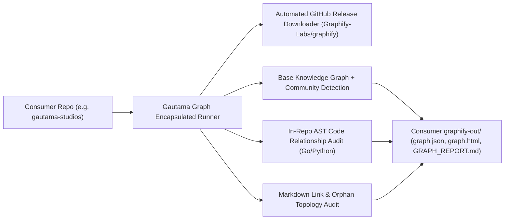

# Gautama Graph Master Product & Architecture Roadmap

- **Repository**: `github.com/jameshawkins-art/gautama-graph`
- **Lead Personas**:
  - Lead AI Workflow Architect & Governor ([@nexus.md](../../.agents/personas/nexus.md))
  - Feature Engineer ([@feature-engineer.md](../../.agents/personas/feature-engineer.md))
  - Security & Compliance Auditor ([@security-auditor.md](../../.agents/personas/security-auditor.md))
  - Regression & Test Guard ([@regression-tester.md](../../.agents/personas/regression-tester.md))
- **Status**: Active (Pre-SDLC / Feature Planning)

---

## Executive Summary & Strategic Mission

**Gautama Graph** is the definitive knowledge graph extraction, AST verification, and documentation topology engine for the Gautama ecosystem.

The engine delivers:
1. **Deterministic Code AST Auditing**: Inspects Go and Python call/selector expressions (`go/ast`, `go/parser`, `ast_auditor_bridge.py`) to prune heuristic phantom edges and apply verifiable provenance tags (`EXTRACTED_AST`, `INFERRED_HEURISTIC`, `PRUNED_PHANTOM`).
2. **Markdown Documentation Link Topology**: Resolves all relative Markdown links, enforces zero-trust filesystem boundary containment, computes graph in/out degrees, and detects orphaned documentation.
3. **Encapsulated, Self-Bootstrapping Graphify Runner**: Eliminates host-level OS/pip/uv dependencies by downloading, caching, and orchestrating official Graphify releases directly via Go subprocesses.
4. **Atomic Two-Phase Persistence**: Guarantees zero partial writes to `graphify-out/` through `.tmp` staging buffers and atomic `os.Rename` commits.



---

## Master Feature Roadmap Table

| Seq | Feature Title | Lead Personas | Target Milestone | Status |
| :---: | :--- | :--- | :---: | :---: |
| **001** | [Encapsulated Graphify Binary Manager & Single-Entrypoint Orchestrator](./encapsulated-graphify-binary-runner-roadmap-001.md) | `@feature-engineer.md`, `@security-auditor.md`, `@nexus.md` | Milestone 1 (V1.1.0) | `(🟢 COMPLETED V1.1.0)` |
| **002** | [Deep AST Multi-Package Import & Interface Implementation Resolution](./deep-ast-multi-package-import-roadmap-002.md) | `@feature-engineer.md`, `@regression-tester.md` | Milestone 2 (V1.2.0) | `(🟢 COMPLETED V1.2.0)` |
| **003** | [Streaming AST IPC Bridge & Persistent Subprocess Daemon Pool](./streaming-ast-ipc-bridge-roadmap-003.md) | `@feature-engineer.md`, `@debugger-remediation.md` | Milestone 3 (V1.3.0) | `(🟢 COMPLETED V1.3.0)` |
| **004** | Markdown Doc Link Auto-Remediation & Circular Cycle Detector | `@feature-engineer.md`, `@security-auditor.md` | Milestone 4 (V1.4.0) | `(🔴 NOT STARTED)` |

---

## Detailed Item Specifications

### Item 001: Encapsulated Graphify Binary Manager & Single-Entrypoint Orchestrator
- **Specification Document**: [`docs/roadmap/encapsulated-graphify-binary-runner-roadmap-001.md`](./encapsulated-graphify-binary-runner-roadmap-001.md)
- **Primary Goal**: Remove all host-level Python/pip/uv installation prerequisites for consumer repos (such as `gautama-studios`). Automatically query and download official releases from `Graphify-Labs/graphify`, verify SHA-256 integrity, cache the binary locally within `.gautama-graph/bin/`, and execute the complete pipeline (detection, AST/semantic extraction, community clustering, `GRAPH_REPORT.md`, `graph.html`, in-repo AST audit, doc audit) cleanly writing all outputs to the target project's `graphify-out/` directory.

### Item 002: Deep AST Multi-Package Import & Interface Implementation Resolution
- **Specification Document**: [`docs/roadmap/deep-ast-multi-package-import-roadmap-002.md`](./deep-ast-multi-package-import-roadmap-002.md)
- **Primary Goal**: Expand AST relationship auditing from isolated single-file traversal to a workspace-wide multi-package compilation and type-checking engine. Parse `ast.Package` compilation units (`go/parser.ParseDir`), build a global exported symbol index, resolve package aliases, and use `go/types` method-set comparisons to deterministically prove implicit interface implementations (`RESOLVED_INTERFACE_IMPL`) and cross-package calls (`RESOLVED_CROSS_PACKAGE_CALL`).

### Item 003: Streaming AST IPC Bridge & Persistent Subprocess Daemon Pool
- **Specification Document**: [`docs/roadmap/streaming-ast-ipc-bridge-roadmap-003.md`](./streaming-ast-ipc-bridge-roadmap-003.md)
- **Primary Goal**: Replace ephemeral, one-shot Python subprocess execution with a high-throughput, persistent subprocess worker daemon pool (`internal/auditor/ipc_bridge.go` and `python/ast_daemon.py`). Communicate over bidirectional non-blocking Newline-Delimited JSON (NDJSON) pipes with heartbeat monitoring, crash auto-recovery, concurrency scaling, and zero orphaned zombie processes.

---

## Architectural Subsystems Overview

```
internal/
├── auditor/             # Core AST verification & Doc Graph engine
│   ├── engine.go        # Pipeline orchestration & edge routing
│   ├── parser.go        # Go file AST parser with boundary checks
│   ├── evaluator.go     # ast.Inspect selector & call matcher
│   ├── doc_auditor.go   # Markdown link topology & orphan detector
│   ├── python_bridge.go # Python AST analyzer subprocess bridge
│   ├── store.go         # Atomic two-phase GraphStore (.tmp -> os.Rename)
│   └── types.go         # Domain interfaces & data structures
├── runner/              # [Planned 001] Encapsulated binary manager & release downloader
│   ├── downloader.go    # GitHub release API client & binary cache manager
│   ├── runner.go        # Multi-stage graphify execution orchestrator
│   └── integrity.go     # SHA-256 & platform/arch validation
cmd/
├── graphify-ast-audit/  # CLI entrypoint for AST relationship auditing
├── graphify-doc-audit/  # CLI entrypoint for Markdown link auditing
└── gautama-graph/       # [Planned 001] Unified CLI for consumers
python/
└── ast_auditor_bridge.py # Isolated Python AST visitor script
scripts/
└── graphify_sync.sh     # Master synchronization pipeline script
```

---

## Quality, Safety & Governance Guardrails

1. **Deterministic Test Suites & Race Detection**: Every new component requires table-driven tests passing `GOWORK=off go test -v -race ./...`.
2. **Coverage Gate**: Minimum $\ge 85\%$ statement coverage on all core packages.
3. **Zero-Trust Filesystem Security**: All file downloads and workspace manipulations must enforce strict path containment (`filepath.Clean`, root prefix validation, no path traversal).
4. **Hermetic Binary Verification**: All remote release downloads must verify checksums and enforce TLS 1.3 / HTTPS integrity.
