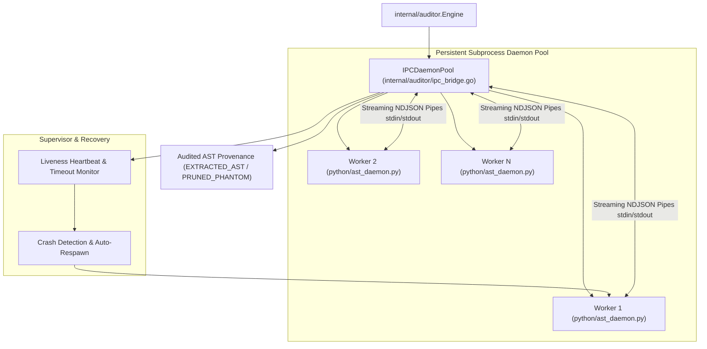

# Feature Roadmap Item 003: Streaming AST IPC Bridge & Persistent Subprocess Daemon Pool (🟢 COMPLETED V1.3.0)

- **Sequence Code**: `003`
- **Document Status**: `🟢 COMPLETED V1.3.0`
- **Milestone Target**: `Milestone 3 (V1.3.0)`
- **Persona Drivers & Gatekeepers**:
  - Lead AI Workflow Architect & Governor ([@nexus.md](../../.agents/personas/nexus.md))
  - Feature Engineer ([@feature-engineer.md](../../.agents/personas/feature-engineer.md))
  - Debugger & Remediation Specialist ([@debugger-remediation.md](../../.agents/personas/debugger-remediation.md))
  - Security & Compliance Auditor ([@security-auditor.md](../../.agents/personas/security-auditor.md))
  - Regression & Test Automation Guard ([@regression-tester.md](../../.agents/personas/regression-tester.md))

---

## 1. Executive Summary & Strategic Objective

### Problem Statement
Currently, Python AST relationship auditing in `internal/auditor/python_bridge.go` relies on ephemeral, one-shot subprocess invocations (`exec.CommandContext("python3", "python/ast_auditor_bridge.py", ...)`). 

While functional for small codebases, this architecture exhibits severe limitations at scale:
1. **Subprocess Spawning Latency**: Spawning a new Python interpreter process per audit batch incurs heavy OS fork/exec overhead, Python runtime initialization, and module loading penalties (200ms–500ms per batch).
2. **IPC Throughput Bottlenecks**: Serializing arguments through CLI flags and temporary files creates disk I/O churn and serialization overhead.
3. **Fragile Process Lifecycle Management**: If a Python subprocess deadlocks or encounters malformed AST syntax, the Go parent engine cannot cleanly recycle the worker without tearing down the entire batch execution.
4. **Lack of Parallel Worker Pool**: Multi-core CPU resources are underutilized when processing massive polyglot repositories containing hundreds of Python modules.

### Strategic Solution & Target Architecture
Architect and implement a high-performance **Streaming AST IPC Bridge and Persistent Subprocess Daemon Pool** (`internal/auditor/ipc_bridge.go` and `python/ast_daemon.py`) that:
1. **Persistent Worker Daemon Pool (`internal/auditor/ipc_bridge.go`)**:
   - Manages a configurable pool of long-lived Python subprocess daemons (`ast_daemon.py`) initialized at engine startup.
   - Dispatches edge evaluation workloads across idle workers via buffered channels and worker round-robin queues.
2. **Streaming NDJSON / JSON-RPC Protocol**:
   - Establishes bidirectional, non-blocking `stdin`/`stdout` UNIX pipes using Newline-Delimited JSON (NDJSON).
   - Encodes requests (`IPCRequest`) and decodes streaming verification responses (`IPCResponse`) with sub-millisecond dispatch times.
3. **Robust Fault Tolerance & Health Monitoring**:
   - Implements liveness heartbeats (`ping`/`pong`) and per-request timeouts.
   - Automatically terminates, recycles, and respawns crashed or deadlocked Python worker processes without failing in-flight pipeline batches.
4. **Graceful Teardown & Resource Cleanup**:
   - Guarantees complete cleanup of child processes (no zombie/orphaned Python processes) via context cancellation and POSIX signal management (`SIGTERM` / `SIGKILL`).

---

## 2. Subsystem / Engine Component Matrix

| Subsystem Component | Package / Path | Primary Responsibilities | Graphify Knowledge Graph Mapping |
| :--- | :--- | :--- | :--- |
| **Daemon Pool Supervisor** | `internal/auditor/ipc_bridge.go` | Spawns, balances, supervises, and recycles persistent Python AST worker processes | IPC orchestrator and daemon pool manager |
| **Daemon Domain Contracts** | `internal/auditor/types.go` | Defines `IPCWorkerPool`, `IPCSession`, `IPCRequest`, `IPCResponse`, `WorkerStatus` | Core IPC interfaces and protocol structs |
| **Python AST Daemon** | `python/ast_daemon.py` | Long-lived daemon listening on `stdin`, parsing Python ASTs, streaming verified call edges over `stdout` | Python AST analysis worker daemon |
| **Engine IPC Adapter** | `internal/auditor/engine.go` | Connects AST audit pipeline with the `IPCWorkerPool` for polyglot Go/Python AST verification | Core AST pipeline integration |
| **Integration Test Suite** | `internal/auditor/ipc_bridge_test.go` | Mocks crashes, deadlocks, throughput benchmarks, and high-concurrency request workloads | Concurrency and resilience test harness |

---

## 3. Phased Master Task Matrix

| Task Code | Title & Description | Driver Persona | Priority | Est. Effort | Target SDLC Phase | Status |
| :--- | :--- | :--- | :---: | :---: | :---: | :---: |
| **003.1** | **IPC Protocol & Domain Contracts Specification**: Define `IPCRequest`, `IPCResponse`, `IPCWorkerPool`, and `WorkerStatus` models in `internal/auditor/types.go` utilizing standard NDJSON framing. | `@feature-engineer.md` | P0 | 1.0 Day | Phase 1 & 2 | `(🟢 COMPLETED)` |
| **003.2** | **Persistent Python AST Worker Daemon**: Implement `python/ast_daemon.py` with continuous event loop reading NDJSON from `sys.stdin`, executing `ast.walk` and `ast.NodeVisitor`, and writing responses to `sys.stdout`. | `@feature-engineer.md`, `@debugger-remediation.md` | P0 | 1.5 Days | Phase 2 & 3 | `(🟢 COMPLETED)` |
| **003.3** | **Go Subprocess Daemon Pool & Stream Multiplexer**: Implement `internal/auditor/ipc_bridge.go` managing long-lived child processes, pipe I/O streams, worker selection, and buffered channel dispatch. | `@feature-engineer.md` | P0 | 2.0 Days | Phase 3 | `(🟢 COMPLETED)` |
| **003.4** | **Heartbeat Monitoring & Crash Auto-Recovery**: Implement supervisor watchdog in `ipc_bridge.go` tracking worker timeouts, killing unresponsive processes, and transparently retrying requests on fresh workers. | `@debugger-remediation.md`, `@security-auditor.md` | P0 | 1.5 Days | Phase 3 | `(🟢 COMPLETED)` |
| **003.5** | **Engine Pipeline Integration**: Wire `DefaultIPCWorkerPool` into `internal/auditor/engine.go` and `cmd/graphify-ast-audit/main.go`, deprecating one-shot `python_bridge.go` invocations. | `@feature-engineer.md` | P0 | 1.0 Day | Phase 3 | `(🟢 COMPLETED)` |
| **003.6** | **Resilience, Concurrency & SQA Verification**: Build high-concurrency table-driven tests in `ipc_bridge_test.go` asserting zero data races (`-race`), clean worker cleanup (0 zombies), and $\ge 85\%$ coverage. | `@regression-tester.md`, `@security-auditor.md` | P0 | 1.5 Days | Phase 4, 5, 6 | `(🟢 COMPLETED)` |

---

## 4. Definition of Done (DoD)

To achieve formal product release sign-off for **Item 003 (V1.3.0)**:
1. **Throughput & Latency**: Edge auditing latency across 1,000 Python candidate edges must improve by at least $5\times$ compared to one-shot subprocess invocations (sub-10ms IPC round-trip per batch).
2. **Process Resilience**: The engine must automatically recover from sudden worker termination (`SIGKILL`) or malformed input without dropping candidate edges or hanging the parent Go process.
3. **Resource Leak Prevention**: Zero orphaned Python processes remaining after engine exit (`SIGINT`/`SIGTERM`/context cancellation).
4. **Security & Boundary Enforcement**: All Python file paths received over IPC must be strictly validated via `ValidatePathBoundary`.
5. **Deterministic Testing**: All new tests pass cleanly under `GOWORK=off go test -v -race ./...` with $\ge 85\%$ statement coverage.
6. **Knowledge Graph Synchronization**: Master knowledge graph `./scripts/graphify_sync.sh` synchronizes cleanly with 0 errors.
