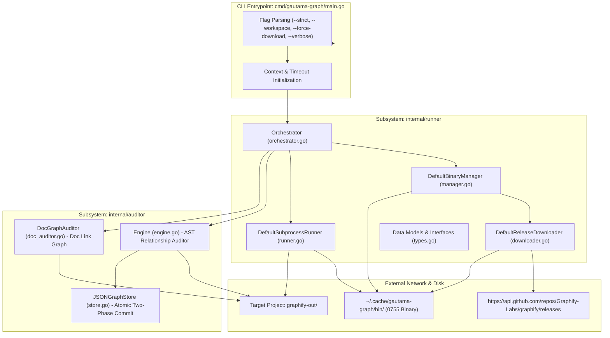
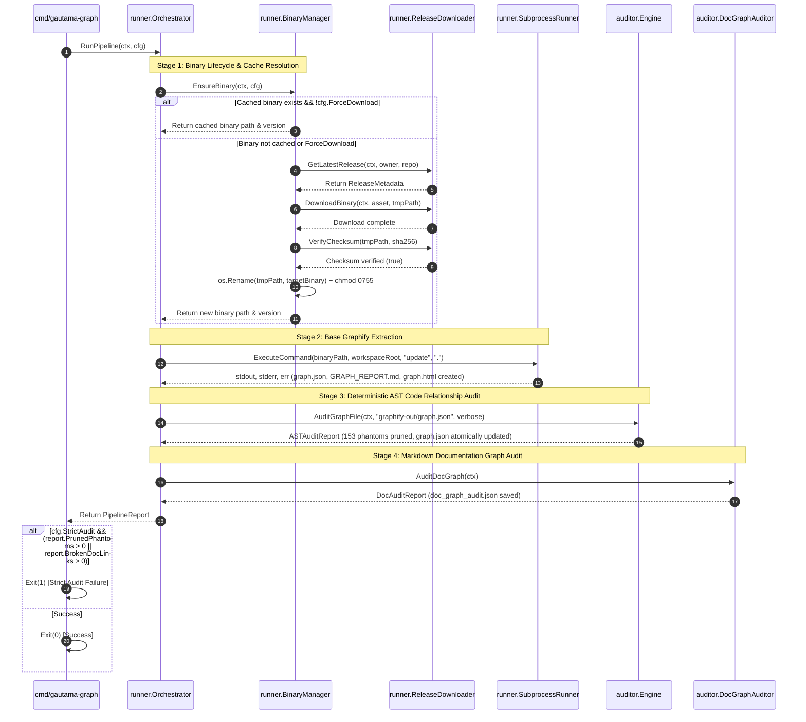

# Technical Architecture Blueprint: Encapsulated Graphify Binary Manager & Single-Entrypoint Orchestrator

- **Feature Title**: Encapsulated Graphify Binary Manager & Single-Entrypoint Orchestrator
- **Sequence Code**: `001`
- **Target Milestone**: `Milestone 1 (V1.1.0)`
- **Persona Drivers & Gatekeepers**:
  - Lead AI Workflow Architect & Governor ([@nexus.md](../../.agents/personas/nexus.md))
  - Feature Engineer ([@feature-engineer.md](../../.agents/personas/feature-engineer.md))
  - Security & Compliance Auditor ([@security-auditor.md](../../.agents/personas/security-auditor.md))
- **Status**: `🟢 DELIVERED & CERTIFIED V1.1.0`

---

## 1. Subsystem Architecture & System Topology

The **Encapsulated Graphify Runner** eliminates external host-level OS prerequisites (`pip`, `uv`, Python version lock-in) by introducing an automated binary lifecycle manager in `internal/runner` and coordinating the unified 4-stage pipeline alongside `internal/auditor`.



---

## 2. Granular Go Interface Contracts (`internal/runner/types.go`)

In adherence to the **Interface Segregation Principle (ISP)** and Go export standards, the runner contracts are partitioned into discrete, single-responsibility interfaces:

```go
package runner

import (
	"context"
	"time"
)

// PlatformTarget represents the resolved host OS and CPU architecture.
type PlatformTarget struct {
	OS   string `json:"os"`   // "linux", "darwin", "windows"
	Arch string `json:"arch"` // "amd64", "arm64"
}

// ReleaseAsset defines a downloadable release asset from GitHub releases.
type ReleaseAsset struct {
	Name               string `json:"name"`
	BrowserDownloadURL string `json:"browser_download_url"`
	Size               int64  `json:"size"`
	ChecksumSHA256     string `json:"checksum_sha256,omitempty"`
}

// ReleaseMetadata encapsulates release tag information from GitHub API.
type ReleaseMetadata struct {
	TagName     string                  `json:"tag_name"`
	PublishedAt time.Time               `json:"published_at"`
	Assets      map[string]ReleaseAsset `json:"assets"` // key: "<os>-<arch>"
}

// RunnerConfig configures binary caching, execution deadlines, and target workspace paths.
type RunnerConfig struct {
	WorkspaceRootPath  string        `json:"workspace_root_path"`
	CacheDirectoryPath string        `json:"cache_directory_path"`
	GitHubRepoOwner    string        `json:"github_repo_owner"`
	GitHubRepoName     string        `json:"github_repo_name"`
	ExecutionTimeout   time.Duration `json:"execution_timeout"`
	StrictAudit        bool          `json:"strict_audit"`
	ForceDownload      bool          `json:"force_download"`
	VerboseLogging     bool          `json:"verbose_logging"`
}

// PipelineStageStatus records execution metrics for an individual pipeline stage.
type PipelineStageStatus struct {
	StageName string        `json:"stage_name"`
	Duration  time.Duration `json:"duration"`
	Success   bool          `json:"success"`
	Error     string        `json:"error,omitempty"`
}

// PipelineReport summarizes the complete multi-stage execution pass.
type PipelineReport struct {
	Timestamp      time.Time             `json:"timestamp"`
	TotalDuration  time.Duration         `json:"total_duration"`
	BinarySource   string                `json:"binary_source"` // "CACHED", "DOWNLOADED_GITHUB"
	BinaryVersion  string                `json:"binary_version"`
	Stages         []PipelineStageStatus `json:"stages"`
	GraphNodeCount int                   `json:"graph_node_count"`
	GraphEdgeCount int                   `json:"graph_edge_count"`
	PrunedPhantoms int                   `json:"pruned_phantoms"`
	DocOrphanCount int                   `json:"doc_orphan_count"`
	BrokenDocLinks int                   `json:"broken_doc_links"`
}

// ReleaseDownloader abstracts fetching release metadata and binaries from GitHub.
type ReleaseDownloader interface {
	GetLatestRelease(ctx context.Context, owner, repo string) (*ReleaseMetadata, error)
	DownloadBinary(ctx context.Context, asset ReleaseAsset, destinationPath string) error
	VerifyChecksum(filePath, expectedSHA256 string) (bool, error)
}

// BinaryManager manages local binary resolution, cache validation, and executable permissions.
type BinaryManager interface {
	EnsureBinary(ctx context.Context, cfg RunnerConfig) (string, string, error)
}

// SubprocessRunner orchestrates headless Graphify subprocess commands with stream isolation.
type SubprocessRunner interface {
	ExecuteCommand(ctx context.Context, binaryPath, workspaceRoot string, args ...string) ([]byte, []byte, error)
}

// OrchestratorService coordinates the complete multi-stage pipeline.
type OrchestratorService interface {
	RunPipeline(ctx context.Context, cfg RunnerConfig) (*PipelineReport, error)
}
```

---

## 3. End-to-End Execution Sequence Flow

The execution workflow coordinates the 4 sequential stages with deterministic error propagation:



---

## 4. Subprocess Lifecycle & Stream Safety Design

### 4.1 Subprocess Command Invariant
- **Discrete Argument Slice**: In `internal/runner/runner.go`, command creation strictly uses `exec.CommandContext`:
  ```go
  cmd := exec.CommandContext(ctx, binaryPath, args...)
  cmd.Dir = cleanWorkspaceRoot
  ```
- **Zero Shell Wrapping**: Passing command strings to `sh -c` or `bash -c` is prohibited to prevent shell injection vulnerabilities.

### 4.2 Deadlock-Free Stream Capture
- `cmd.Stdout` and `cmd.Stderr` are assigned discrete `*bytes.Buffer` pointers.
- Standard input is set to `nil` (`cmd.Stdin = nil`) to ensure headless subprocess execution without blocking on interactive prompts.
- Bounded memory buffers (`io.LimitReader` max 10MB) prevent out-of-memory exhaustion in pathological log outputs.

---

## 5. Zero-Trust Security, Hash Integrity & Atomic Persistence Plan

### 5.1 TLS & SHA-256 Checksum Verification
- `DefaultReleaseDownloader` enforces HTTPS TLS 1.3 for all HTTP calls.
- After downloading bytes to `<cachePath>.tmp`, the downloader computes the SHA-256 digest:
  ```go
  hasher := sha256.New()
  if _, err := io.Copy(hasher, file); err != nil {
      return false, err
  }
  calculatedSHA := hex.EncodeToString(hasher.Sum(nil))
  if !strings.EqualFold(calculatedSHA, expectedSHA256) {
      _ = os.Remove(filePath)
      return false, fmt.Errorf("security violation: checksum mismatch (expected %s, got %s)", expectedSHA256, calculatedSHA)
  }
  ```

### 5.2 Zero-Trust Filesystem Confinement
- All target workspace paths are normalized via `filepath.Clean` and checked against workspace boundaries using `ValidatePathBoundary`.
- Binary cache paths are confined to `filepath.Clean(cfg.CacheDirectoryPath)`.

### 5.3 Two-Phase Atomic Persistence Protocol
- All modified graph data files (`graphify-out/graph.json` and `graphify-out/doc_graph_audit.json`) are written via the two-phase staging protocol:
  1. Serialize data to JSON buffer.
  2. Write to `<targetPath>.tmp` with `0644` permissions.
  3. Commit atomically via `os.Rename(<targetPath>.tmp, <targetPath>)`.
  4. Defer removal of `.tmp` staging buffer on any error.
- All store and cache operations are synchronized via `sync.Mutex`.

---

## 6. Edge Case & Failure Mode Matrix

| Scenario | Trigger Condition | System Handling & Recovery |
| :--- | :--- | :--- |
| **Offline Execution with Cache** | HTTP network failure, binary already exists in cache | Log warning `[WARN] Offline mode: using cached binary %s`; proceed to Stage 2. |
| **Offline Execution without Cache** | HTTP network failure, cache is empty | Return structured error `E_OFFLINE_NO_BINARY` instructing user to connect to internet for initial bootstrap. |
| **Corrupted Download Payload** | Checksum verification fails against release metadata | Abort immediately, remove staging `.tmp` file, return error without assigning executable permissions (`0755`). |
| **Graphify Syntax / Execution Crash** | Non-zero exit code from Graphify binary | Read stderr buffer, format structured error `fmt.Errorf("graphify failed (exit %d): %s", exitCode, stderr)`, abort remaining stages cleanly. |
| **Concurrent Pipeline Invocations** | Multiple processes invoke runner simultaneously | `BinaryManager` acquires mutex lock during download; file rename via atomic `os.Rename` guarantees safe file replacement. |
