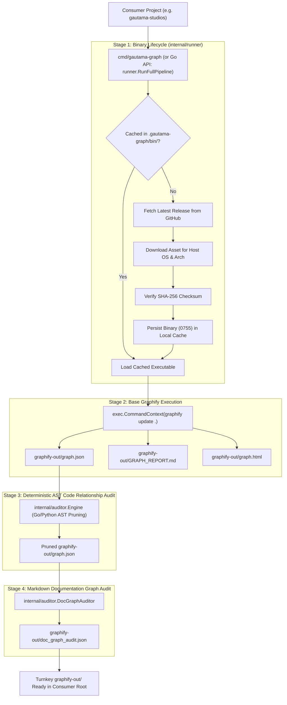

# Requirements Specification: Encapsulated Graphify Binary Manager & Single-Entrypoint Orchestrator

- **Feature Title**: Encapsulated Graphify Binary Manager & Single-Entrypoint Orchestrator
- **Sequence Code**: `001`
- **Target Milestone**: `Milestone 1 (V1.1.0)`
- **Persona Drivers & Gatekeepers**:
  - Lead AI Workflow Architect & Governor ([@nexus.md](../../.agents/personas/nexus.md))
  - Feature Engineer ([@feature-engineer.md](../../.agents/personas/feature-engineer.md))
  - Security & Compliance Auditor ([@security-auditor.md](../../.agents/personas/security-auditor.md))
  - Regression & Test Automation Guard ([@regression-tester.md](../../.agents/personas/regression-tester.md))
- **Status**: `🟢 DELIVERED & CERTIFIED V1.1.0`

---

## 1. Executive Summary & Problem Scope

### 1.1 Context & Background
In the current Gautama ecosystem, repositories such as `gautama-studios` import `github.com/jameshawkins-art/gautama-graph` to establish architectural knowledge graphs and deterministic AST relationship audits. Under tag `v1.0.2`, consumers executing `cmd/graphify-ast-audit` and `cmd/graphify-doc-audit` successfully generate AST provenance annotations and documentation validation.

However, **the foundational Graphify knowledge graph extraction, community clustering, `GRAPH_REPORT.md`, and interactive `graph.html` visualizer are not generated** unless the consumer manually installs Graphify via host-level Python (`pip` or `uv`) and manually coordinates multi-step extraction commands (as detailed in [scripts/gautama-studio-execute.sh](../../scripts/gautama-studio-execute.sh)).

### 1.2 Strategic Goal & Functional Scope
Transform `gautama-graph` into a **self-contained, turnkey, zero-prerequisite single point of integration** for all Graphify knowledge graph needs across consumer repositories.



---

## 2. Go Interface & Data Model Specifications

The new capability will reside in package `internal/runner` while extending public CLI entrypoints in `cmd/gautama-graph`.

### 2.1 Domain Data Models & Enums

```go
package runner

import (
	"context"
	"time"
)

// PlatformTarget represents the resolved host operating system and CPU architecture.
type PlatformTarget struct {
	OS   string `json:"os"`   // "linux", "darwin", "windows"
	Arch string `json:"arch"` // "amd64", "arm64"
}

// ReleaseAsset defines a downloadable release asset from GitHub releases.
type ReleaseAsset struct {
	Name               string `json:"name"`
	BrowserDownloadURL string `json:"browser_download_url"`
	Size               int64  `json:"size"`
	ChecksumSHA256     string `json:"checksum_sha256,omitempty"`
}

// ReleaseMetadata encapsulates release tag information from GitHub API.
type ReleaseMetadata struct {
	TagName     string                  `json:"tag_name"`
	PublishedAt time.Time               `json:"published_at"`
	Assets      map[string]ReleaseAsset `json:"assets"` // key: "<os>-<arch>"
}

// RunnerConfig configures binary caching, timeout constraints, and target workspace paths.
type RunnerConfig struct {
	WorkspaceRootPath  string        `json:"workspace_root_path"`
	CacheDirectoryPath string        `json:"cache_directory_path"`
	GitHubRepoOwner    string        `json:"github_repo_owner"`
	GitHubRepoName     string        `json:"github_repo_name"`
	ExecutionTimeout   time.Duration `json:"execution_timeout"`
	StrictAudit        bool          `json:"strict_audit"`
	ForceDownload      bool          `json:"force_download"`
	VerboseLogging     bool          `json:"verbose_logging"`
}

// PipelineStageStatus records execution metrics for an individual pipeline stage.
type PipelineStageStatus struct {
	StageName string        `json:"stage_name"`
	Duration  time.Duration `json:"duration"`
	Success   bool          `json:"success"`
	Error     string        `json:"error,omitempty"`
}

// PipelineReport summarizes the complete multi-stage execution pass.
type PipelineReport struct {
	Timestamp      time.Time             `json:"timestamp"`
	TotalDuration  time.Duration         `json:"total_duration"`
	BinarySource   string                `json:"binary_source"` // "CACHED", "DOWNLOADED_GITHUB"
	BinaryVersion  string                `json:"binary_version"`
	Stages         []PipelineStageStatus `json:"stages"`
	GraphNodeCount int                   `json:"graph_node_count"`
	GraphEdgeCount int                   `json:"graph_edge_count"`
	PrunedPhantoms int                   `json:"pruned_phantoms"`
	DocOrphanCount int                   `json:"doc_orphan_count"`
	BrokenDocLinks int                   `json:"broken_doc_links"`
}
```

### 2.2 Go Interface Contracts (ISP Compliant)

```go
package runner

import (
	"context"
)

// ReleaseDownloader abstracts fetching release metadata and binaries from GitHub.
type ReleaseDownloader interface {
	// GetLatestRelease fetches metadata for the latest release on GitHub.
	GetLatestRelease(ctx context.Context, owner, repo string) (*ReleaseMetadata, error)

	// DownloadBinary downloads and caches the target binary for the given platform target.
	DownloadBinary(ctx context.Context, asset ReleaseAsset, destinationPath string) error

	// VerifyChecksum validates a downloaded binary file against expected SHA-256 hash.
	VerifyChecksum(filePath, expectedSHA256 string) (bool, error)
}

// BinaryManager manages local binary resolution, cache validation, and executable permissions.
type BinaryManager interface {
	// EnsureBinary ensures a valid Graphify binary exists locally, downloading if necessary.
	EnsureBinary(ctx context.Context, cfg RunnerConfig) (string, string, error) // returns (binaryPath, version, error)
}

// SubprocessRunner orchestrates headless Graphify subprocess commands with stream isolation.
type SubprocessRunner interface {
	// ExecuteCommand runs a subcommand on the Graphify binary within the target workspace.
	ExecuteCommand(ctx context.Context, binaryPath, workspaceRoot string, args ...string) ([]byte, []byte, error)
}

// OrchestratorService defines the primary end-to-end multi-stage pipeline coordinator.
type OrchestratorService interface {
	// RunPipeline coordinates Download -> Base Extraction -> AST Audit -> Doc Graph Audit.
	RunPipeline(ctx context.Context, cfg RunnerConfig) (*PipelineReport, error)
}
```

---

## 3. Filesystem Confinement & Two-Phase Persistence Plan

### 3.1 Local Binary Caching Strategy
1. **Cache Location Resolution**:
   - Default cache path: `~/.cache/gautama-graph/bin/graphify-<version>-<os>-<arch>` (or `<workspaceRoot>/.gautama-graph/bin/`).
   - Binary permissions: strictly `0755` (`-rwxr-xr-x`).
2. **Path Confinement Verification**:
   - Every file download and cache read must assert `filepath.Clean` and pass through `ValidatePathBoundary` to ensure target paths cannot traverse outside permitted directories.

### 3.2 Atomic Persistence Protocol
- When the runner triggers base extraction, AST relationship auditing, and documentation graph validation:
  - All outputs (`graph.json`, `doc_graph_audit.json`) must follow the **Two-Phase Commit Protocol**:
    1. Write output payload to `<targetPath>.tmp`.
    2. Commit atomically via `os.Rename(<targetPath>.tmp, <targetPath>)`.
    3. On failure, cleanly remove the `.tmp` staging artifact.
  - All stateful file modifications in `internal/runner` and `internal/auditor` must synchronize with `sync.Mutex`.

---

## 4. Cyber Security Threat Modeling & Subprocess Safety

### 4.1 Threat Matrix & Mitigation Plan

| Threat Vector | Severity | Attack Surface | Mitigation Strategy |
| :--- | :---: | :--- | :--- |
| **Tampered / Malicious Binary Download** | **Critical** | Remote HTTP download of external executable | Enforce HTTPS TLS 1.3; restrict download domains to `api.github.com` and `github.com/Graphify-Labs/`; calculate SHA-256 hash immediately after download and verify against published release checksums before executing or assigning `0755` permissions. |
| **Command & Argument Injection** | **High** | `exec.CommandContext` invocation | Pass arguments strictly as discrete slice elements (`[]string{"update", "."}`); prohibit `sh -c`, `bash -c`, or any shell string interpolation. |
| **Path Traversal via Release Archive Extraction** | **High** | Tar/zip asset decompression | Validate all archive entry paths against target directory root using `filepath.Rel` and reject entries with `..` or leading `/`. |
| **Subprocess Pipe Deadlock & Resource Starvation** | **Medium** | OS stdin/stdout buffers & lingering child processes | Enforce `context.WithTimeout(ctx, cfg.ExecutionTimeout)`; read stdout and stderr concurrently into discrete `bytes.Buffer` instances; ensure process group termination upon context cancellation. |
| **Unsafe Memory & Third-Party Vulnerabilities** | **Medium** | Go runtime & imported libraries | Strict zero-tolerance for `import "unsafe"` and CGo; maintain 100% pure Go standard library dependencies. |

---

## 5. Edge Case & Failure Mode Matrix

| Scenario | Execution Condition | Expected System Behavior | Fallback / Remediation |
| :--- | :--- | :--- | :--- |
| **Offline Mode with Cached Binary** | No internet connectivity, valid cached binary present in `.gautama-graph/bin/` | Skip GitHub release query; log `[WARN] Offline mode: using cached Graphify vX.Y.Z`; execute extraction normally. | Proceed with cached version without halting pipeline. |
| **Offline Mode without Cached Binary** | No internet connectivity, zero cached binaries in filesystem | Fail gracefully with error `E_NO_BINARY_AVAILABLE: unable to connect to GitHub releases and no cached binary exists in ~/.cache/gautama-graph/bin/`. | Prompt user to connect to internet for initial bootstrap. |
| **Corrupted Download / Checksum Mismatch** | Downloaded bytes fail SHA-256 comparison | Immediately delete temporary downloaded file; abort before chmod `0755`; return security error `E_CHECKSUM_MISMATCH`. | Retry download once; if persistent failure, halt pipeline. |
| **Non-Zero Graphify Subprocess Exit** | Graphify crashes due to syntax error in user repo | Capture complete stderr buffer; wrap error with context `fmt.Errorf("graphify extraction failed (exit %d): %s", exitCode, stderr)`; emit partial report. | Return clean error report indicating offending file. |
| **Read-Only Filesystem in Consumer Repo** | Consumer project `graphify-out/` is mounted read-only | Catch `os.ErrPermission` on `.tmp` write; log explicit error and exit without partial corruption. | Clean failure with non-zero exit code. |

---

## 6. Definition of Done (DoD) & Acceptance Criteria

### 6.1 Acceptance Criteria
1. **Zero Host Prerequisite Execution**:
   - On a machine without `uv`, `pip`, or Python in `PATH`, invoking `cmd/gautama-graph` inside a target repository (e.g. `gautama-studios`) successfully completes the 4-stage pipeline and creates `graphify-out/graph.json`, `graphify-out/GRAPH_REPORT.md`, `graphify-out/graph.html`, and `graphify-out/doc_graph_audit.json`.
2. **Automated Release Management**:
   - `internal/runner/downloader.go` automatically resolves platform (`linux/amd64`, `darwin/arm64`, etc.), downloads from GitHub releases, validates SHA-256 checksums, and caches the executable.
3. **Subprocess Isolation & Stream Hygiene**:
   - Subprocess calls are bounded by configurable execution deadlines and captured cleanly via `bytes.Buffer`.
4. **Deterministic In-Repo Auditing Integration**:
   - The orchestrator runs in-repo Go/Python AST relationship auditing to prune phantom edges and runs Markdown doc-graph link validation with zero manual steps.
5. **Quality & Coverage Gate**:
   - `GOWORK=off go test -v -race ./internal/runner/... ./internal/auditor/...` passes 100% with 0 race conditions.
   - Package statement coverage on `internal/runner` reaches $\ge 85\%$.
