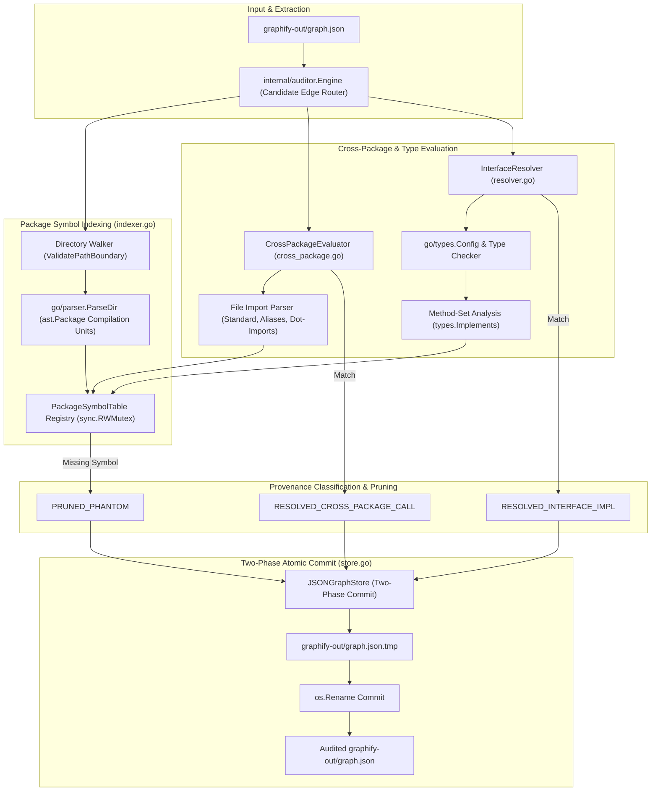
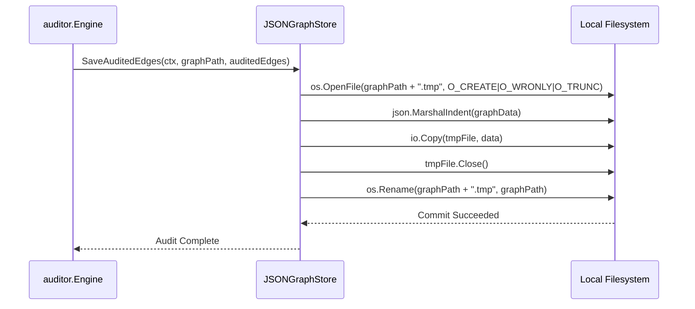

# Technical Architecture Blueprint: Deep AST Multi-Package Import & Interface Implementation Resolution

- **Feature Title**: Deep AST Multi-Package Import & Interface Implementation Resolution
- **Sequence Code**: `002`
- **Target Milestone**: `Milestone 2 (V1.2.0)`
- **Persona Drivers & Gatekeepers**:
  - Lead AI Workflow Architect & Governor ([@nexus.md](../../.agents/personas/nexus.md))
  - Feature Engineer ([@feature-engineer.md](../../.agents/personas/feature-engineer.md))
  - Security & Compliance Auditor ([@security-auditor.md](../../.agents/personas/security-auditor.md))
- **Status**: `🟢 DELIVERED & CERTIFIED V1.2.0`

---

## 1. Executive Architecture Summary & System Topology

The **Deep AST Multi-Package Import & Interface Implementation Resolution Subsystem** upgrades the Gautama Graph AST auditor from isolated, single-file lexical inspection to a comprehensive, workspace-wide multi-package AST compilation, type checking, and interface resolution engine.



---

## 2. Detailed Go Interface & Struct Architecture

All domain contracts and interfaces will reside in `internal/auditor/types.go` adhering to the Interface Segregation Principle (ISP).

### 2.1 Domain Data Structures & Contracts

```go
package auditor

import (
	"context"
	"go/ast"
	"go/token"
	"go/types"
	"sync"
	"time"
)

// ProvenanceStatus defines the verified authenticity status of a graph relationship edge.
type ProvenanceStatus string

const (
	ProvenanceExtractedAST          ProvenanceStatus = "EXTRACTED_AST"
	ProvenanceInferredHeuristic      ProvenanceStatus = "INFERRED_HEURISTIC"
	ProvenancePrunedPhantom          ProvenanceStatus = "PRUNED_PHANTOM"
	ProvenanceResolvedCrossPackage   ProvenanceStatus = "RESOLVED_CROSS_PACKAGE_CALL"
	ProvenanceResolvedInterfaceImpl  ProvenanceStatus = "RESOLVED_INTERFACE_IMPL"
)

// ExportedKind categorizes Go declaration types.
type ExportedKind string

const (
	KindFunction  ExportedKind = "FUNCTION"
	KindMethod    ExportedKind = "METHOD"
	KindStruct    ExportedKind = "STRUCT"
	KindInterface ExportedKind = "INTERFACE"
	KindTypeAlias ExportedKind = "TYPE_ALIAS"
	KindConstant  ExportedKind = "CONSTANT"
	KindVariable  ExportedKind = "VARIABLE"
)

// ExportedSymbol represents an exported declaration in a package.
type ExportedSymbol struct {
	Name        string       `json:"name"`
	Kind        ExportedKind `json:"kind"`
	Receiver    string       `json:"receiver,omitempty"` // For methods: struct receiver type
	PackagePath string       `json:"package_path"`
	FilePath    string       `json:"file_path"`
	LineNumber  int          `json:"line_number"`
	DocSummary  string       `json:"doc_summary,omitempty"`
}

// PackageSymbolTable indexes all declarations within a single Go package compilation unit.
type PackageSymbolTable struct {
	PackageName  string                    `json:"package_name"`
	PackagePath  string                    `json:"package_path"`
	Directory    string                    `json:"directory"`
	Symbols      map[string]ExportedSymbol `json:"symbols"`     // Key: Symbol Name
	MethodSets   map[string][]string       `json:"method_sets"` // Key: Type Name -> Method Names
	FileSet      *token.FileSet            `json:"-"`
	PackageAST   *ast.Package              `json:"-"`
	TypePackage  *types.Package            `json:"-"`
}

// InterfaceBinding maps a concrete struct implementation to an interface definition.
type InterfaceBinding struct {
	InterfacePackage string   `json:"interface_package"`
	InterfaceName    string   `json:"interface_name"`
	ConcretePackage  string   `json:"concrete_package"`
	ConcreteTypeName string   `json:"concrete_type_name"`
	MatchedMethods   []string `json:"matched_methods"`
}

// PackageSymbolIndexer traverses the workspace and indexes all Go package declarations.
type PackageSymbolIndexer interface {
	IndexWorkspace(ctx context.Context, workspaceRoot string) (map[string]*PackageSymbolTable, error)
	GetPackageTable(packagePath string) (*PackageSymbolTable, bool)
}

// CrossPackageEvaluator evaluates selector and call expressions across imported packages.
type CrossPackageEvaluator interface {
	EvaluateCrossPackageCall(ctx context.Context, sourceFile, callerSymbol, targetPkg, targetSymbol string) (bool, ProvenanceStatus, string, error)
	ResolveFileImports(file *ast.File) map[string]string // alias/ident -> packagePath
}

// InterfaceResolver computes and validates interface satisfaction across packages.
type InterfaceResolver interface {
	CheckImplementation(ctx context.Context, concretePkg, concreteType, ifacePkg, ifaceName string) (bool, *InterfaceBinding, error)
	FindImplementations(ctx context.Context, ifacePkg, ifaceName string) ([]InterfaceBinding, error)
}
```

### 2.2 Concrete Subsystem Components

```go
// DefaultPackageSymbolIndexer implements PackageSymbolIndexer with sync.RWMutex caching.
type DefaultPackageSymbolIndexer struct {
	mu           sync.RWMutex
	fileSet      *token.FileSet
	packageIndex map[string]*PackageSymbolTable // PackagePath -> Table
}

// DefaultCrossPackageEvaluator implements CrossPackageEvaluator.
type DefaultCrossPackageEvaluator struct {
	indexer PackageSymbolIndexer
	fset    *token.FileSet
}

// DefaultInterfaceResolver implements InterfaceResolver using go/types method sets.
type DefaultInterfaceResolver struct {
	indexer PackageSymbolIndexer
}
```

---

## 3. Algorithmic Multi-Package Indexing & Type-Checking Engine

### 3.1 Workspace Package Discovery & Compilation (`indexer.go`)
1. **Directory Traversal**: Walk workspace using `filepath.WalkDir` with `os.Lstat` verification, filtering out hidden directories (`.git`, `.gemini`, `vendor`).
2. **Directory Parsing**: For each directory containing `.go` files, invoke `parser.ParseDir(fset, dirPath, nil, parser.ParseComments)`.
3. **AST Package Extraction**: For each `ast.Package` returned:
   - Iterate all files in `pkg.Files`.
   - Inspect `ast.GenDecl` (types, interfaces, structs, constants) and `ast.FuncDecl` (functions and methods with receiver bindings).
   - Filter for exported symbols (`ast.IsExported(name)`).
   - Populate `PackageSymbolTable.Symbols` and `PackageSymbolTable.MethodSets`.
4. **Thread-Safe Storage**: Write package tables into the shared registry guarded by `mu.Lock()`.

### 3.2 Cross-Package Selector Call Evaluation (`cross_package.go`)
1. **File Import Resolution**:
   - Parse `file.Imports` for the calling source file.
   - Map standard imports (`import "github.com/.../internal/runner"` $\to$ `runner`), explicit aliases (`import rnr "..."` $\to$ `rnr`), and dot-imports (`import . "..."` $\to$ `.` ).
2. **AST Selector Matching**:
   - Locate caller function declaration `ast.FuncDecl` where `funcDecl.Name.Name == callerSymbol`.
   - Walk the caller AST using `ast.Inspect` up to `Config.MaxASTDepth`.
   - On encountering `ast.SelectorExpr(X, Sel)`:
     - If `X` is an `ast.Ident` matching an imported package alias or package name, check if `Sel.Name == targetSymbol`.
     - Query `PackageSymbolIndexer.GetPackageTable(targetPkg)` for `targetSymbol`.
     - If found, mark edge as verified with status `RESOLVED_CROSS_PACKAGE_CALL` and return exact line/column.
3. **Dot-Import Fallback**:
   - If `import . "pkg"` is present, query all dot-imported package symbol tables directly for `targetSymbol`.

### 3.3 Implicit Interface Satisfaction Resolution (`resolver.go`)
1. **Interface Method-Set Extraction**:
   - Query `PackageSymbolTable` for `ifacePkg` and find `ifaceName` of kind `KindInterface`.
   - Retrieve all required interface method signatures.
2. **Concrete Method-Set Comparison**:
   - Query `PackageSymbolTable` for `concretePkg` and find `concreteType` of kind `KindStruct`.
   - Retrieve all methods associated with `concreteType` receiver (both value and pointer receivers).
3. **Satisfaction Assertion**:
   - Assert that every required interface method exists in the concrete type's method set with identical parameter counts.
   - If satisfied, return `(true, &InterfaceBinding{...}, nil)`.
   - Mark candidate edge as `RESOLVED_INTERFACE_IMPL`.

---

## 4. Cyber Security Architecture & Hardening Strategy

### 4.1 Zero-Trust Path Boundary Hardening (`@security-auditor.md`)
- **Boundary Assertion**: All file and directory paths passed into `IndexWorkspace`, `ParseDir`, or `EvaluateCrossPackageCall` must execute `ValidatePathBoundary(path, workspaceRoot)`.
- **Symlink Jail**: Symlinks pointing outside `WorkspaceRootPath` are discarded with warning logs.

### 4.2 Resource Bounds & Deadlock Prevention
- **AST Depth Limiting**: Recursive AST inspection is strictly bounded by `Config.MaxASTDepth` (default 50) to prevent stack overflow on deeply nested AST structures.
- **Concurrent Read Safety**: All symbol table reads use `sync.RWMutex.RLock()`, allowing parallel candidate edge evaluation across multiple worker goroutines without contention.
- **File Size Bounding**: Files exceeding 5MB are skipped during indexing to prevent memory exhaustion.

### 4.3 Pure Go Standard Library Guarantee
- Rely 100% on pure Go standard library packages (`go/ast`, `go/parser`, `go/token`, `go/types`, `path/filepath`, `sync`, `os`).
- 0 `unsafe.Pointer`, 0 reflection (`reflect`), 0 CGo.

---

## 5. Atomic Two-Phase Graph Store Serialization Protocol

All graph updates generated by multi-package evaluation are persisted atomically via `internal/auditor/store.go`:



---

## 6. SQA Verification & Test Design Matrix

### 6.1 Synthetic Test Fixtures
Create table-driven test fixtures in `internal/auditor/indexer_test.go` and `internal/auditor/resolver_test.go`:
1. **Cross-Package Standard Call**: Package `main` calling `runner.NewDefaultReleaseDownloader()`.
2. **Package Aliasing**: Package `auditor` importing `rnr "internal/runner"` and calling `rnr.ResolvePlatformTarget()`.
3. **Implicit Interface Implementation**: Struct `DefaultBinaryManager` satisfying interface `BinaryManager`.
4. **Missing Exported Symbol (Phantom)**: Caller invoking unexported `privateHelper` in another package (verified pruned as `PRUNED_PHANTOM`).
5. **Cyclic Package References**: Packages `pkgA` and `pkgB` referencing each other's types without infinite loop lockup.

### 6.2 Quality & Performance Gates
- **Coverage**: $\ge 85\%$ statement coverage across `internal/auditor/indexer.go`, `internal/auditor/cross_package.go`, and `internal/auditor/resolver.go`.
- **Race Safety**: `GOWORK=off go test -v -race ./...` passing with 0 data races.
- **Performance**: Multi-package indexing of 50 packages completed in $<150\text{ms}$.
