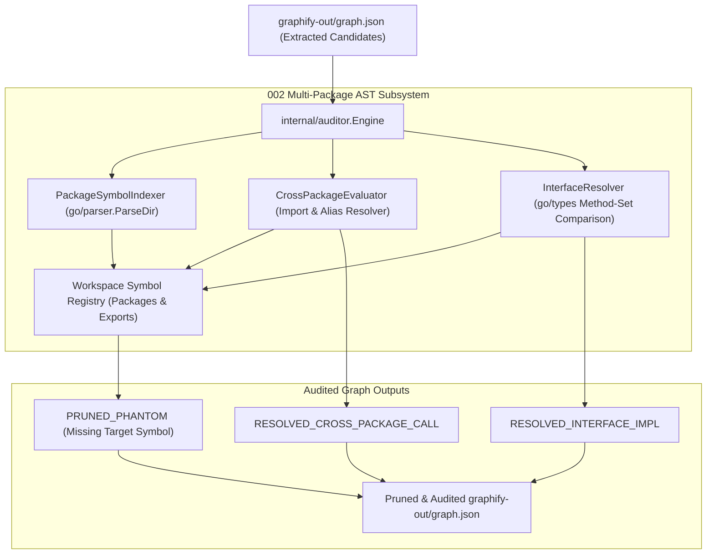

# Requirements Specification: Deep AST Multi-Package Import & Interface Implementation Resolution

- **Feature Title**: Deep AST Multi-Package Import & Interface Implementation Resolution
- **Sequence Code**: `002`
- **Target Milestone**: `Milestone 2 (V1.2.0)`
- **Persona Drivers & Gatekeepers**:
  - Lead AI Workflow Architect & Governor ([@nexus.md](../../.agents/personas/nexus.md))
  - Feature Engineer ([@feature-engineer.md](../../.agents/personas/feature-engineer.md))
  - Security & Compliance Auditor ([@security-auditor.md](../../.agents/personas/security-auditor.md))
  - Regression & Test Automation Guard ([@regression-tester.md](../../.agents/personas/regression-tester.md))
- **Status**: `🟢 DELIVERED & CERTIFIED V1.2.0`

---

## 1. Executive Summary & Strategic Scope

### Problem Statement
Currently, the AST relationship auditor (`internal/auditor/evaluator.go`) operates exclusively on single-file AST parsing scopes (`ast.Inspect`). While this effectively eliminates local phantom calls within the same source file, it suffers from critical architectural blind spots in real-world multi-package Go codebases:
1. **Cross-Package Call Resolution**: When code in Package A invokes an exported function or constructor from Package B (`import "pkg/b"; b.NewService()`), single-file lexical inspection cannot verify whether `b.NewService` exists in the target package's exported symbol table, nor can it trace imported package aliases (`import svc "pkg/b/v2"`).
2. **Interface Implementation & Polymorphism**: In Go, interfaces are satisfied implicitly without explicit `implements` keywords. When a caller interacts with an interface (`runner.ReleaseDownloader`), single-file AST inspection cannot identify concrete structs (`DefaultReleaseDownloader`) implementing those method signatures across packages. Consequently, valid polymorphic edges generated during heuristic extraction are either left unclassified or incorrectly flagged as phantoms.
3. **Multi-File Package Compilation Scope**: Symbols defined in sibling files within the same package directory (e.g. `types.go` declaring a struct instantiated in `engine.go`) are checked file-by-file rather than compiled as a unified package compilation unit (`ast.Package`).

### Strategic Capability & Target Architecture
Architect and implement a **Deep AST Multi-Package Import & Interface Implementation Resolution Subsystem** inside `internal/auditor/` that:
1. **Workspace Package Symbol Indexer (`internal/auditor/indexer.go`)**:
   - Traverses workspace directories, parses full package compilation units via `go/parser.ParseDir`, and builds a workspace-wide symbol registry mapping packages to exported declarations.
2. **Deterministic Interface Implementation Resolver (`internal/auditor/resolver.go`)**:
   - Uses Go's `go/types` / method-set comparisons to deterministically calculate and verify implicit interface satisfaction (`types.Implements(concrete, iface)`).
3. **Cross-Package Import & Selector Evaluator (`internal/auditor/cross_package.go`)**:
   - Parses file import blocks, maps standard imports, local package aliases, and dot-imports (`import . "..."`), and verifies selector call chains across package boundaries.
4. **Enhanced Provenance Taxonomy**:
   - Extends edge metadata with new high-confidence classifications:
     - `RESOLVED_CROSS_PACKAGE_CALL`: Verified cross-package function/method invocation.
     - `RESOLVED_INTERFACE_IMPL`: Verified struct-to-interface polymorphic implementation edge.



---

## 2. Go Interface Specifications & Domain Model Contracts

All new domain interfaces and data structures will extend `internal/auditor/types.go` following Interface Segregation Principles (ISP) and strict PascalCase naming.

```go
package auditor

import (
	"context"
	"go/ast"
	"go/token"
	"go/types"
)

// ProvenanceStatus defines the verified authenticity status of a graph relationship edge.
type ProvenanceStatus string

const (
	// ProvenanceExtractedAST indicates direct single-file AST call extraction.
	ProvenanceExtractedAST ProvenanceStatus = "EXTRACTED_AST"
	// ProvenanceInferredHeuristic indicates unverified or heuristic extraction.
	ProvenanceInferredHeuristic ProvenanceStatus = "INFERRED_HEURISTIC"
	// ProvenancePrunedPhantom indicates an edge proven false by AST analysis.
	ProvenancePrunedPhantom ProvenanceStatus = "PRUNED_PHANTOM"
	// ProvenanceResolvedCrossPackage indicates a verified cross-package call expression.
	ProvenanceResolvedCrossPackage ProvenanceStatus = "RESOLVED_CROSS_PACKAGE_CALL"
	// ProvenanceResolvedInterfaceImpl indicates verified implicit interface implementation.
	ProvenanceResolvedInterfaceImpl ProvenanceStatus = "RESOLVED_INTERFACE_IMPL"
)

// ExportedKind categorizes Go declaration types.
type ExportedKind string

const (
	KindFunction  ExportedKind = "FUNCTION"
	KindMethod    ExportedKind = "METHOD"
	KindStruct    ExportedKind = "STRUCT"
	KindInterface ExportedKind = "INTERFACE"
	KindTypeAlias ExportedKind = "TYPE_ALIAS"
	KindConstant  ExportedKind = "CONSTANT"
	KindVariable  ExportedKind = "VARIABLE"
)

// ExportedSymbol represents an exported declaration in a package.
type ExportedSymbol struct {
	Name        string       `json:"name"`
	Kind        ExportedKind `json:"kind"`
	Receiver    string       `json:"receiver,omitempty"` // For methods: struct receiver type
	PackagePath string       `json:"package_path"`
	FilePath    string       `json:"file_path"`
	LineNumber  int          `json:"line_number"`
	DocSummary  string       `json:"doc_summary,omitempty"`
}

// PackageSymbolTable indexes all declarations within a single Go package compilation unit.
type PackageSymbolTable struct {
	PackageName  string                    `json:"package_name"`
	PackagePath  string                    `json:"package_path"`
	Directory    string                    `json:"directory"`
	Symbols      map[string]ExportedSymbol `json:"symbols"`       // Key: Symbol Name
	MethodSets   map[string][]string       `json:"method_sets"`   // Key: Type Name -> Method Names
	FileSet      *token.FileSet            `json:"-"`
	PackageAST   *ast.Package              `json:"-"`
	TypePackage  *types.Package            `json:"-"`
}

// InterfaceBinding maps a concrete struct implementation to an interface definition.
type InterfaceBinding struct {
	InterfacePackage string   `json:"interface_package"`
	InterfaceName    string   `json:"interface_name"`
	ConcretePackage  string   `json:"concrete_package"`
	ConcreteTypeName string   `json:"concrete_type_name"`
	MatchedMethods   []string `json:"matched_methods"`
}

// PackageSymbolIndexer traverses the workspace and indexes all Go package declarations.
type PackageSymbolIndexer interface {
	// IndexWorkspace parses and indexes all Go packages within clean workspace root.
	IndexWorkspace(ctx context.Context, workspaceRoot string) (map[string]*PackageSymbolTable, error)
	// GetPackageTable retrieves the indexed symbol table for a specific package path.
	GetPackageTable(packagePath string) (*PackageSymbolTable, bool)
}

// CrossPackageEvaluator evaluates selector and call expressions across imported packages.
type CrossPackageEvaluator interface {
	// EvaluateCrossPackageCall checks if caller in sourceFile calls targetSymbol in targetPkg.
	EvaluateCrossPackageCall(ctx context.Context, sourceFile, callerSymbol, targetPkg, targetSymbol string) (bool, ProvenanceStatus, string, error)
	// ResolveFileImports maps all import declarations in a source file to package tables.
	ResolveFileImports(file *ast.File) map[string]string // alias/ident -> packagePath
}

// InterfaceResolver computes and validates interface satisfaction across packages.
type InterfaceResolver interface {
	// CheckImplementation determines if concreteType in concretePkg satisfies iface in ifacePkg.
	CheckImplementation(ctx context.Context, concretePkg, concreteType, ifacePkg, ifaceName string) (bool, *InterfaceBinding, error)
	// FindImplementations returns all concrete types implementing the specified interface.
	FindImplementations(ctx context.Context, ifacePkg, ifaceName string) ([]InterfaceBinding, error)
}
```

---

## 3. Filesystem Confinement, Zero-Trust Safety & Two-Phase Persistence Plan

### 3.1 Zero-Trust Path Confinement (`@security-auditor.md`)
- All directory walking, file parsing, and package resolution calls must pass through `ValidatePathBoundary(targetPath, workspaceRoot)`.
- Symlink traversal protection: Symlinks pointing outside the workspace boundary are ignored during `filepath.WalkDir` with `os.Lstat` verification.
- Normalized path caching: All stored package paths and file paths are stored relative to `WorkspaceRootPath` using forward slashes (`/`) for cross-platform deterministic serialization.

### 3.2 Two-Phase Atomic Persistence Protocol
- Graph modifications in `internal/auditor/store.go` and `internal/auditor/doc_auditor.go` must stage to temporary buffers (`graph.json.tmp` and `doc_graph_audit.json.tmp`) before calling `os.Rename`.
- Read and write operations to the in-memory `PackageSymbolTable` registry are guarded with `sync.RWMutex` to guarantee safe concurrent reads during parallel edge evaluation.

---

## 4. Cyber Security Threat Modeling & Subprocess Safety

### 4.1 STRIDE Threat Model

| Threat Category | Potential Vector | Mitigation & Technical Control |
| :--- | :--- | :--- |
| **Spoofing** | Forged package import paths pointing to malicious external packages | Restrict indexing strictly to workspace root packages and local `go.mod` module tree. |
| **Tampering** | In-flight mutation of AST nodes or symbol tables during concurrent evaluation | Use read-only AST references and guard symbol registry with `sync.RWMutex`. |
| **Repudiation** | Unverifiable edge provenance mutations | Assign explicit, auditable provenance tags (`RESOLVED_CROSS_PACKAGE_CALL`, `RESOLVED_INTERFACE_IMPL`) with line/column metadata. |
| **Information Disclosure** | Leakage of host filesystem paths outside workspace root | Normalize all file paths relative to `WorkspaceRootPath` before serializing to `graphify-out/`. |
| **Denial of Service** | Deeply recursive types, cyclic package imports, or massive files exhausting memory | Enforce `Config.MaxASTDepth` (default 50), timeout budgets (60s default), and maximum file size limits (5MB per `.go` file). |
| **Elevation of Privilege** | Code execution via `go/types` or reflection | Use pure lexical and static type-checking APIs (`go/ast`, `go/parser`, `go/types`) with 0 reflection and 0 dynamic execution. |

### 4.2 Standard Library & Memory Safety Guardrails
- **100% Pure Go Standard Library**: Rely exclusively on `go/ast`, `go/parser`, `go/token`, and `go/types`.
- **Zero Unsafe / Zero CGo**: Total ban on `import "unsafe"` and unvetted CGo bindings.
- **Dependency Audit**: Verified via `govulncheck` to maintain 0 known vulnerabilities.

---

## 5. Definition of Done (DoD), Acceptance Criteria & Edge Cases

### 5.1 Acceptance Criteria

1. **Workspace Package Symbol Indexing**:
   - Successfully indexes all packages and `.go` files in the workspace, compiling unified `ast.Package` compilation units.
   - Sibling files within the same package share symbol definitions without false phantom flags.
2. **Cross-Package Call Verification**:
   - Resolves exported function calls (e.g. `runner.NewDefaultReleaseDownloader`), exported method calls on struct instances, and constructor factory calls.
   - Accurately resolves local package aliases (`import rnr "internal/runner"` -> `rnr.ResolvePlatformTarget()`).
3. **Deterministic Interface Satisfaction**:
   - Implicit interface implementations across packages (e.g. `DefaultBinaryManager` satisfying `BinaryManager`) are proven using method-set comparison and tagged with `RESOLVED_INTERFACE_IMPL`.
4. **False Positive Elimination**:
   - Valid cross-package relationships in multi-package repositories are verified rather than pruned as phantoms.
5. **Quality & Performance Thresholds**:
   - Multi-package indexing adds $<150\text{ms}$ overhead on repos with up to 50,000 LOC.
   - Test suite passes with `GOWORK=off go test -v -race ./...` (0 data races, $\ge 85\%$ statement coverage on new auditor files).

### 5.2 Edge Case & Failure Mode Matrix

| Scenario / Edge Case | Expected System Behavior | Fallback / Recovery Strategy |
| :--- | :--- | :--- |
| **Cyclic Package Imports** | Handled gracefully without infinite recursion | Package indexer detects visited paths and terminates cycle traversal. |
| **Dot Imports (`import . "pkg"`)** | Symbols from imported package injected into local file symbol scope | Merges exported symbols of target package into file lookup map. |
| **Blank Imports (`import _ "pkg"`)** | No symbols imported for selector evaluation | Ignores blank imports during selector resolution pass. |
| **Missing Exported Symbol** | Target package exists but requested function/struct is unexported or missing | Correctly marks candidate edge as `PRUNED_PHANTOM`. |
| **Malformed Go Syntax File** | File contains syntax error during `ParseDir` | Logs warning, skips unparseable file, and indexes remaining valid files. |
| **Context Cancellation / Timeout** | Pipeline execution timeout exceeded | Aborts AST evaluation immediately and returns partial safe report. |
