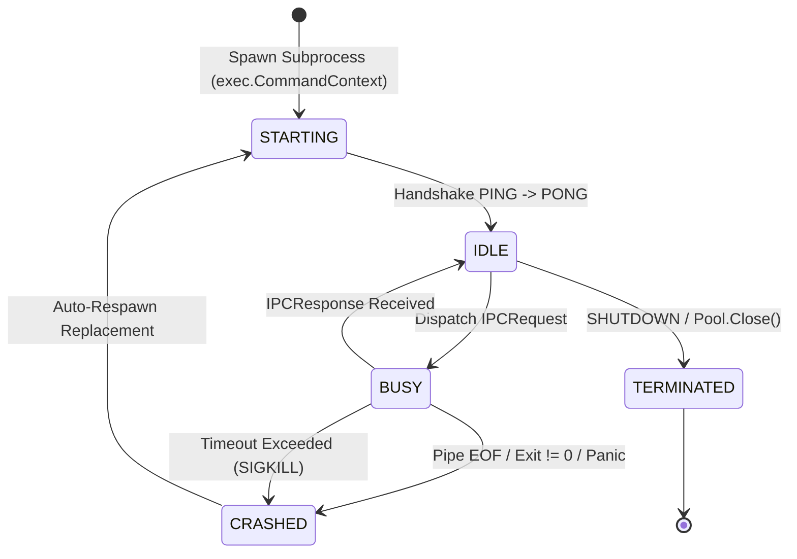

# Architecture Blueprint: Streaming AST IPC Bridge & Persistent Subprocess Daemon Pool

- **Feature Title**: Streaming AST IPC Bridge & Persistent Subprocess Daemon Pool
- **Sequence Code**: `003`
- **Target Milestone**: `Milestone 3 (V1.3.0)`
- **Persona Drivers & Gatekeepers**:
  - Lead AI Workflow Architect & Governor ([@nexus.md](../../.agents/personas/nexus.md))
  - Feature Engineer ([@feature-engineer.md](../../.agents/personas/feature-engineer.md))
  - Debugger & Remediation Specialist ([@debugger-remediation.md](../../.agents/personas/debugger-remediation.md))
  - Security & Compliance Auditor ([@security-auditor.md](../../.agents/personas/security-auditor.md))
- **Status**: `🟢 DELIVERED & CERTIFIED V1.3.0`

---

## 1. System Architecture & High-Level Topology

This blueprint details the architecture for the **Streaming AST IPC Bridge and Persistent Subprocess Daemon Pool** (`internal/auditor/ipc_bridge.go` and `python/ast_daemon.py`), replacing ephemeral one-shot Python invocations with a managed pool of long-lived worker daemons communicating over bidirectional **Newline-Delimited JSON (NDJSON)** streams.

```mermaid
flowchart TD
    Engine["internal/auditor.Engine"] --> Pool["DefaultIPCWorkerPool (internal/auditor/ipc_bridge.go)"]
    
    subgraph PoolSupervisor ["IPC Worker Pool Supervisor"]
        Pool --> WorkerQueue["Idle Worker Channel (chan *workerSession)"]
        Pool --> Watchdog["Supervisor Watchdog & Heartbeat Monitor"]
    end
    
    subgraph Workers ["Persistent Child Processes (python/ast_daemon.py)"]
        WorkerQueue --> W1["Worker 1 (PID: 10421)"]
        WorkerQueue --> W2["Worker 2 (PID: 10422)"]
        WorkerQueue --> WN["Worker N (PID: 1042N)"]
        
        W1 <-->|stdin (NDJSON Request) / stdout (NDJSON Response)| Pool
        W2 <-->|stdin (NDJSON Request) / stdout (NDJSON Response)| Pool
        WN <-->|stdin (NDJSON Request) / stdout (NDJSON Response)| Pool
    end
    
    subgraph FaultTolerance ["Resilience & Auto-Recovery"]
        Watchdog -->|Heartbeat Ping/Pong| Workers
        Watchdog -->|Detect Crash / Timeout| Recycler["Process Recycler & Auto-Respawn"]
        Recycler -.->|Spawn Replacement| W1
    end
    
    Pool --> Results["Audited Python Edges (EXTRACTED_AST / PRUNED_PHANTOM)"]
```

---

## 2. Go Domain Interface Architecture & Contracts

The contracts adhere strictly to the Interface Segregation Principle (ISP) and reside in `internal/auditor/types.go` and `internal/auditor/ipc_bridge.go`.

### 2.1 Domain Models & Framing Types

```go
package auditor

import (
	"context"
	"sync"
	"time"
)

// IPCCommand defines the discrete action requested of the Python daemon worker.
type IPCCommand string

const (
	// CmdPing verifies daemon liveness and measures IPC round-trip latency.
	CmdPing IPCCommand = "PING"
	// CmdAuditPythonCandidates instructs the worker to evaluate candidate edges against Python source AST.
	CmdAuditPythonCandidates IPCCommand = "AUDIT_CANDIDATES"
	// CmdShutdown signals the worker process to terminate cleanly with exit code 0.
	CmdShutdown IPCCommand = "SHUTDOWN"
)

// WorkerState models the lifecycle state machine of an IPC worker daemon.
type WorkerState string

const (
	WorkerStateStarting   WorkerState = "STARTING"
	WorkerStateIdle       WorkerState = "IDLE"
	WorkerStateBusy       WorkerState = "BUSY"
	WorkerStateCrashed    WorkerState = "CRASHED"
	WorkerStateTerminated WorkerState = "TERMINATED"
)

// IPCRequest represents a single NDJSON message sent over stdin to a Python worker.
type IPCRequest struct {
	ID            string          `json:"id"`
	Command       IPCCommand      `json:"command"`
	WorkspaceRoot string          `json:"workspace_root"`
	SourceFile    string          `json:"source_file,omitempty"`
	Candidates    []CandidateEdge `json:"candidates,omitempty"`
	Timestamp     time.Time       `json:"timestamp"`
}

// IPCResponse represents the single NDJSON message received over stdout from a Python worker.
type IPCResponse struct {
	ID           string        `json:"id"`
	Success      bool          `json:"success"`
	Error        string        `json:"error,omitempty"`
	AuditedEdges []AuditedEdge `json:"audited_edges,omitempty"`
	DurationMs   float64       `json:"duration_ms"`
}

// WorkerStats captures telemetry for an individual daemon process.
type WorkerStats struct {
	WorkerID      int         `json:"worker_id"`
	PID           int         `json:"pid"`
	State         WorkerState `json:"state"`
	RequestsTotal int64       `json:"requests_total"`
	ErrorsTotal   int64       `json:"errors_total"`
	RestartsTotal int64       `json:"restarts_total"`
	LastActive    time.Time   `json:"last_active"`
}

// PoolStats provides aggregated operational health metrics across the worker pool.
type PoolStats struct {
	TotalWorkers int           `json:"total_workers"`
	IdleWorkers  int           `json:"idle_workers"`
	BusyWorkers  int           `json:"busy_workers"`
	Workers      []WorkerStats `json:"workers"`
}
```

### 2.2 Go Subsystem Interfaces

```go
// IPCSession encapsulates an active bi-directional streaming pipe session to a child daemon.
type IPCSession interface {
	Send(ctx context.Context, req *IPCRequest) (*IPCResponse, error)
	Ping(ctx context.Context) (time.Duration, error)
	Status() WorkerState
	PID() int
	Close() error
}

// IPCWorkerPool supervises, load-balances, and auto-recovers a pool of persistent Python worker daemons.
type IPCWorkerPool interface {
	AuditPython(ctx context.Context, sourceFile string, candidates []CandidateEdge) ([]AuditedEdge, error)
	SpawnWorkers(ctx context.Context, poolSize int) error
	Stats() PoolStats
	Close() error
}
```

---

## 3. Streaming NDJSON Wire Protocol & Python Worker Architecture

### 3.1 Protocol Specification
1. **Framing Standard**: Newline-Delimited JSON (NDJSON). Each JSON object must be serialized onto a single line followed by `\n`.
2. **Buffering Configuration**: 
   - Go parent writes via `bufio.Writer` and flushes immediately.
   - Python worker reads from `sys.stdin.readline()` and writes to `sys.stdout` with `sys.stdout.flush()`.
   - Execution environment enforces `PYTHONUNBUFFERED=1`.
3. **Correlation ID**: Every request contains a unique `id` (e.g. `req-0001-uuid`). The Python worker echoes the identical `id` in its response to guarantee lock-step request/response validation.

### 3.2 Python Daemon Specification (`python/ast_daemon.py`)

```python
#!/usr/bin/env python3
"""
ast_daemon.py - Persistent Python AST Relationship Auditor Daemon for Gautama Graph.
Communicates with Go parent process over stdin/stdout via Newline-Delimited JSON (NDJSON).
"""
import ast
import json
import os
import sys
import time

def audit_candidates(workspace_root: str, source_file: str, candidates: list) -> list:
    abs_path = os.path.abspath(source_file)
    if not os.path.isfile(abs_path):
        return [{"candidate": c, "provenance": "PRUNED_PHANTOM", "confidence": 0.0} for c in candidates]
    
    try:
        with open(abs_path, "r", encoding="utf-8") as f:
            code = f.read()
        tree = ast.parse(code, filename=abs_path)
    except Exception as e:
        return [{"candidate": c, "provenance": "PRUNED_PHANTOM", "confidence": 0.0, "error": str(e)} for c in candidates]
    
    # Extract caller AST scopes and selectors
    results = []
    for c in candidates:
        source_symbol = c.get("source_symbol", "")
        target_symbol = c.get("target_symbol", "")
        
        # AST visitor inspection logic matching FunctionDef and Call/Attribute nodes
        matched, pattern = evaluate_python_ast(tree, source_symbol, target_symbol)
        if matched:
            results.append({
                "candidate": c,
                "provenance": "EXTRACTED_AST",
                "confidence": 1.0,
                "ast_pattern": pattern
            })
        else:
            results.append({
                "candidate": c,
                "provenance": "PRUNED_PHANTOM",
                "confidence": 0.0
            })
    return results

def main():
    while True:
        line = sys.stdin.readline()
        if not line:
            break
        
        line = line.strip()
        if not line:
            continue
        
        start_time = time.perf_counter()
        try:
            req = json.loads(line)
            req_id = req.get("id", "")
            cmd = req.get("command", "")
            
            if cmd == "PING":
                res = {"id": req_id, "success": True, "duration_ms": (time.perf_counter() - start_time) * 1000}
            elif cmd == "AUDIT_CANDIDATES":
                edges = audit_candidates(req.get("workspace_root", "."), req.get("source_file", ""), req.get("candidates", []))
                res = {
                    "id": req_id,
                    "success": True,
                    "audited_edges": edges,
                    "duration_ms": (time.perf_counter() - start_time) * 1000
                }
            elif cmd == "SHUTDOWN":
                res = {"id": req_id, "success": True, "duration_ms": 0.0}
                sys.stdout.write(json.dumps(res) + "\n")
                sys.stdout.flush()
                break
            else:
                res = {"id": req_id, "success": False, "error": f"Unknown command: {cmd}"}
        except Exception as e:
            res = {"id": req.get("id", "") if "req" in locals() else "", "success": False, "error": str(e)}
        
        sys.stdout.write(json.dumps(res) + "\n")
        sys.stdout.flush()

if __name__ == "__main__":
    main()
```

---

## 4. Subprocess Supervisor Lifecycle & State Machine



### 4.1 Process Supervisor Details (`internal/auditor/ipc_bridge.go`)
- **Worker Struct (`workerSession`)**:
  - `cmd *exec.Cmd`
  - `stdin io.WriteCloser`
  - `stdout *bufio.Reader`
  - `mu sync.Mutex` (guarantees serial lock-step request/response on individual worker pipe)
  - `state WorkerState`
  - `stats WorkerStats`
- **Pool Struct (`DefaultIPCWorkerPool`)**:
  - `workers []*workerSession`
  - `idleQueue chan *workerSession`
  - `poolMu sync.RWMutex`
  - `workspaceRoot string`
  - `daemonScriptPath string`
  - `closed bool`

### 4.2 Auto-Recovery Protocol
1. When `Send()` encounters a broken pipe, EOF, or timeout error:
2. Mark worker as `WorkerStateCrashed`.
3. Kill the underlying OS process group with `syscall.Kill(-pid, syscall.SIGKILL)`.
4. Spawn a fresh replacement worker in the background and insert it into `idleQueue`.
5. Transparently re-dispatch the in-flight request to another idle worker (up to 2 retries).

---

## 5. Cyber Security Architecture & Hardening Controls

### 5.1 Zero-Trust Path Boundary Confinement
- All incoming `source_file` paths must pass through `ValidatePathBoundary(workspaceRoot, sourceFile)` before transmission to child daemons.
- The Python daemon independently computes `os.path.abspath` and verifies path prefix against `workspace_root`.

### 5.2 Command Injection Prevention & Process Isolation
- Processes are launched exclusively via `exec.CommandContext("python3", daemonScriptPath)` with direct argument slices. Shell evaluators (`sh -c`, `bash -c`, `cmd.exe`) are strictly banned.
- Process group isolation is enforced via `SysProcAttr: &syscall.SysProcAttr{Setpgid: true}` on POSIX systems.
- Complete teardown protocol guarantees **zero zombie/orphaned processes**:
  ```go
  func (w *workerSession) killProcess() {
      if w.cmd != nil && w.cmd.Process != nil {
          _ = syscall.Kill(-w.cmd.Process.Pid, syscall.SIGKILL)
          _ = w.cmd.Wait()
      }
  }
  ```

### 5.3 Memory Limits & DoS Guardrails
- Streaming read payloads are limited via `io.LimitReader(w.stdout, 10*1024*1024)` (10MB maximum response).
- Default per-request context timeout: 5.0 seconds.

---

## 6. SQA Verification & Testing Strategy

### 6.1 Planned Test Harness (`internal/auditor/ipc_bridge_test.go`)
1. **`TestIPCWorkerPool_NominalExecution`**: Spawns pool, sends batch requests, asserts accurate `EXTRACTED_AST` and `PRUNED_PHANTOM` results.
2. **`TestIPCWorkerPool_CrashRecovery`**: Sends simulated `kill -9` to active worker, asserts automatic recovery, request completion, and zero worker count drop.
3. **`TestIPCWorkerPool_TimeoutHandling`**: Tests unresponsive worker timeout, forced process kill, and retry.
4. **`TestIPCWorkerPool_ZeroOrphanCleanup`**: Closes pool, checks OS process table (`kill(pid, 0)`), asserts 0 lingering Python processes.
5. **`TestIPCWorkerPool_HighConcurrencyLoad`**: Dispatches 1,000 requests across 4 workers concurrently with `-race` validation.

---

## 7. Next Step & Phase Handoff

Upon user review and sign-off of this Phase 2 Architecture Blueprint, proceed to **Phase 3 & 4 (Implementation & SQA Verification Gate)** by invoking:
`@[docs/prompts/sdlc-step3.md] with @[docs/specs/003-streaming-ast-ipc-bridge-architecture-blueprint.md]`
