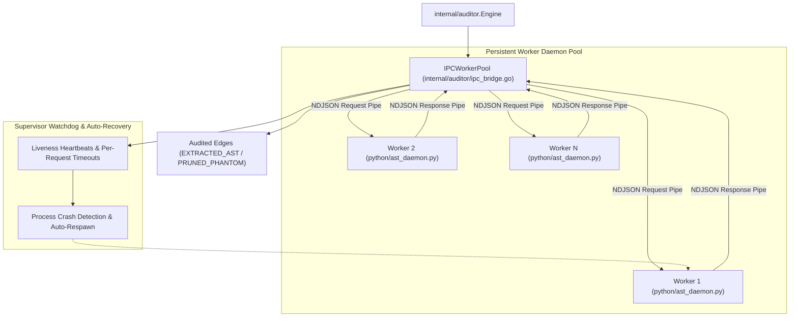

# Requirements Specification: Streaming AST IPC Bridge & Persistent Subprocess Daemon Pool

- **Feature Title**: Streaming AST IPC Bridge & Persistent Subprocess Daemon Pool
- **Sequence Code**: `003`
- **Target Milestone**: `Milestone 3 (V1.3.0)`
- **Persona Drivers & Gatekeepers**:
  - Lead AI Workflow Architect & Governor ([@nexus.md](../../.agents/personas/nexus.md))
  - Feature Engineer ([@feature-engineer.md](../../.agents/personas/feature-engineer.md))
  - Debugger & Remediation Specialist ([@debugger-remediation.md](../../.agents/personas/debugger-remediation.md))
  - Security & Compliance Auditor ([@security-auditor.md](../../.agents/personas/security-auditor.md))
  - Regression & Test Automation Guard ([@regression-tester.md](../../.agents/personas/regression-tester.md))
- **Status**: `🟢 DELIVERED & CERTIFIED V1.3.0`

---

## 1. Executive Summary & Problem Scope

### 1.1 Context & Problem Statement
In **Gautama Graph**, relationship auditing verifies candidate code relationships against language abstract syntax trees (ASTs). For Go source code, the engine directly leverages the Go compiler frontend (`go/ast`, `go/parser`, `go/types`). For Python code, relationship verification is delegated to a Python AST visitor script.

Currently, Python verification in `internal/auditor/python_bridge.go` relies on ephemeral subprocess invocations (`exec.CommandContext("python3", "python/ast_auditor_bridge.py", ...)`). This design exhibits critical performance and resilience bottlenecks:
1. **Subprocess Spawning Overhead**: Spawning a new Python interpreter process per audit batch incurs 200ms–500ms in OS process creation, runtime initialization, and `ast` module loading. Across large polyglot repositories with hundreds of Python modules, this adds minutes of cumulative overhead.
2. **Disk I/O & Serialization Overhead**: Ephemeral subprocesses serialize arguments via temporary files and CLI flags, inducing unnecessary disk churn.
3. **Fragile Process Lifecycle**: If a worker crashes or deadlocks on malformed Python code, the parent engine must abort the entire batch or fail silently without worker recycling.
4. **Lack of Concurrency Scaling**: Multi-core CPU resources are underutilized due to single-threaded sequential execution.

### 1.2 Target Vision
Item 003 replaces one-shot subprocess invocations with a persistent, supervised **Subprocess Daemon Pool** communicating over bidirectional, non-blocking **Newline-Delimited JSON (NDJSON)** streams.



---

## 2. Go Interface Contracts & Domain Models

All domain models and interfaces will reside in `internal/auditor/types.go` and `internal/auditor/ipc_bridge.go`.

### 2.1 IPC Protocol & Data Contracts

```go
package auditor

import (
	"context"
	"time"
)

// IPCCommand defines the operation requested of the Python AST daemon.
type IPCCommand string

const (
	// CmdPing checks daemon liveness and measures IPC round-trip latency.
	CmdPing IPCCommand = "PING"
	// CmdAuditPythonCandidates instructs the daemon to evaluate candidate edges against a Python AST.
	CmdAuditPythonCandidates IPCCommand = "AUDIT_CANDIDATES"
	// CmdShutdown requests clean termination of the worker process.
	CmdShutdown IPCCommand = "SHUTDOWN"
)

// WorkerState models the current lifecycle state of an IPC worker daemon.
type WorkerState string

const (
	WorkerStateStarting   WorkerState = "STARTING"
	WorkerStateIdle       WorkerState = "IDLE"
	WorkerStateBusy       WorkerState = "BUSY"
	WorkerStateCrashed    WorkerState = "CRASHED"
	WorkerStateTerminated WorkerState = "TERMINATED"
)

// IPCRequest represents a single NDJSON request sent over stdin to a Python AST daemon.
type IPCRequest struct {
	ID            string          `json:"id"`
	Command       IPCCommand      `json:"command"`
	WorkspaceRoot string          `json:"workspace_root"`
	SourceFile    string          `json:"source_file,omitempty"`
	Candidates    []CandidateEdge `json:"candidates,omitempty"`
	Timestamp     time.Time       `json:"timestamp"`
}

// IPCResponse represents the single NDJSON response received over stdout from a Python AST daemon.
type IPCResponse struct {
	ID           string        `json:"id"`
	Success      bool          `json:"success"`
	Error        string        `json:"error,omitempty"`
	AuditedEdges []AuditedEdge `json:"audited_edges,omitempty"`
	DurationMs   float64       `json:"duration_ms"`
}

// WorkerStats tracks operational metrics for an individual daemon worker.
type WorkerStats struct {
	WorkerID      int         `json:"worker_id"`
	PID           int         `json:"pid"`
	State         WorkerState `json:"state"`
	RequestsTotal int64       `json:"requests_total"`
	ErrorsTotal   int64       `json:"errors_total"`
	RestartsTotal int64       `json:"restarts_total"`
	LastActive    time.Time   `json:"last_active"`
}

// PoolStats provides aggregate telemetry for the active worker pool.
type PoolStats struct {
	TotalWorkers int           `json:"total_workers"`
	IdleWorkers  int           `json:"idle_workers"`
	BusyWorkers  int           `json:"busy_workers"`
	Workers      []WorkerStats `json:"workers"`
}
```

### 2.2 IPC Worker & Pool Interfaces

```go
// IPCSession encapsulates an active connection to an individual Python worker daemon.
type IPCSession interface {
	// Send dispatches an IPCRequest and awaits the matching IPCResponse within the context deadline.
	Send(ctx context.Context, req *IPCRequest) (*IPCResponse, error)
	// Ping verifies worker responsiveness.
	Ping(ctx context.Context) (time.Duration, error)
	// Status returns the current lifecycle state of the worker.
	Status() WorkerState
	// PID returns the OS process ID of the child process.
	PID() int
	// Close terminates the worker process gracefully.
	Close() error
}

// IPCWorkerPool orchestrates, balances, and supervises a pool of long-lived Python AST daemons.
type IPCWorkerPool interface {
	// AuditPython dispatches candidate edge auditing to an available worker.
	AuditPython(ctx context.Context, sourceFile string, candidates []CandidateEdge) ([]AuditedEdge, error)
	// SpawnWorkers initializes workers up to the specified pool size.
	SpawnWorkers(ctx context.Context, poolSize int) error
	// Stats returns real-time diagnostic telemetry for the worker pool.
	Stats() PoolStats
	// Close shuts down all workers cleanly, ensuring zero orphaned processes.
	Close() error
}
```

---

## 3. Streaming NDJSON Protocol & Python Daemon Architecture

### 3.1 Framing Specification
- **Transport**: Standard OS pipes (`stdin` / `stdout`).
- **Framing**: Newline-Delimited JSON (NDJSON). Each JSON message must be serialized on a single line and terminated with `\n`.
- **Buffering**: Python worker uses unbuffered binary/text I/O (`PYTHONUNBUFFERED=1`, explicit `sys.stdout.flush()`).
- **Correlation**: Every request contains a UUID/incremental `ID`. The worker echoes the identical `ID` in its response.

### 3.2 Python Daemon Specification (`python/ast_daemon.py`)
- Continuous event loop reading `sys.stdin.readline()`.
- Parses incoming JSON using Python standard library `json`.
- Dispatches based on `command`:
  - `PING`: Responds immediately with `{"id": req["id"], "success": true, "duration_ms": 0.1}`.
  - `AUDIT_CANDIDATES`: Parses Python source file AST in memory, evaluates candidate call expressions and attribute selectors, and returns verified `AuditedEdge` objects.
  - `SHUTDOWN`: Exits cleanly with code 0.
- Catches syntax errors and exceptions locally, returning `{"id": req["id"], "success": false, "error": "SyntaxError: ..."}` without crashing the daemon process.

---

## 4. Cyber Security Threat Modeling & Subprocess Safety

### 4.1 Path Traversal Defense
- **Zero-Trust File Access**: All `SourceFile` paths in incoming candidate batches must be verified via `ValidatePathBoundary(workspaceRoot, sourceFile)` before transmission to the Python worker.
- **Worker Confinement**: The Python daemon verifies that target source files resolve strictly within the configured `workspace_root`.

### 4.2 Subprocess Security & Injection Prevention
- **No Shell Execution**: Processes must be spawned directly via `exec.CommandContext("python3", ...)` with explicit argument slices. Never execute through shell wrappers (`sh -c` or `bash -c`).
- **Standard Library Dependency**: Python daemon must rely strictly on standard library modules (`ast`, `sys`, `json`, `os`, `time`). Zero third-party Python packages (`pip`) required.
- **Process Group Isolation & Cleanup**:
  - Spawn child processes in dedicated process groups (`Setpgid: true` on Linux/macOS).
  - On shutdown or context cancellation, send `SIGTERM` followed by `SIGKILL` if worker does not exit within a 3-second grace period.
  - Assert zero zombie/orphaned Python processes left running after test execution or CLI completion.

### 4.3 Memory Bounds & DoS Protection
- **Request Payload Limit**: Reject requests with payloads exceeding 10MB.
- **Per-Request Timeout**: Each IPC invocation is bounded by `context.WithTimeout` (default 5.0 seconds).
- **Concurrency Limit**: Worker pool size capped at `runtime.NumCPU()` by default (configurable between 1 and 16).

---

## 5. Edge Case & Failure Mode Matrix

| Scenario / Failure Mode | Root Cause | Expected Subsystem Handling | Provenance Classification |
| :--- | :--- | :--- | :--- |
| **Worker Process Crash (SIGSEGV / OOM)** | Malformed input or memory exhaustion in Python runtime | Pool supervisor detects pipe EOF/broken pipe, marks worker `WorkerStateCrashed`, respawns worker, and transparently retries request on fresh worker. | `INFERRED_HEURISTIC` (if retry fails) |
| **Worker Deadlock / Infinite Loop** | Python AST visitor hangs on complex AST | Per-request context timeout expires (5s). Supervisor terminates unresponsive worker via `SIGKILL`, spawns replacement, returns timeout error. | `INFERRED_HEURISTIC` (fallback) |
| **Python SyntaxError in Source File** | Unparseable Python file | Daemon catches `SyntaxError`, returns `success: false` with error message. Worker stays alive and ready for subsequent requests. | `PRUNED_PHANTOM` (confidence 0.0) |
| **Parent Process SIGINT / SIGTERM** | User interrupts CLI execution | Context cancellation triggers `IPCWorkerPool.Close()`. Pool sends `SHUTDOWN` NDJSON command, waits 1s grace period, issues `SIGKILL` to remaining children. | N/A (clean termination) |
| **Missing `python3` Binary on Host** | Host lacks Python installation | Pool initialization fails gracefully with clear diagnostic message; engine falls back to Go-only AST auditing with heuristic Python tags. | `INFERRED_HEURISTIC` (50% confidence) |

---

## 6. Definition of Done (DoD) & Acceptance Criteria

### 6.1 Functional Acceptance Criteria
- [ ] `IPCWorkerPool` initializes and manages a pool of persistent Python worker daemons.
- [ ] Streaming NDJSON protocol achieves bi-directional request/response correlation with sub-millisecond IPC round-trip times.
- [ ] Supervisor automatically detects crashed or deadlocked workers, terminates them, and auto-spawns replacements without losing candidate edges.
- [ ] Context cancellation and process exit guarantee zero orphaned child processes.
- [ ] Integrated with `internal/auditor/engine.go`, replacing legacy one-shot `python_bridge.go`.

### 6.2 Performance & Quality Criteria
- [ ] **Throughput Speedup**: Python candidate edge verification runs at least $5\times$ faster than legacy one-shot subprocess execution on batches of 500+ edges.
- [ ] **Test Coverage**: $\ge 85\%$ statement coverage across `internal/auditor/ipc_bridge.go`.
- [ ] **Race Detector**: `GOWORK=off go test -v -race ./...` passes with 0 data races.
- [ ] **Vulnerability Gate**: Zero known CVEs in `go.mod` dependencies via `govulncheck`.
- [ ] **Knowledge Graph Sync**: `./scripts/graphify_sync.sh` runs cleanly to completion.

---

## 7. Next Step & Phase Handoff

Upon user review and sign-off of this Phase 1 Requirements Specification, proceed to **Phase 2 (Technical Architecture Blueprint)** by invoking:
`@[docs/prompts/sdlc-step2.md] with @[docs/specs/003-streaming-ast-ipc-bridge-requirements.md]`
