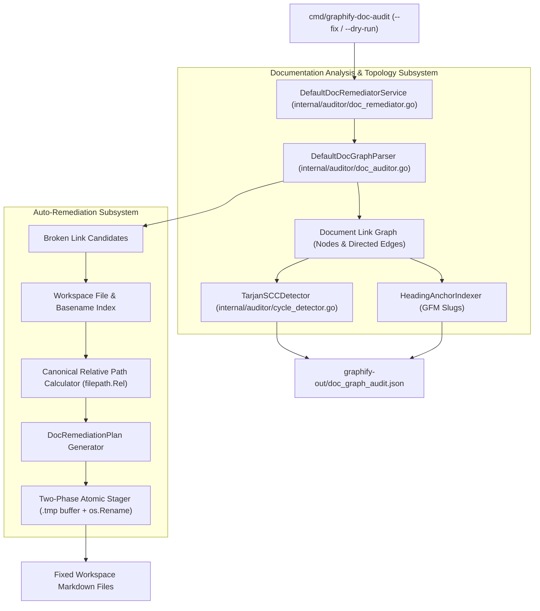
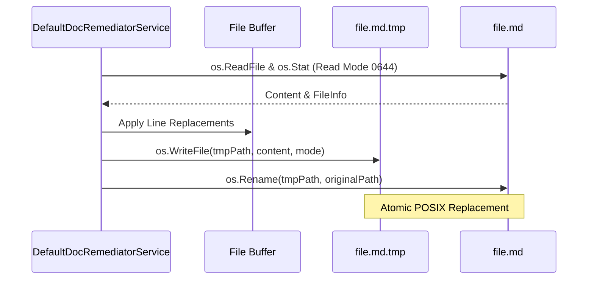

# Architecture Blueprint: Markdown Doc Link Auto-Remediation & Circular Cycle Detector

- **Feature Title**: Markdown Doc Link Auto-Remediation & Circular Cycle Detector
- **Sequence Code**: `004`
- **Target Milestone**: `Milestone 4 (V1.4.0)`
- **Persona Drivers & Gatekeepers**:
  - Lead AI Workflow Architect & Governor ([@nexus.md](../../.agents/personas/nexus.md))
  - Feature Engineer ([@feature-engineer.md](../../.agents/personas/feature-engineer.md))
  - Debugger & Remediation Specialist ([@debugger-remediation.md](../../.agents/personas/debugger-remediation.md))
  - Security & Compliance Auditor ([@security-auditor.md](../../.agents/personas/security-auditor.md))
- **Status**: `🟢 DELIVERED & CERTIFIED V1.4.0`

---

## 1. System Architecture & High-Level Topology

This blueprint details the technical architecture for the **Markdown Doc Link Auto-Remediation, Anchor Verification & Cycle Detection Engine** (`internal/auditor/doc_remediator.go`, `internal/auditor/cycle_detector.go`, and `cmd/graphify-doc-audit`).

The subsystem upgrades documentation auditing from passive reporting into an automated, self-healing remediation and graph topology engine.



---

## 2. Go Interface Architecture & Domain Contracts

The contracts adhere strictly to the Interface Segregation Principle (ISP) and reside in `internal/auditor/types.go`, `internal/auditor/doc_remediator.go`, and `internal/auditor/cycle_detector.go`.

### 2.1 Domain Data Structures

```go
package auditor

import (
	"context"
	"time"
)

// RemediationRule defines the specific heuristic applied to correct a markdown link.
type RemediationRule string

const (
	// RuleFixRelativePath corrects inaccurate relative directory stepping (e.g. ../../docs -> ../docs).
	RuleFixRelativePath RemediationRule = "FIX_RELATIVE_PATH"
	// RuleResolveFuzzyBasename resolves a moved or renamed target file based on unique basename match.
	RuleResolveFuzzyBasename RemediationRule = "RESOLVE_FUZZY_BASENAME"
	// RuleStripInvalidScheme removes unsupported URI schemes (e.g. file:/// -> relative path).
	RuleStripInvalidScheme RemediationRule = "STRIP_INVALID_SCHEME"
	// RuleFixHeadingAnchor corrects or normalizes heading fragment anchors.
	RuleFixHeadingAnchor RemediationRule = "FIX_HEADING_ANCHOR"
)

// RemediationAction captures an individual link rewrite within a markdown document.
type RemediationAction struct {
	SourceFile       string          `json:"source_file"`
	LineNumber       int             `json:"line_number"`
	OriginalLinkText string          `json:"original_link_text"`
	OriginalTarget   string          `json:"original_target"`
	ResolvedTarget   string          `json:"resolved_target"`
	CanonicalRelPath string          `json:"canonical_rel_path"`
	Rule             RemediationRule `json:"rule"`
	Applied          bool            `json:"applied"`
}

// DocRemediationPlan aggregates all planned link rewrites across the workspace.
type DocRemediationPlan struct {
	Timestamp       time.Time           `json:"timestamp"`
	TotalDocuments  int                 `json:"total_documents"`
	ModifiedDocs    int                 `json:"modified_docs"`
	TotalActions    int                 `json:"total_actions"`
	Actions         []RemediationAction `json:"actions"`
	DryRun          bool                `json:"dry_run"`
	ExecutionTimeMs float64             `json:"execution_time_ms"`
}

// HeadingAnchorTable maps GitHub-Flavored Markdown (GFM) heading anchor slugs to source headings.
type HeadingAnchorTable struct {
	FilePath string            `json:"file_path"`
	Anchors  map[string]string `json:"anchors"` // anchor_slug -> heading_text
}

// CircularCycle represents a closed directed reference loop in the documentation graph.
type CircularCycle struct {
	CycleID  string   `json:"cycle_id"`
	Length   int      `json:"length"`
	DocChain []string `json:"doc_chain"` // e.g. ["docA.md", "docB.md", "docA.md"]
}

// CycleReport aggregates all circular reference cycles detected in the documentation topology.
type CycleReport struct {
	TotalCycles int             `json:"total_cycles"`
	Cycles      []CircularCycle `json:"cycles"`
}
```

### 2.2 Subsystem Interfaces

```go
// DocRemediatorService provides automated link calculation, fuzzy resolution, and atomic in-place rewriting.
type DocRemediatorService interface {
	PlanRemediation(ctx context.Context, workspaceRoot string, dryRun bool) (*DocRemediationPlan, error)
	ApplyRemediation(ctx context.Context, plan *DocRemediationPlan) error
	DetectCycles(ctx context.Context, workspaceRoot string) (*CycleReport, error)
	IndexHeadingAnchors(ctx context.Context, workspaceRoot string) (map[string]*HeadingAnchorTable, error)
}

// CycleDetector computes strongly connected components and closed cycles on the doc link graph.
type CycleDetector interface {
	FindCycles(graph *DocGraph) *CycleReport
}
```

---

## 3. Core Algorithms & Implementation Details

### 3.1 Canonical Relative Path Normalization
```go
func CalculateCanonicalRelPath(sourceFile, targetFile string) (string, error) {
	cleanSource := filepath.Clean(sourceFile)
	cleanTarget := filepath.Clean(targetFile)

	sourceDir := filepath.Dir(cleanSource)
	rel, err := filepath.Rel(sourceDir, cleanTarget)
	if err != nil {
		return "", err
	}

	canonical := filepath.ToSlash(rel)
	if !strings.HasPrefix(canonical, ".") {
		canonical = "./" + canonical
	}

	return canonical, nil
}
```

### 3.2 Fuzzy Basename & Tree Distance Matching
1. **Workspace Index Construction**: Walk workspace root, building a map: `basenameMap: map[string][]string` (e.g. `"059-arch.md"` $\to$ `["docs/specs/059-markdown-doc-graph-auditor-architecture-blueprint.md"]`).
2. **Basename Matching**:
   - Clean target URI: strip `file:///`, `#anchor`, and directory prefixes.
   - If exact file exists at cleaned path: return path.
   - Look up candidate paths in `basenameMap` by exact base or prefix.
   - If single candidate found: resolve target.
   - If multiple candidates found: calculate directory tree distance (`filepath.Split`) from `sourceFile` and pick closest sibling.

### 3.3 GitHub-Flavored Markdown (GFM) Anchor Extraction
```go
func GenerateHeadingSlug(headingText string) string {
	// 1. Lowercase
	s := strings.ToLower(strings.TrimSpace(headingText))
	
	// 2. Strip punctuation [^\w\s-]
	var buf strings.Builder
	for _, r := range s {
		if (r >= 'a' && r <= 'z') || (r >= '0' && r <= '9') || r == '-' || r == '_' || r == ' ' {
			buf.WriteRune(r)
		}
	}
	cleaned := buf.String()

	// 3. Replace whitespace with hyphens
	fields := strings.Fields(cleaned)
	return strings.Join(fields, "-")
}
```

### 3.4 Tarjan's Strongly Connected Components (SCC) Cycle Detector
1. Build adjacency list representation $Adj[u]$ where vertices are normalized markdown document paths.
2. Initialize `indices`, `lowlink`, `onStack`, and `stack`.
3. Traverse unvisited nodes with `strongconnect(v)`:
   - Assign index and lowlink.
   - For each neighbor $w \in Adj[v]$:
     - If $w$ not visited: recursively `strongconnect(w)`, update $lowlink[v] = \min(lowlink[v], lowlink[w])$.
     - Else if $w$ is on stack: update $lowlink[v] = \min(lowlink[v], index[w])$.
4. If $lowlink[v] == index[v]$: pop nodes forming an SCC. If $|SCC| > 1$ or self-loop $v \to v$, register as a `CircularCycle`.
5. Time complexity: $\mathcal{O}(|V| + |E|)$, Space complexity: $\mathcal{O}(|V|)$.

---

## 4. Two-Phase Atomic In-Place File Persistence

To guarantee zero partial writes or file corruption during `--fix`:



---

## 5. Cyber Security Architecture & Hardening Controls

### 5.1 Zero-Trust Path Boundary Confinement
- Every target path resolved during remediation must pass through `ValidatePathBoundary(workspaceRoot, resolvedTarget)` before being accepted into a `DocRemediationPlan`.
- If a link target attempts to traverse above `workspaceRoot` (e.g. `../../docs/INDEX.md`), it is rejected with a `SECURITY_PATH_TRAVERSAL` error and excluded from automatic disk writes.

### 5.2 Atomic Write Safety & Permission Preservation
- All file mutations preserve original file modes (`os.FileMode`).
- In case of write failure, all `.tmp` staging buffers are immediately cleaned up via `defer os.Remove(tmpPath)`.

### 5.3 Pure Go 1.26+ Standard Library
- 100% pure standard library implementation (`path/filepath`, `strings`, `regexp`, `os`, `sync`). Zero third-party dependencies, zero `unsafe`, zero CGo.

---

## 6. SQA Verification & Testing Strategy

### 6.1 Planned Test Harness (`internal/auditor/doc_remediator_test.go`)
1. **`TestDocRemediator_CalculateCanonicalRelPath`**: Tests exact relative stepping across root, parent, sibling, and sub-directories.
2. **`TestDocRemediator_FuzzyBasenameResolution`**: Tests resolving relocated files, duplicate basename disambiguation, and slug matching.
3. **`TestDocRemediator_ApplyRemediation_TwoPhase`**: Tests `--fix` in-place rewriting, `.tmp` staging, and mode preservation.
4. **`TestHeadingAnchorIndexer_GFMSlugValidation`**: Tests anchor extraction, special character stripping, and fragment verification.
5. **`TestCycleDetector_TarjanSCC`**: Tests detecting direct circular cycles (A $\leftrightarrow$ B) and multi-node loops (A $\to$ B $\to$ C $\to$ A).
6. **`TestDocRemediator_SecurityBoundarySafety`**: Tests rejecting path traversal link targets.

---

## 7. Next Step & Phase Handoff

Upon user review and sign-off of this Phase 2 Architecture Blueprint, proceed to **Phase 3 & 4 (Implementation & SQA Verification Gate)** by invoking:
`@[docs/prompts/sdlc-step3.md] with @[docs/specs/004-markdown-doc-link-auto-remediation-architecture-blueprint.md]`
