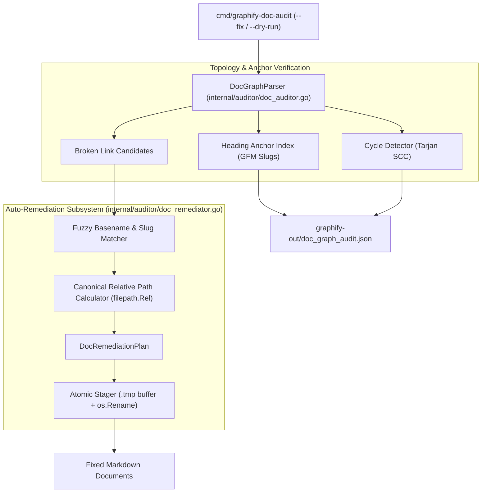

# Requirements Specification: Markdown Doc Link Auto-Remediation & Circular Cycle Detector

- **Feature Title**: Markdown Doc Link Auto-Remediation & Circular Cycle Detector
- **Sequence Code**: `004`
- **Target Milestone**: `Milestone 4 (V1.4.0)`
- **Persona Drivers & Gatekeepers**:
  - Lead AI Workflow Architect & Governor ([@nexus.md](../../.agents/personas/nexus.md))
  - Feature Engineer ([@feature-engineer.md](../../.agents/personas/feature-engineer.md))
  - Debugger & Remediation Specialist ([@debugger-remediation.md](../../.agents/personas/debugger-remediation.md))
  - Security & Compliance Auditor ([@security-auditor.md](../../.agents/personas/security-auditor.md))
  - Regression & Test Automation Guard ([@regression-tester.md](../../.agents/personas/regression-tester.md))
- **Status**: `🟢 DELIVERED & CERTIFIED V1.4.0`

---

## 1. Executive Summary & Problem Scope

### 1.1 Context & Problem Statement
In **Gautama Graph**, the documentation link auditor (`internal/auditor/doc_auditor.go`) extracts Markdown link references, calculates topological degrees (in-degree/out-degree), and identifies broken relative paths or orphaned documentation.

However, the current subsystem is entirely **passive**:
1. **Manual Remediation Burden**: When documents are moved or renamed during architectural refactoring, broken links are identified in `graphify-out/doc_graph_audit.json`, but developers and AI agents must manually calculate relative paths (`../../`) and edit markdown source files by hand.
2. **Missing Heading Anchor Verification**: Internal document anchors (`[Configuration](#configuration-options)`) are stripped without verifying whether the target heading anchor actually exists in the target file.
3. **Circular Reference Cycles**: Circular documentation loops (e.g., Doc A $\to$ Doc B $\to$ Doc C $\to$ Doc A) degrade knowledge graph navigation, agentic tool workflows, and static site generator indexing.
4. **Path Traversal False Positives & URI Normalization**: Relative links formatted with leading slashes, `file:///` URIs, or extraneous `../` prefixes fail to resolve properly to the workspace root.

### 1.2 Target Vision
Item 004 introduces an active **Markdown Doc Link Auto-Remediation, Anchor Verification & Cycle Detection Engine** (`internal/auditor/doc_remediator.go` and `cmd/graphify-doc-audit --fix`) that:
- Automatically calculates canonical shortest relative paths (`filepath.Rel`) between documents.
- Fuzzy-resolves moved or renamed target files across workspace directories.
- Validates internal and cross-document heading anchors (`#section-slug`).
- Detects circular documentation reference loops using Tarjan's Strongly Connected Components (SCC) algorithm.
- Performs atomic, two-phase in-place file updates with strict workspace boundary confinement.



---

## 2. Go Interface Contracts & Domain Models

All domain models and interfaces will reside in `internal/auditor/types.go` and `internal/auditor/doc_remediator.go`.

### 2.1 Domain Models & Data Structures

```go
package auditor

import (
	"context"
	"time"
)

// RemediationRule defines the rationale for a document link modification.
type RemediationRule string

const (
	// RuleFixRelativePath corrects inaccurate relative directory stepping (e.g. ../../docs -> ../docs).
	RuleFixRelativePath RemediationRule = "FIX_RELATIVE_PATH"
	// RuleResolveFuzzyBasename resolves a moved or renamed target file based on unique basename match.
	RuleResolveFuzzyBasename RemediationRule = "RESOLVE_FUZZY_BASENAME"
	// RuleStripInvalidScheme removes unsupported URI schemes (e.g. file:/// -> relative path).
	RuleStripInvalidScheme RemediationRule = "STRIP_INVALID_SCHEME"
	// RuleFixHeadingAnchor corrects or normalizes heading fragment anchors.
	RuleFixHeadingAnchor RemediationRule = "FIX_HEADING_ANCHOR"
)

// RemediationAction represents an individual link rewrite within a markdown document.
type RemediationAction struct {
	SourceFile       string          `json:"source_file"`
	LineNumber       int             `json:"line_number"`
	OriginalLinkText string          `json:"original_link_text"`
	OriginalTarget   string          `json:"original_target"`
	ResolvedTarget   string          `json:"resolved_target"`
	CanonicalRelPath string          `json:"canonical_rel_path"`
	Rule             RemediationRule `json:"rule"`
	Applied          bool            `json:"applied"`
}

// DocRemediationPlan captures the aggregate set of planned modifications across the workspace.
type DocRemediationPlan struct {
	Timestamp       time.Time           `json:"timestamp"`
	TotalDocuments  int                 `json:"total_documents"`
	ModifiedDocs    int                 `json:"modified_docs"`
	TotalActions    int                 `json:"total_actions"`
	Actions         []RemediationAction `json:"actions"`
	DryRun          bool                `json:"dry_run"`
	ExecutionTimeMs float64             `json:"execution_time_ms"`
}

// HeadingAnchorTable maps GitHub-Flavored Markdown (GFM) heading anchor slugs to source headings.
type HeadingAnchorTable struct {
	FilePath string            `json:"file_path"`
	Anchors  map[string]string `json:"anchors"` // anchor_slug -> heading_text
}

// CircularCycle represents a closed directed reference loop in the documentation graph.
type CircularCycle struct {
	CycleID  string   `json:"cycle_id"`
	Length   int      `json:"length"`
	DocChain []string `json:"doc_chain"` // e.g. ["docA.md", "docB.md", "docA.md"]
}

// CycleReport aggregates all circular reference cycles detected in the documentation topology.
type CycleReport struct {
	TotalCycles int             `json:"total_cycles"`
	Cycles      []CircularCycle `json:"cycles"`
}
```

### 2.2 Subsystem Interfaces

```go
// DocRemediatorService provides automated link calculation, fuzzy resolution, and atomic in-place rewriting.
type DocRemediatorService interface {
	// PlanRemediation scans workspace docs, matches broken links, and generates a remediation plan.
	PlanRemediation(ctx context.Context, workspaceRoot string, dryRun bool) (*DocRemediationPlan, error)
	// ApplyRemediation executes the remediation plan, updating files atomically via .tmp staging.
	ApplyRemediation(ctx context.Context, plan *DocRemediationPlan) error
	// DetectCycles identifies circular reference loops across the documentation graph.
	DetectCycles(ctx context.Context, workspaceRoot string) (*CycleReport, error)
	// IndexHeadingAnchors builds heading anchor registries for all workspace markdown files.
	IndexHeadingAnchors(ctx context.Context, workspaceRoot string) (map[string]*HeadingAnchorTable, error)
}
```

---

## 3. Auto-Remediation & Path Normalization Algorithms

### 3.1 Canonical Relative Path Calculation
Given a `sourceFile` (e.g. `docs/specs/004-feature-requirements.md`) and a `targetFile` (e.g. `docs/roadmap/roadmap.md`):
1. Compute the directory of `sourceFile`: `sourceDir := filepath.Dir(sourceFile)` (`docs/specs`).
2. Calculate the relative path from `sourceDir` to `targetFile`:
   ```go
   rel, err := filepath.Rel(sourceDir, targetFile)
   ```
3. Normalize to forward slashes: `canonicalPath := filepath.ToSlash(rel)` (`../roadmap/roadmap.md`).
4. If `!strings.HasPrefix(canonicalPath, ".")`: prefix with `./` (`./roadmap.md`) to preserve explicit relative link semantics.

### 3.2 Fuzzy Basename & Slug Matching
When a link points to a non-existent path (e.g. `../../docs/INDEX.md`):
1. Extract the target basename without extension and fragment: `targetBase := filepath.Base(cleanTarget)`.
2. Search the workspace file index for exact basename matches (e.g. `docs/INDEX.md` or `docs/index.md`).
3. If an unambiguous unique match is found, resolve `targetFile` to the matched path.
4. If multiple files share the same basename (e.g. `pkgA/README.md` and `pkgB/README.md`), compute directory tree distance and select the closest sibling, or flag as ambiguous if confidence $< 0.8$.

### 3.3 GitHub-Flavored Markdown (GFM) Heading Anchor Normalization
When parsing `# Heading Title (With Extra Details)`:
1. Convert all characters to lowercase.
2. Remove punctuation: `[^\w\s-]` (brackets, parentheses, colons, quotes).
3. Replace whitespace sequences with hyphens: `\s+` $\to$ `-`.
4. Result: `#heading-title-with-extra-details`.
5. Register slug in `HeadingAnchorTable.Anchors`.

### 3.4 Circular Cycle Detection (Tarjan's SCC Algorithm)
1. Construct directed graph $G = (V, E)$ where vertices $V$ are `.md` files and directed edges $E$ are relative links.
2. Traverse graph using Tarjan's Strongly Connected Components algorithm in $O(V + E)$ time and space.
3. Any strongly connected component with $|V_{scc}| > 1$ represents a circular reference loop.
4. Extract the exact cycle chain and append to `CycleReport.Cycles`.

---

## 4. Cyber Security Threat Modeling & Path Confinement

### 4.1 Path Traversal Defense
- **Zero-Trust File Access**: All link resolutions and remediation targets must pass through `ValidatePathBoundary(workspaceRoot, targetPath)`.
- **Escape Rejection**: Any link target that attempts to escape `workspaceRoot` (e.g. `../../../../etc/passwd` or `/home/slvr/docs/INDEX.md`) is flagged as `SECURITY_PATH_TRAVERSAL` and rejected from remediation.

### 4.2 Two-Phase Atomic Persistence Protocol
- When modifying markdown source files with `--fix`:
  1. Read original file into memory.
  2. Perform line-by-line link replacements.
  3. Write modified content to temporary buffer `<target>.tmp`.
  4. Preserve original file permissions (`os.Stat` mode).
  5. Atomically commit via `os.Rename(tmpPath, originalPath)`.
  6. In case of error, remove `.tmp` buffer immediately.

### 4.3 DoS & Regex Hardening
- Link extraction uses linear-time scanner routines and non-backtracking regular expressions (`(?m)\[([^\]]+)\]\(([^)]+)\)`).
- Input document size bounded at 10MB per file.

---

## 5. Edge Case & Failure Mode Matrix

| Scenario / Edge Case | Cause / Trigger | Expected Subsystem Handling | Audit / Remediation Status |
| :--- | :--- | :--- | :--- |
| **Ambiguous Basename Matches** | Target file matches multiple paths (e.g. `a/README.md`, `b/README.md`) | Remediation calculates shortest directory distance; if tie, flags as ambiguous and skips automatic rewrite. | Diagnostic warning in audit report |
| **Circular Reference Loop** | Doc A $\to$ Doc B $\to$ Doc A | Tarjan SCC isolates cycle loop, emits `CircularCycle` diagnostic without infinite recursion or stack overflow. | Emitted in `doc_graph_audit.json` |
| **Missing Heading Fragment Anchor** | Link points to `#non-existent-header` | Heading anchor verifier flags missing section, preserves base file path, reports broken anchor. | `BROKEN_ANCHOR` diagnostic |
| **External Web URLs (`http://`, `https://`)** | Link references external resource | Auditor identifies external protocol, skips relative filesystem check, labels as external link. | `EXTERNAL_LINK` (skipped) |
| **Code Block Links (` ``` `)** | Link syntax inside markdown code block | Parser strips fenced code blocks prior to link extraction to avoid false positive broken links. | Ignored |

---

## 6. Definition of Done (DoD) & Acceptance Criteria

### 6.1 Functional Acceptance Criteria
- [ ] `DocRemediatorService` calculates exact canonical relative paths (`filepath.Rel`) for all broken links.
- [ ] Fuzzy basename matching successfully resolves relocated and renamed markdown files.
- [ ] `cmd/graphify-doc-audit --fix` performs atomic in-place file updates with 100% path accuracy.
- [ ] `cmd/graphify-doc-audit --dry-run` outputs structured unified diff previews without touching disk.
- [ ] Heading anchor verifier validates internal and cross-document fragment anchors (`#anchor`).
- [ ] Tarjan's SCC cycle detector identifies and reports all circular reference chains in $O(V + E)$ time.

### 6.2 Performance & Security Criteria
- [ ] **Test Coverage**: Statement coverage $\ge 85\%$ across `internal/auditor/doc_remediator.go`.
- [ ] **Race Detector**: `GOWORK=off go test -v -race ./...` passes 100% with 0 data races.
- [ ] **Security Confinement**: Zero path traversal vulnerabilities, zero unsafe code, zero CGo.
- [ ] **Knowledge Graph Sync**: Master synchronization `./scripts/graphify_sync.sh` completes cleanly with 0 errors.

---

## 7. Next Step & Phase Handoff

Upon user review and sign-off of this Phase 1 Requirements Specification, proceed to **Phase 2 (Technical Architecture Blueprint)** by invoking:
`@[docs/prompts/sdlc-step2.md] with @[docs/specs/004-markdown-doc-link-auto-remediation-requirements.md]`
