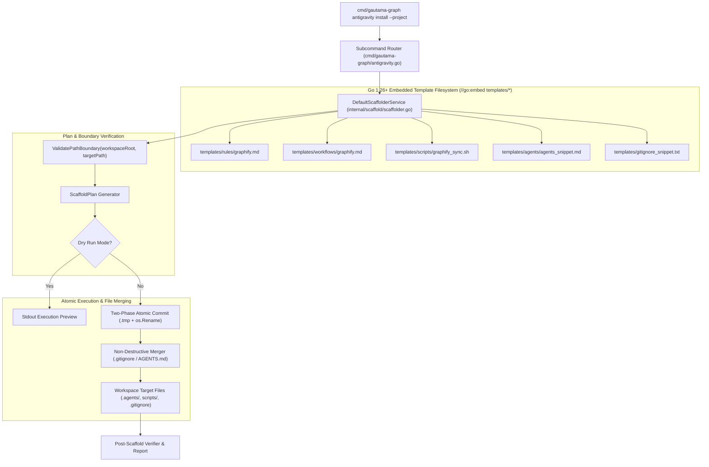
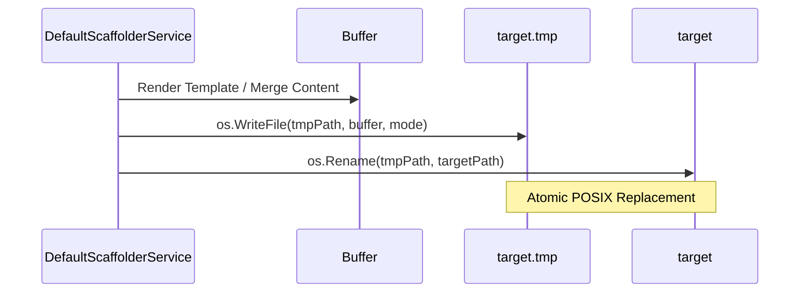

# Architecture Blueprint: Antigravity Environment Scaffolder & Knowledge Setup CLI

- **Feature Title**: Antigravity Environment Scaffolder & Knowledge Setup CLI
- **Sequence Code**: `005`
- **Target Milestone**: `Milestone 5 (V1.5.0)`
- **Persona Drivers & Gatekeepers**:
  - Lead AI Workflow Architect & Governor ([@nexus.md](../../.agents/personas/nexus.md))
  - Feature Engineer ([@feature-engineer.md](../../.agents/personas/feature-engineer.md))
  - Security & Compliance Auditor ([@security-auditor.md](../../.agents/personas/security-auditor.md))
  - Regression & Test Automation Guard ([@regression-tester.md](../../.agents/personas/regression-tester.md))
- **Status**: `🟢 DELIVERED & CERTIFIED V1.5.0`

---

## 1. System Architecture & High-Level Topology

This blueprint details the technical architecture for the **Antigravity Environment Scaffolder & Knowledge Setup Subsystem** (`internal/scaffold/` and `cmd/gautama-graph antigravity install --project`).

The subsystem enables any repository adopting `github.com/jameshawkins-art/gautama-graph` to bootstrap and configure its Antigravity 2.0 and Graphify knowledge topology in a single, hermetic, and safe CLI invocation.



---

## 2. Go Interface Architecture & Domain Contracts

All domain contracts and interfaces reside in `internal/scaffold/types.go` and `internal/scaffold/scaffolder.go`.

### 2.1 Domain Data Structures

```go
package scaffold

import (
	"context"
	"io/fs"
	"time"
)

// ScaffoldActionType defines the nature of an individual file or directory mutation.
type ScaffoldActionType string

const (
	ActionCreateFile      ScaffoldActionType = "CREATE_FILE"
	ActionSkipExists      ScaffoldActionType = "SKIP_EXISTS"
	ActionOverwriteForce  ScaffoldActionType = "OVERWRITE_FORCE"
	ActionAppendMerge     ScaffoldActionType = "APPEND_MERGE"
	ActionCreateDirectory ScaffoldActionType = "CREATE_DIRECTORY"
)

// ScaffoldAction represents a discrete file or directory scaffolding operation.
type ScaffoldAction struct {
	RelativePath string             `json:"relative_path"`
	AbsolutePath string             `json:"absolute_path"`
	ActionType   ScaffoldActionType `json:"action_type"`
	FileMode     fs.FileMode        `json:"file_mode"`
	Content      string             `json:"content,omitempty"`
	Reason       string             `json:"reason"`
	ExistedPrior bool               `json:"existed_prior"`
	Applied      bool               `json:"applied"`
}

// ScaffoldOptions specifies configuration flags for the scaffolding process.
type ScaffoldOptions struct {
	WorkspaceRoot string `json:"workspace_root"`
	Force         bool   `json:"force"`
	DryRun        bool   `json:"dry_run"`
	Minimal       bool   `json:"minimal"`
	WithScripts   bool   `json:"with_scripts"`
	WithGitIgnore bool   `json:"with_gitignore"`
	Verbose       bool   `json:"verbose"`
}

// ScaffoldPlan aggregates all planned actions before execution.
type ScaffoldPlan struct {
	Timestamp       time.Time        `json:"timestamp"`
	WorkspaceRoot   string           `json:"workspace_root"`
	DryRun          bool             `json:"dry_run"`
	TotalActions    int              `json:"total_actions"`
	CreatedFiles    int              `json:"created_files"`
	ModifiedFiles   int              `json:"modified_files"`
	SkippedFiles    int              `json:"skipped_files"`
	Actions         []ScaffoldAction `json:"actions"`
	ExecutionTimeMs float64          `json:"execution_time_ms"`
}

// ScaffoldVerificationReport summarizes post-installation health checks.
type ScaffoldVerificationReport struct {
	Timestamp     time.Time `json:"timestamp"`
	WorkspaceRoot string    `json:"workspace_root"`
	AllValid      bool      `json:"all_valid"`
	RulesFound    bool      `json:"rules_found"`
	WorkflowFound bool      `json:"workflow_found"`
	ScriptFound   bool      `json:"script_found"`
	Errors        []string  `json:"errors,omitempty"`
}
```

### 2.2 Subsystem Interfaces

```go
// ScaffolderService orchestrates workspace inspection, plan formulation, template rendering, and file generation.
type ScaffolderService interface {
	Plan(ctx context.Context, opts ScaffoldOptions) (*ScaffoldPlan, error)
	Execute(ctx context.Context, plan *ScaffoldPlan) error
	Verify(ctx context.Context, workspaceRoot string) (*ScaffoldVerificationReport, error)
}
```

---

## 3. Core Algorithms & Implementation Details

### 3.1 Embedded Template Filesystem Layout
The templates are packaged using Go 1.26+ `//go:embed` directive inside `internal/scaffold/templates/`:

```
internal/scaffold/templates/
├── rules/
│   └── graphify.md          # Official Graphify discovery rules
├── workflows/
│   └── graphify.md          # Knowledge graph extraction workflow
├── scripts/
│   └── graphify_sync.sh     # Master 3-stage sync script (chmod 0755)
├── agents/
│   └── agents_snippet.md    # AGENTS.md routing declarations
└── gitignore_snippet.txt    # gitignore patterns (graphify-out/, .gautama-graph/)
```

### 3.2 Plan Formulation & Non-Destructive Scaffolding
1. **Target Directory Resolution**:
   - Resolve absolute target paths: `.agents/rules/graphify.md`, `.agents/workflows/graphify.md`, `scripts/graphify_sync.sh`, `.agents/AGENTS.md`, `.gitignore`.
   - Validate each path with `ValidatePathBoundary(workspaceRoot, targetPath)`.
2. **File Existence & Action Classification**:
   - For static templates (`rules/graphify.md`, `workflows/graphify.md`, `scripts/graphify_sync.sh`):
     - If file does not exist $\to$ `CREATE_FILE`.
     - If file exists and `opts.Force == true` $\to$ `OVERWRITE_FORCE`.
     - If file exists and `opts.Force == false` $\to$ `SKIP_EXISTS`.
3. **Merge File Handling**:
   - **`.gitignore`**:
     - If `.gitignore` does not exist $\to$ `CREATE_FILE` containing header + snippets.
     - If `.gitignore` exists: inspect contents for `graphify-out/`. If absent $\to$ `APPEND_MERGE`. If present $\to$ `SKIP_EXISTS`.
   - **`.agents/AGENTS.md`**:
     - If `.agents/AGENTS.md` does not exist $\to$ `CREATE_FILE` with basic routing manifest.
     - If `.agents/AGENTS.md` exists: inspect contents for `rules/graphify.md`. If absent $\to$ `APPEND_MERGE`. If present $\to$ `SKIP_EXISTS`.

### 3.3 Atomic Two-Phase File Commit
To prevent corrupted or partial file writes:



---

## 4. CLI Subcommand Integration

The CLI command is registered in `cmd/gautama-graph/antigravity.go` and handles:

```bash
# Nominal project installation into current workspace
gautama-graph antigravity install --project

# Dry-run inspection without disk mutations
gautama-graph antigravity install --project --dry-run

# Force update to official embedded templates
gautama-graph antigravity install --project --force

# Custom workspace path
gautama-graph antigravity install --workspace=/path/to/repo --project
```

---

## 5. Cyber Security Architecture & Hardening Controls

### 5.1 Zero-Trust Path Boundary Confinement
- Every output path generated during planning is strictly validated against `ValidatePathBoundary(workspaceRoot, targetPath)`.
- If any path parameter or relative escape resolves outside `workspaceRoot`, the operation fails immediately with `SECURITY_PATH_TRAVERSAL`.

### 5.2 POSIX Permissions & Script Safety
- Documents (`.md`, `.gitignore`, `AGENTS.md`) are written with standard mode `0644`.
- Synchronization scripts (`scripts/graphify_sync.sh`) are explicitly assigned `0755` (executable) permissions.
- Templates contain zero network `curl | bash` or unvetted scripts; all commands invoke the verified Go toolchain.

### 5.3 Pure Go 1.26+ Standard Library
- Scaffolding engine uses 100% Go standard library (`embed`, `io/fs`, `os`, `path/filepath`, `strings`, `time`). Zero third-party dependencies, zero `unsafe`, zero CGo.

---

## 6. SQA Verification Strategy

### 6.1 Planned Test Harness (`internal/scaffold/scaffolder_test.go`)
1. **`TestScaffolder_NominalInstallation`**: Tests scaffolding into an empty directory, asserting all `.agents/`, `scripts/`, and `.gitignore` files exist with expected content and permissions.
2. **`TestScaffolder_IdempotentSkip`**: Re-runs scaffolding on an existing workspace without `--force`, asserting all actions are `SKIP_EXISTS` and existing content is untouched.
3. **`TestScaffolder_ForceOverwrite`**: Runs scaffolding with `--force`, asserting that outdated files are updated to official templates.
4. **`TestScaffolder_DryRun`**: Asserts that `--dry-run` returns a full plan without creating directories or files on disk.
5. **`TestScaffolder_MergeGitIgnoreAndAgents`**: Tests appending Graphify rules to existing `.gitignore` and `AGENTS.md` without duplicating existing entries.
6. **`TestScaffolder_SecurityBoundarySafety`**: Tests path traversal rejections for workspace escapes.

---

## 7. Next Step & Phase Handoff

Upon user review and sign-off of this Phase 2 Architecture Blueprint, proceed to **Phase 3 & 4 (Implementation & SQA Verification Gate)** by invoking:
`@[docs/prompts/sdlc-step3.md] with @[docs/specs/005-antigravity-environment-installer-architecture-blueprint.md]`
