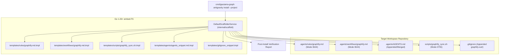

# Requirements Specification: Antigravity Environment Scaffolder & Knowledge Setup CLI

- **Feature Title**: Antigravity Environment Scaffolder & Knowledge Setup CLI
- **Sequence Code**: `005`
- **Target Milestone**: `Milestone 5 (V1.5.0)`
- **Persona Drivers & Gatekeepers**:
  - Lead AI Workflow Architect & Governor ([@nexus.md](../../.agents/personas/nexus.md))
  - Feature Engineer ([@feature-engineer.md](../../.agents/personas/feature-engineer.md))
  - Security & Compliance Auditor ([@security-auditor.md](../../.agents/personas/security-auditor.md))
  - Regression & Test Automation Guard ([@regression-tester.md](../../.agents/personas/regression-tester.md))
- **Status**: `🟢 DELIVERED & CERTIFIED V1.5.0`

---

## 1. Executive Summary & Problem Scope

### 1.1 Context & Problem Statement
When a consumer repository (such as `gautama-studios`, `gautama-social`, or `dragons-breath`) adds `github.com/jameshawkins-art/gautama-graph` as a dependency or CLI tool, setting up the workspace for Graphify and Antigravity 2.0 requires manual file creation and configuration:
1. **Manual Rule Setup**: Creating `.agents/rules/graphify.md` with knowledge graph rules, AST auditing standard operating procedures, and token optimization guidelines.
2. **Manual Workflow Setup**: Creating `.agents/workflows/graphify.md` for interactive graph extraction and inspection.
3. **Manual Manifest Injection**: Declaring Graphify rules, workflows, and slash commands in `.agents/AGENTS.md`.
4. **Manual Script Provisioning**: Writing executable synchronization scripts (`scripts/graphify_sync.sh`) and setting POSIX permissions (`chmod +x`).
5. **GitIgnore Configuration**: Adding `graphify-out/` and `.gautama-graph/bin/` to `.gitignore`.

This manual workflow causes configuration drift, missing rules, broken relative links, and setup friction.

### 1.2 Target Vision
Item 005 introduces a turnkey **Antigravity Environment Scaffolder & Knowledge Setup CLI** (`internal/scaffold/`, `cmd/gautama-graph antigravity install --project`) that:
- Embeds official Antigravity 2.0 template assets into the `gautama-graph` binary using Go `embed.FS`.
- Scaffolds `.agents/rules/graphify.md`, `.agents/workflows/graphify.md`, `.agents/AGENTS.md`, `scripts/graphify_sync.sh`, and `.gitignore` in a single command.
- Provides safe, non-destructive file merging (never overwriting custom configurations unless `--force` is passed).
- Supports `--dry-run` to preview planned directory and file mutations.
- Enforces strict workspace path boundary confinement (`ValidatePathBoundary`).



---

## 2. Go Interface Contracts & Domain Models

All domain models and interfaces will reside in `internal/scaffold/types.go` and `internal/scaffold/scaffolder.go`.

### 2.1 Domain Models & Data Structures

```go
package scaffold

import (
	"context"
	"io/fs"
	"time"
)

// ScaffoldActionType defines the nature of an individual file or directory mutation.
type ScaffoldActionType string

const (
	ActionCreateFile      ScaffoldActionType = "CREATE_FILE"
	ActionSkipExists      ScaffoldActionType = "SKIP_EXISTS"
	ActionOverwriteForce  ScaffoldActionType = "OVERWRITE_FORCE"
	ActionAppendMerge     ScaffoldActionType = "APPEND_MERGE"
	ActionCreateDirectory ScaffoldActionType = "CREATE_DIRECTORY"
)

// ScaffoldAction represents a discrete file or directory scaffolding operation.
type ScaffoldAction struct {
	RelativePath string             `json:"relative_path"`
	AbsolutePath string             `json:"absolute_path"`
	ActionType   ScaffoldActionType `json:"action_type"`
	FileMode     fs.FileMode        `json:"file_mode"`
	Content      string             `json:"content,omitempty"`
	Reason       string             `json:"reason"`
	ExistedPrior bool               `json:"existed_prior"`
	Applied      bool               `json:"applied"`
}

// ScaffoldOptions specifies configuration flags for the scaffolding process.
type ScaffoldOptions struct {
	WorkspaceRoot string `json:"workspace_root"`
	Force         bool   `json:"force"`
	DryRun        bool   `json:"dry_run"`
	Minimal       bool   `json:"minimal"`
	WithScripts   bool   `json:"with_scripts"`
	WithGitIgnore bool   `json:"with_gitignore"`
	Verbose       bool   `json:"verbose"`
}

// ScaffoldPlan aggregates all planned actions before execution.
type ScaffoldPlan struct {
	Timestamp       time.Time        `json:"timestamp"`
	WorkspaceRoot   string           `json:"workspace_root"`
	DryRun          bool             `json:"dry_run"`
	TotalActions    int              `json:"total_actions"`
	CreatedFiles    int              `json:"created_files"`
	ModifiedFiles   int              `json:"modified_files"`
	SkippedFiles    int              `json:"skipped_files"`
	Actions         []ScaffoldAction `json:"actions"`
	ExecutionTimeMs float64          `json:"execution_time_ms"`
}

// ScaffoldVerificationReport summarizes post-installation health checks.
type ScaffoldVerificationReport struct {
	Timestamp     time.Time `json:"timestamp"`
	WorkspaceRoot string    `json:"workspace_root"`
	AllValid      bool      `json:"all_valid"`
	RulesFound    bool      `json:"rules_found"`
	WorkflowFound bool      `json:"workflow_found"`
	ScriptFound   bool      `json:"script_found"`
	Errors        []string  `json:"errors,omitempty"`
}
```

### 2.2 Subsystem Interfaces

```go
// ScaffolderService orchestrates workspace inspection, plan formulation, template rendering, and file generation.
type ScaffolderService interface {
	// Plan inspects the target workspace and constructs a non-destructive scaffold execution plan.
	Plan(ctx context.Context, opts ScaffoldOptions) (*ScaffoldPlan, error)
	// Execute applies the planned actions atomically to disk.
	Execute(ctx context.Context, plan *ScaffoldPlan) error
	// Verify checks that all required Antigravity 2.0 files exist and conform to syntax rules.
	Verify(ctx context.Context, workspaceRoot string) (*ScaffoldVerificationReport, error)
}
```

---

## 3. Scaffolding & Merging Algorithms

### 3.1 Embedded Template Rendering
1. Read embedded template from `templatesFS.ReadFile(templatePath)`.
2. Perform dynamic template substitution:
   - `{{.WorkspaceRoot}}` $\to$ Target workspace name.
   - `{{.Timestamp}}` $\to$ Current UTC timestamp.
   - `{{.Version}}` $\to$ Gautama Graph release version.

### 3.2 Non-Destructive File Merging
1. **`.gitignore` Merging**:
   - Check if `.gitignore` exists. If not, create it.
   - Search for marker `# Graphify Knowledge Graph & Topology`.
   - If marker absent, append:
     ```gitignore
     # Graphify Knowledge Graph & Topology
     graphify-out/
     .gautama-graph/
     ```
2. **`.agents/AGENTS.md` Merging**:
   - Check if `.agents/AGENTS.md` exists. If not, create standard routing manifest.
   - If file exists, check for `rules/graphify.md` and `workflows/graphify.md` references.
   - If references missing, cleanly append Graphify rule & workflow entries under appropriate markdown headers.

### 3.3 Two-Phase Atomic Persistence & POSIX Permissions
1. For every target file:
   - Ensure parent directory exists (`os.MkdirAll(dir, 0755)`).
   - Write content to `.tmp` buffer (`targetPath + ".tmp"`) with target mode (`0644` for docs, `0755` for scripts).
   - Atomically commit via `os.Rename(tmpPath, targetPath)`.
   - In case of failure, clean up temporary buffer immediately.

---

## 4. Cyber Security Threat Modeling & Path Confinement

### 4.1 Path Traversal Defense
- **Strict Boundary Assertion**: All output target paths must pass through `ValidatePathBoundary(workspaceRoot, targetPath)`.
- **Absolute Escape Rejection**: If an option tries to specify a path escaping `workspaceRoot` (e.g. `/etc/`, `../outside/`), the scaffolder aborts immediately with `SECURITY_PATH_TRAVERSAL`.

### 4.2 Script Execution & Permission Isolation
- Script templates (`scripts/graphify_sync.sh`) are written with `0755` permissions strictly inside `scripts/` directory within `workspaceRoot`.
- Scripts never invoke dynamic `curl | bash` or unvetted external scripts. All commands call the local Go toolchain (`go run` / `gautama-graph`).

### 4.3 Zero Third-Party Dependencies
- Scaffolding engine uses 100% Go 1.26+ standard library (`embed`, `io/fs`, `os`, `path/filepath`, `strings`, `time`). Zero third-party packages, zero `unsafe`, zero CGo.

---

## 5. Edge Case & Failure Mode Matrix

| Scenario / Edge Case | Cause / Trigger | Expected Subsystem Handling | Status / Outcome |
| :--- | :--- | :--- | :--- |
| **Existing Files Without `--force`** | Target `.agents/rules/graphify.md` already exists | Action marked `SKIP_EXISTS`; original file preserved without modification. | `SKIP_EXISTS` (0 errors) |
| **Existing Files With `--force`** | User specifies `--force` flag | Action marked `OVERWRITE_FORCE`; existing file overwritten atomically via `.tmp` buffer. | `OVERWRITE_FORCE` |
| **Missing Directory Tree** | `.agents/rules/` and `scripts/` do not exist | Scaffolder creates directories with mode `0755` automatically. | `CREATE_DIRECTORY` |
| **Dry-Run Flag (`--dry-run`)** | User specifies `--dry-run` | Generates full plan, prints preview of planned actions, touches zero disk files. | `DRY_RUN_PREVIEW` |
| **Existing Custom `.gitignore`** | Target repo has existing `.gitignore` | Scaffolder appends Graphify patterns without overwriting existing gitignore rules. | `APPEND_MERGE` |
| **Read-Only Filesystem** | Target workspace lacks write permissions | Scaffolder catches `os.PathError`, aborts cleanly, and reports permission denied. | Graceful error report |

---

## 6. Definition of Done (DoD) & Acceptance Criteria

### 6.1 Functional Acceptance Criteria
- [ ] `gautama-graph antigravity install --project` scaffolds all required files into `.agents/` and `scripts/`.
- [ ] `gautama-graph antigravity install --dry-run` displays execution preview without touching disk.
- [ ] Re-running the command is 100% idempotent and non-destructive when `--force` is false.
- [ ] Passing `--force` cleanly updates all files to official embedded templates.
- [ ] `scripts/graphify_sync.sh` is generated with executable `0755` permissions.
- [ ] `Verify()` confirms that all scaffolded files pass boundary safety and syntax checks.

### 6.2 Performance & Security Criteria
- [ ] **Test Coverage**: Statement coverage $\ge 85\%$ across `internal/scaffold`.
- [ ] **Race Detector**: `GOWORK=off go test -v -race ./...` passes 100% with 0 data races.
- [ ] **Security Confinement**: Zero path traversal vulnerabilities, zero unsafe code, zero CGo.
- [ ] **Knowledge Graph Sync**: Master synchronization `./scripts/graphify_sync.sh` completes cleanly with 0 errors.

---

## 7. Next Step & Phase Handoff

Upon user review and sign-off of this Phase 1 Requirements Specification, proceed to **Phase 2 (Technical Architecture Blueprint)** by invoking:
`@[docs/prompts/sdlc-step2.md] with @[docs/specs/005-antigravity-environment-installer-requirements.md]`
