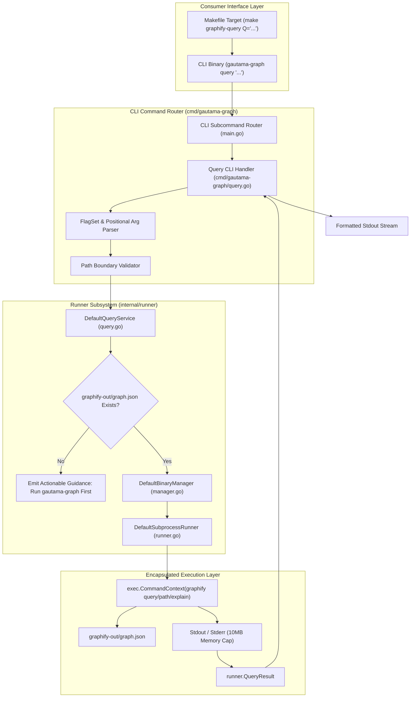
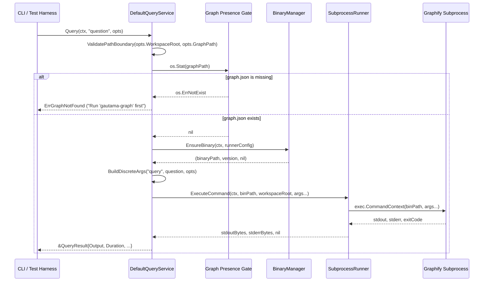

# Technical Architecture Blueprint: Consumer Graphify Query Infrastructure & Unified Agent Routing

- **Feature Title**: Consumer Graphify Query Infrastructure & Unified Agent Routing
- **Sequence Code**: `006`
- **Target Milestone**: `Milestone 6 (V1.7.0)`
- **Persona Drivers & Gatekeepers**:
  - Lead AI Workflow Architect & Governor ([@nexus.md](../../.agents/personas/nexus.md))
  - Feature Engineer ([@feature-engineer.md](../../.agents/personas/feature-engineer.md))
  - Security & Compliance Auditor ([@security-auditor.md](../../.agents/personas/security-auditor.md))
  - Regression & Test Automation Guard ([@regression-tester.md](../../.agents/personas/regression-tester.md))
- **Status**: `🟢 DELIVERED & CERTIFIED V1.7.0`

---

## 1. System Architecture & High-Level Topology

This blueprint details the architectural design and component interactions for the **Consumer Graphify Query Infrastructure & Unified Agent Routing Engine** across `internal/runner`, `cmd/gautama-graph`, `internal/scaffold`, and workspace agent governance assets.

The subsystem bridges consumer repositories (e.g., `gautama-studios`, `gautama-social`, `the-dancing-pony-v2-mzihqk`) to the encapsulated Graphify binary runner, exposing first-class CLI query commands, scaffolded Makefile targets, and standardized agent prompts without requiring host-level Python or unmanaged global binaries.



---

## 2. Granular Go Interface Contracts (`internal/runner/types.go`)

In adherence to the **Interface Segregation Principle (ISP)** and Go export standards, the runner query subsystem introduces specialized, single-responsibility types and interfaces into `internal/runner/types.go`:

```go
package runner

import (
	"context"
	"time"
)

// QueryOptions configures semantic and question-based graph traversal queries.
type QueryOptions struct {
	// WorkspaceRoot specifies the project root directory (defaults to current working directory).
	WorkspaceRoot string `json:"workspace_root"`

	// GraphPath overrides the default graph location (defaults to graphify-out/graph.json).
	GraphPath string `json:"graph_path,omitempty"`

	// DFS enables depth-first search traversal instead of breadth-first search.
	DFS bool `json:"dfs"`

	// Context specifies repeatable edge-context filter tags.
	Context []string `json:"context,omitempty"`

	// BudgetTokens caps the maximum token output volume (defaults to 2000).
	BudgetTokens int `json:"budget_tokens"`

	// JSONOutput instructs the query engine to emit raw JSON data.
	JSONOutput bool `json:"json_output"`
}

// PathOptions configures shortest-path topological graph queries between two nodes.
type PathOptions struct {
	// WorkspaceRoot specifies the project root directory (defaults to current working directory).
	WorkspaceRoot string `json:"workspace_root"`

	// GraphPath overrides the default graph location (defaults to graphify-out/graph.json).
	GraphPath string `json:"graph_path,omitempty"`
}

// ExplainOptions configures plain-language explanation queries for a target node and neighborhood.
type ExplainOptions struct {
	// WorkspaceRoot specifies the project root directory (defaults to current working directory).
	WorkspaceRoot string `json:"workspace_root"`

	// GraphPath overrides the default graph location (defaults to graphify-out/graph.json).
	GraphPath string `json:"graph_path,omitempty"`
}

// QueryResult encapsulates the raw output, execution duration, and metadata for a completed query.
type QueryResult struct {
	// Output contains the stdout string produced by the graph traversal.
	Output string `json:"output"`

	// BinarySource indicates how the runner resolved the binary ("cached", "system-path", "downloaded").
	BinarySource string `json:"binary_source"`

	// BinaryVersion indicates the release tag or version identifier of the executed binary.
	BinaryVersion string `json:"binary_version"`

	// Duration records total execution time.
	Duration time.Duration `json:"duration"`

	// WorkspaceRoot is the canonical workspace path against which the query was resolved.
	WorkspaceRoot string `json:"workspace_root"`
}

// QueryService coordinates knowledge graph querying via the encapsulated Graphify binary.
type QueryService interface {
	// Query executes a BFS or DFS question traversal across the knowledge graph.
	Query(ctx context.Context, question string, opts QueryOptions) (*QueryResult, error)

	// Path finds the shortest topological path between two nodes in the knowledge graph.
	Path(ctx context.Context, nodeA, nodeB string, opts PathOptions) (*QueryResult, error)

	// Explain generates a plain-language explanation of a node and its adjacent neighborhood.
	Explain(ctx context.Context, concept string, opts ExplainOptions) (*QueryResult, error)
}
```

---

## 3. Query Engine Service Architecture (`internal/runner/query.go`)

### 3.1 Service Struct Definition
The query engine is implemented as `DefaultQueryService` within package `runner`:

```go
package runner

import (
	"context"
	"errors"
	"fmt"
	"os"
	"path/filepath"
	"strconv"
	"strings"
	"sync"
	"time"
)

// ErrGraphNotFound indicates that the target graphify-out/graph.json file does not exist.
var ErrGraphNotFound = errors.New("knowledge graph not found")

// ErrPathOutOfBounds indicates that a path parameter escapes the workspace boundary.
var ErrPathOutOfBounds = errors.New("path escapes workspace boundary")

// DefaultQueryService coordinates Graphify binary discovery, validation, and execution.
type DefaultQueryService struct {
	binManager BinaryManager
	runner     SubprocessRunner
	mu         sync.Mutex
}

// NewDefaultQueryService initializes a new DefaultQueryService instance with injected dependencies.
func NewDefaultQueryService(binManager BinaryManager, runner SubprocessRunner) *DefaultQueryService {
	if binManager == nil {
		binManager = NewDefaultBinaryManager(nil)
	}
	if runner == nil {
		runner = NewDefaultSubprocessRunner()
	}
	return &DefaultQueryService{
		binManager: binManager,
		runner:     runner,
	}
}
```

### 3.2 Query Execution Lifecycle & Sequence Diagram



### 3.3 Dispatch Methods & Argument Construction

#### `Query(ctx context.Context, question string, opts QueryOptions) (*QueryResult, error)`
1. **Validation**: Check `question != ""` and validate workspace boundary.
2. **Graph Existence Check**: Assert `graph.json` exists at resolved path.
3. **Binary Resolution**: Call `m.binManager.EnsureBinary(ctx, cfg)`.
4. **Argument Building**:
   - `args := []string{"query", question}`
   - If `opts.DFS == true`: `args = append(args, "--dfs")`
   - If `opts.BudgetTokens > 0`: `args = append(args, "--budget", strconv.Itoa(opts.BudgetTokens))`
   - For each tag in `opts.Context`: `args = append(args, "--context", tag)`
   - If `opts.GraphPath != ""`: `args = append(args, "--graph", opts.GraphPath)`
5. **Execution**: Execute via `m.runner.ExecuteCommand(ctx, binPath, cleanWorkspaceRoot, args...)`.
6. **Result Assembly**: Return `&QueryResult{Output: string(stdout), Duration: elapsed, BinarySource: source, BinaryVersion: version, WorkspaceRoot: cleanWorkspaceRoot}`.

#### `Path(ctx context.Context, nodeA, nodeB string, opts PathOptions) (*QueryResult, error)`
1. **Validation**: Assert `nodeA != ""` and `nodeB != ""`.
2. **Graph Existence Check**: Assert `graph.json` exists.
3. **Binary Resolution**: Call `m.binManager.EnsureBinary(ctx, cfg)`.
4. **Argument Building**:
   - `args := []string{"path", nodeA, nodeB}`
   - If `opts.GraphPath != ""`: `args = append(args, "--graph", opts.GraphPath)`
5. **Execution & Assembly**: Execute command and return populated `*QueryResult`.

#### `Explain(ctx context.Context, concept string, opts ExplainOptions) (*QueryResult, error)`
1. **Validation**: Assert `concept != ""`.
2. **Graph Existence Check**: Assert `graph.json` exists.
3. **Binary Resolution**: Call `m.binManager.EnsureBinary(ctx, cfg)`.
4. **Argument Building**:
   - `args := []string{"explain", concept}`
   - If `opts.GraphPath != ""`: `args = append(args, "--graph", opts.GraphPath)`
5. **Execution & Assembly**: Execute command and return populated `*QueryResult`.

---

## 4. CLI Subcommand Architecture (`cmd/gautama-graph`)

### 4.1 CLI Routing in `cmd/gautama-graph/main.go`
The master command line router is updated to intercept `query`, `path`, and `explain` subcommands before falling back to the pipeline runner:

```go
func main() {
	if len(os.Args) > 1 {
		switch os.Args[1] {
		case "antigravity", "init":
			if err := handleAntigravityCommand(os.Args[2:]); err != nil {
				log.Fatalf("❌ Antigravity setup failed: %v", err)
			}
			return
		case "query":
			if err := handleQueryCommand(os.Args[2:]); err != nil {
				fmt.Fprintf(os.Stderr, "❌ Query failed: %v\n", err)
				os.Exit(1)
			}
			return
		case "path":
			if err := handlePathCommand(os.Args[2:]); err != nil {
				fmt.Fprintf(os.Stderr, "❌ Path query failed: %v\n", err)
				os.Exit(1)
			}
			return
		case "explain":
			if err := handleExplainCommand(os.Args[2:]); err != nil {
				fmt.Fprintf(os.Stderr, "❌ Explain query failed: %v\n", err)
				os.Exit(1)
			}
			return
		}
	}
	// ... standard 4-stage pipeline execution ...
}
```

### 4.2 CLI Handlers in `cmd/gautama-graph/query.go`
A new file `cmd/gautama-graph/query.go` encapsulates the flag parsing, workspace resolution, and output streaming for all three subcommands:

1. **`handleQueryCommand(args []string) error`**:
   - Parses flags: `--dfs` (bool), `--budget` (int, default 2000), `--workspace` (string, default CWD), `--graph` (string), `--json` (bool), `--context` (repeatable string slice).
   - Validates positional argument: `fs.Args()[0]` contains the question. If missing, prints clear usage syntax.
   - Instantiates `runner.NewDefaultQueryService(nil, nil)`.
   - Executes `svc.Query(ctx, question, opts)`.
   - Streams `res.Output` to `os.Stdout`.
   - If `errors.Is(err, runner.ErrGraphNotFound)`, prints friendly guidance:
     ```
     ⚠️  Knowledge graph not found at: <path>
     👉 Run 'gautama-graph' or 'make graphify-update' first to generate graphify-out/graph.json.
     ```
2. **`handlePathCommand(args []string) error`**:
   - Parses flags: `--workspace` (string), `--graph` (string).
   - Validates positional arguments: requires `fs.NArg() >= 2` (`nodeA` and `nodeB`).
   - Executes `svc.Path(ctx, nodeA, nodeB, opts)`.
   - Streams `res.Output` to `os.Stdout`.
3. **`handleExplainCommand(args []string) error`**:
   - Parses flags: `--workspace` (string), `--graph` (string).
   - Validates positional argument: requires `fs.NArg() >= 1` (`concept`).
   - Executes `svc.Explain(ctx, concept, opts)`.
   - Streams `res.Output` to `os.Stdout`.

---

## 5. Scaffolding Templates & Makefile Architecture

### 5.1 Embedded Makefile Template (`internal/scaffold/templates/Makefile`)
The template `internal/scaffold/templates/Makefile` and the root workspace `Makefile` are enhanced with robust, self-validating make targets:

```makefile
.PHONY: audit-docs audit-ast audit graphify-update audit-remediate graphify-query graphify-path graphify-explain

PATH := $(HOME)/go/bin:$(HOME)/.local/bin:$(PATH)

# Knowledge Graph Query Targets (Zero-Host-Dependency)
graphify-query:
	@if [ -z "$(Q)" ]; then \
		echo "❌ Error: Q is required. Usage: make graphify-query Q=\"<question>\" [DFS=1] [BUDGET=2000]"; \
		exit 1; \
	fi
	GOWORK=off go run github.com/jameshawkins-art/gautama-graph/cmd/gautama-graph query "$(Q)" \
		$(if $(filter 1 true,$(DFS)),--dfs,) \
		$(if $(BUDGET),--budget $(BUDGET),)

graphify-path:
	@if [ -z "$(A)" ] || [ -z "$(B)" ]; then \
		echo "❌ Error: A and B are required. Usage: make graphify-path A=\"<symbol1>\" B=\"<symbol2>\""; \
		exit 1; \
	fi
	GOWORK=off go run github.com/jameshawkins-art/gautama-graph/cmd/gautama-graph path "$(A)" "$(B)"

graphify-explain:
	@if [ -z "$(C)" ]; then \
		echo "❌ Error: C is required. Usage: make graphify-explain C=\"<concept>\""; \
		exit 1; \
	fi
	GOWORK=off go run github.com/jameshawkins-art/gautama-graph/cmd/gautama-graph explain "$(C)"

# Pipeline & Audit Targets
audit-docs:
	GOWORK=off go run github.com/jameshawkins-art/gautama-graph/cmd/graphify-doc-audit -strict

audit-ast:
	GOWORK=off go run github.com/jameshawkins-art/gautama-graph/cmd/graphify-ast-audit

graphify-update:
	GOWORK=off go run github.com/jameshawkins-art/gautama-graph/cmd/gautama-graph

audit-remediate:
	GOWORK=off go run github.com/jameshawkins-art/gautama-graph/cmd/graphify-doc-audit -fix

audit: graphify-update audit-docs audit-ast
```

### 5.2 Root Workspace `Makefile`
The repository root `Makefile` will match these targets, using local relative package paths (`./cmd/gautama-graph`) for fast local iteration while maintaining identical target signatures (`make graphify-query Q="..."`).

---

## 6. Unified Agent Routing & Governance Migration Matrix

Every prompt template, rule, persona, and skill in both `internal/scaffold/templates/` and root `.agents/` will be systematically migrated from unmanaged `graphify query` to `gautama-graph query` and `make graphify-query`:

| File Path | Component Area | Current Deprecated Pattern | Target Standardized Pattern |
| :--- | :--- | :--- | :--- |
| `internal/scaffold/templates/rules/graphify.md` | Scaffold Rule | `graphify query "<question>"` | `gautama-graph query "<question>"` (or `make graphify-query Q="..."`) |
| `internal/scaffold/templates/workflows/graphify.md` | Scaffold Workflow | `graphify query / path / explain` | Full parameter syntax for `gautama-graph query / path / explain` |
| `internal/scaffold/templates/personas/nexus.md` | Scaffold Persona | `graphify query "<concept>"` | `gautama-graph query "<concept>"` |
| `internal/scaffold/templates/prompts/*.md` (12 files) | Scaffold Prompts | `graphify query`, `graphify path` | `gautama-graph query`, `gautama-graph path`, `gautama-graph explain` |
| `.agents/rules/graphify.md` | Workspace Rule | `graphify query "<question>"` | `gautama-graph query "<question>"` (or `make graphify-query Q="..."`) |
| `.agents/workflows/graphify.md` | Workspace Workflow | `graphify query` | `gautama-graph query` |
| `.agents/personas/nexus.md` | Workspace Persona | `graphify query "<concept>"` | `gautama-graph query "<concept>"` |
| `.agents/personas/feature-engineer.md` | Workspace Persona | `graphify query` | `gautama-graph query` |
| `.agents/skills/graphify/SKILL.md` | Workspace Skill | `graphify query` | `gautama-graph query` |
| `docs/prompts/*.md` (8 files) | Workspace Prompts | `graphify query`, `graphify path` | `gautama-graph query`, `gautama-graph path`, `gautama-graph explain` |

---

## 7. Cyber Security Architecture & Hardening Controls

### 7.1 Zero-Trust Path Confinement Protocol
- **Path Sanitization**: All file paths supplied via `--workspace` or `--graph` are canonicalized via `filepath.Clean` and converted to absolute paths via `filepath.Abs`.
- **Prefix Boundary Enforcement**:
  ```go
  func ValidatePathBoundary(rootPath, targetPath string) error {
      cleanRoot := filepath.Clean(rootPath)
      cleanTarget := filepath.Clean(targetPath)
      if !strings.HasPrefix(cleanTarget, cleanRoot+string(filepath.Separator)) && cleanTarget != cleanRoot {
          return fmt.Errorf("%w: target %s escapes root %s", ErrPathOutOfBounds, cleanTarget, cleanRoot)
      }
      return nil
  }
  ```
- Any flag attempting to target arbitrary files outside the repository root (e.g., `--graph /etc/passwd` or `--workspace ../../`) is blocked prior to any subprocess creation.

### 7.2 Subprocess Command Injection Defense
- Subprocesses are spawned exclusively via `exec.CommandContext(ctx, binaryPath, args...)`.
- Direct parameter array slicing guarantees that shell metacharacters (`;`, `&`, `|`, `` ` ``, `$()`) inside user questions, symbols, or concepts are passed as raw string literals to the binary's argv array. Shell interpreters (`sh -c`, `bash -c`) are strictly prohibited.

### 7.3 Resource Bounds & Process Lifecycle
- **Memory Caps**: Output buffers are bounded by `maxOutputBytes: 10 * 1024 * 1024` (10MB) in `SubprocessRunner`.
- **Context Deadlines**: Interactive CLI queries inherit a default 30-second context timeout (`context.WithTimeout`), preventing runaway processes or zombie subprocess leaks.
- **Signal Handling**: If the caller cancels the context (`Ctrl+C`), `exec.CommandContext` immediately kills the child process.

### 7.4 Zero Unsafe & CGo Prohibition
- Package `internal/runner` and `cmd/gautama-graph` use pure Go standard library constructs.
- Zero occurrences of `import "unsafe"` and `import "C"`.

### 7.5 Dependency Vulnerability Baseline
- Continuous `govulncheck` validation certifies 0 known vulnerabilities across all project dependencies.

---

## 8. SQA Test Verification Architecture

### 8.1 Unit Testing Strategy (`internal/runner/query_test.go`)
Table-driven unit tests with mocked `BinaryManager` and `SubprocessRunner`:
1. **`TestDefaultQueryService_Query_BFS_Nominal`**: Tests default BFS query construction, asserting argv contains `["query", "Test Question"]`.
2. **`TestDefaultQueryService_Query_DFS_And_Budget`**: Tests query with `--dfs`, `--budget 4000`, and `--context core`, asserting flags are passed correctly.
3. **`TestDefaultQueryService_Path_Nominal`**: Tests shortest path construction, asserting argv contains `["path", "nodeA", "nodeB"]`.
4. **`TestDefaultQueryService_Explain_Nominal`**: Tests explain construction, asserting argv contains `["explain", "ConceptX"]`.
5. **`TestDefaultQueryService_MissingGraphGuidance`**: Deletes or points to non-existent `graph.json`, asserting `ErrGraphNotFound` is returned with actionable remediation instructions.
6. **`TestDefaultQueryService_PathBoundaryRejection`**: Passes out-of-bounds graph paths (e.g. `/etc/passwd`), asserting `ErrPathOutOfBounds` is returned without executing subprocesses.
7. **`TestDefaultQueryService_SubprocessError`**: Mocks runner failure, asserting clean error wrapping.

### 8.2 CLI Integration Testing Strategy (`cmd/gautama-graph/query_test.go`)
1. **`TestCLI_Query_MissingQuestion`**: Asserts exit code 1 and usage output when no question argument is passed.
2. **`TestCLI_Path_MissingEndpoints`**: Asserts exit code 1 when fewer than 2 arguments are provided to `path`.
3. **`TestCLI_Explain_MissingConcept`**: Asserts exit code 1 when no concept argument is provided to `explain`.
4. **`TestCLI_Query_MissingGraphFile`**: Asserts friendly warning output when `graph.json` is missing.

### 8.3 Scaffolder Verification (`internal/scaffold/scaffolder_test.go`)
1. **`TestScaffolder_MakefileQueryTargets`**: Asserts scaffolded `Makefile` contains `graphify-query`, `graphify-path`, and `graphify-explain` targets.
2. **`TestScaffolder_RuleTemplatesPrescribeGautamaGraph`**: Asserts scaffolded `rules/graphify.md` prescribes `gautama-graph query` and `make graphify-query`.

---

## 9. Next Step & Phase Handoff

Upon user review and sign-off of this Phase 2 Technical Architecture Blueprint, proceed to **Phase 3 & 4 (Implementation & SQA Verification Gate)** by invoking:

```bash
execute docs/prompts/sdlc-step3.md with docs/specs/006-consumer-graphify-query-infrastructure-architecture-blueprint.md
```
