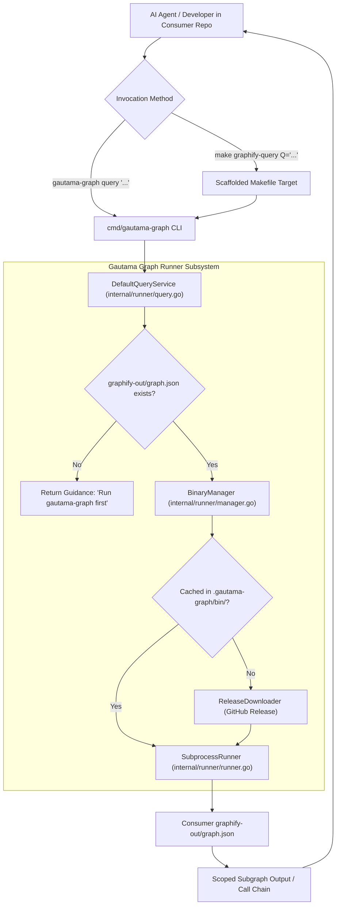

# Requirements Specification: Consumer Graphify Query Infrastructure & Unified Agent Routing

- **Feature Title**: Consumer Graphify Query Infrastructure & Unified Agent Routing
- **Sequence Code**: `006`
- **Target Milestone**: `Milestone 6 (V1.7.0)`
- **Persona Drivers & Gatekeepers**:
  - Lead AI Workflow Architect & Governor ([@nexus.md](../../.agents/personas/nexus.md))
  - Feature Engineer ([@feature-engineer.md](../../.agents/personas/feature-engineer.md))
  - Security & Compliance Auditor ([@security-auditor.md](../../.agents/personas/security-auditor.md))
  - Regression & Test Automation Guard ([@regression-tester.md](../../.agents/personas/regression-tester.md))
- **Status**: `🟢 DELIVERED & CERTIFIED V1.7.0`

---

## 1. Executive Summary & Problem Scope

### 1.1 Context & Problem Statement
When a consumer repository (such as `gautama-studios`, `gautama-social`, or `the-dancing-pony-v2-mzihqk`) initializes or updates its Antigravity AI agent infrastructure via `gautama-graph antigravity install --project`, a critical capability gap emerges:

1. **No Query Target in Scaffolded Makefile**:
   The scaffolded `Makefile` (`internal/scaffold/templates/Makefile`) provides targets for updating the graph (`graphify-update`), running AST code audits (`audit-ast`), auditing documentation links (`audit-docs`), and auto-remediating links (`audit-remediate`). However, it provides **zero targets to query the knowledge graph** (e.g., `graphify-query`, `graphify-path`, `graphify-explain`).
2. **Missing CLI Query Subcommands in `cmd/gautama-graph`**:
   The unified CLI binary `cmd/gautama-graph` only handles the master 4-stage pipeline and the `antigravity`/`init` scaffolding commands. It lacks first-class `query`, `path`, and `explain` subcommands.
3. **Broken Host Dependency Assumptions in Agent Rules & Skills**:
   The agent rules (`.agents/rules/graphify.md`), workflows (`.agents/workflows/graphify.md`), personas (`.agents/personas/nexus.md`), skills (`.agents/skills/graphify/SKILL.md`), and prompt templates instruct AI agents to execute raw `graphify query "<concept>"`, `graphify path "<A>" "<B>"`, or `graphify explain "<concept>"`. Because consumers do not have `graphify` globally installed on their host system or Python virtual environment (the entire value proposition of Item 001 was eliminating host Python/pip/uv dependencies via an encapsulated binary cache), these commands immediately fail with `command not found: graphify` on consumer machines.
4. **Token Bloat & Context Rot**:
   When graph queries fail due to missing commands or missing targets, AI agents fall back to scanning raw source files and issuing broad `ripgrep` commands. This causes immediate context window exhaustion, high API latency, degraded reasoning quality, and hallucinated relationship mappings across consumer projects.

### 1.2 Strategic Goal & Target Vision
Architect and deliver a unified, zero-host-dependency **Consumer Graphify Query Infrastructure & Unified Agent Routing Engine** across `cmd/gautama-graph`, `internal/runner`, `internal/scaffold`, and all workspace agent assets:

- **First-Class CLI Query Subcommands in `cmd/gautama-graph`**: Implement `gautama-graph query "<question>" [flags]`, `gautama-graph path "<nodeA>" "<nodeB>" [flags]`, and `gautama-graph explain "<concept>" [flags]`.
- **Encapsulated Binary Invocation via Runner**: Leverage `internal/runner.BinaryManager` and `internal/runner.SubprocessRunner` to automatically resolve, cache, and execute the headless Graphify binary with stream isolation, bounded memory buffers, and zero zombie process risk.
- **Actionable Missing Graph Guidance**: Intercept queries when `graphify-out/graph.json` has not yet been built and emit clear, deterministic instructions directing the user or agent to run `gautama-graph` or `make graphify-update` first.
- **Scaffolded & Root Makefile Ergonomics**: Provide standard `make graphify-query Q="..."`, `make graphify-path A="..." B="..."`, and `make graphify-explain C="..."` targets in both `internal/scaffold/templates/Makefile` and the root workspace `Makefile`.
- **Unified Agent Governance Alignment**: Eliminate all raw, unmanaged `graphify query` invocations across `.agents/rules/`, `.agents/workflows/`, `.agents/personas/`, `.agents/skills/`, and prompt templates in favor of `gautama-graph query` and `make graphify-query`.
- **Turnkey Scaffolding Distribution**: Ensure `gautama-graph antigravity install --project` deploys the updated `Makefile`, rules, and workflows idempotently into any target consumer repository.



---

## 2. Go Interface & Data Model Specifications

All new domain contracts and service interfaces will reside in `internal/runner/types.go` and be implemented in `internal/runner/query.go` and `cmd/gautama-graph/query.go`.

### 2.1 Domain Data Models & Options

```go
package runner

import (
	"context"
	"time"
)

// QueryOptions specifies traversal flags and parameters for graph BFS/DFS question queries.
type QueryOptions struct {
	// WorkspaceRoot is the absolute or relative path to the project root directory.
	WorkspaceRoot string `json:"workspace_root"`

	// GraphPath optionally overrides the default graph path (defaults to graphify-out/graph.json).
	GraphPath string `json:"graph_path,omitempty"`

	// DFS enables depth-first search traversal instead of the default breadth-first search.
	DFS bool `json:"dfs"`

	// Context filters traversals by explicit edge-context tags (repeatable).
	Context []string `json:"context,omitempty"`

	// BudgetTokens caps output token volume (defaults to 2000 tokens).
	BudgetTokens int `json:"budget_tokens"`

	// JSONOutput instructs the query engine to emit raw JSON instead of formatted text.
	JSONOutput bool `json:"json_output"`
}

// PathOptions specifies parameters for shortest-path graph queries between two symbols.
type PathOptions struct {
	// WorkspaceRoot is the absolute or relative path to the project root directory.
	WorkspaceRoot string `json:"workspace_root"`

	// GraphPath optionally overrides the default graph path (defaults to graphify-out/graph.json).
	GraphPath string `json:"graph_path,omitempty"`
}

// ExplainOptions specifies parameters for explaining a target node and its neighborhood.
type ExplainOptions struct {
	// WorkspaceRoot is the absolute or relative path to the project root directory.
	WorkspaceRoot string `json:"workspace_root"`

	// GraphPath optionally overrides the default graph path (defaults to graphify-out/graph.json).
	GraphPath string `json:"graph_path,omitempty"`
}

// QueryResult encapsulates the raw output, execution time, and resolution status of a graph query.
type QueryResult struct {
	// Output contains the stdout string produced by the graph traversal.
	Output string `json:"output"`

	// BinarySource indicates how the runner resolved the binary ("cached", "system-path", "downloaded").
	BinarySource string `json:"binary_source"`

	// BinaryVersion indicates the release tag or version identifier of the executed binary.
	BinaryVersion string `json:"binary_version"`

	// Duration records total execution time.
	Duration time.Duration `json:"duration"`

	// WorkspaceRoot is the canonical workspace path against which the query was resolved.
	WorkspaceRoot string `json:"workspace_root"`
}
```

### 2.2 Subsystem Interfaces

```go
// QueryService coordinates knowledge graph querying via the encapsulated Graphify binary.
type QueryService interface {
	// Query executes a BFS or DFS question traversal across the knowledge graph.
	Query(ctx context.Context, question string, opts QueryOptions) (*QueryResult, error)

	// Path finds the shortest topological path between two nodes in the knowledge graph.
	Path(ctx context.Context, nodeA, nodeB string, opts PathOptions) (*QueryResult, error)

	// Explain generates a plain-language explanation of a node and its adjacent neighborhood.
	Explain(ctx context.Context, concept string, opts ExplainOptions) (*QueryResult, error)
}
```

### 2.3 CLI Command Contracts (`cmd/gautama-graph`)

The master CLI entrypoint in `cmd/gautama-graph/main.go` will dispatch top-level subcommands to a dedicated handler in `cmd/gautama-graph/query.go`:

```bash
# 1. Natural Language & Semantic Question Queries
gautama-graph query "<question>" [flags]
  Flags:
    --dfs              Enable depth-first traversal (default: false, BFS)
    --budget <N>       Cap output at N tokens (default: 2000)
    --context <tag>    Filter by edge context (repeatable)
    --workspace <dir>  Path to workspace root (default: current working directory)
    --graph <path>     Path to graph.json (default: <workspace>/graphify-out/graph.json)
    --json             Emit output in machine-readable JSON format

# 2. Shortest Topological Path Between Two Symbols
gautama-graph path "<nodeA>" "<nodeB>" [flags]
  Flags:
    --workspace <dir>  Path to workspace root (default: current working directory)
    --graph <path>     Path to graph.json (default: <workspace>/graphify-out/graph.json)

# 3. Plain-Language Symbol & Neighborhood Explanation
gautama-graph explain "<concept>" [flags]
  Flags:
    --workspace <dir>  Path to workspace root (default: current working directory)
    --graph <path>     Path to graph.json (default: <workspace>/graphify-out/graph.json)
```

### 2.4 Scaffolded & Root Makefile Contracts

The scaffolded `internal/scaffold/templates/Makefile` and the root workspace `Makefile` will provide ergonomic targets wrapping the CLI:

```makefile
# Query the knowledge graph with BFS/DFS semantic traversal
graphify-query:
	@if [ -z "$(Q)" ]; then \
		echo "❌ Error: Q parameter is required. Usage: make graphify-query Q=\"<question>\" [DFS=1] [BUDGET=2000]"; \
		exit 1; \
	fi
	GOWORK=off go run github.com/jameshawkins-art/gautama-graph/cmd/gautama-graph query "$(Q)" \
		$(if $(filter 1 true,$(DFS)),--dfs,) \
		$(if $(BUDGET),--budget $(BUDGET),)

# Compute shortest topological path between two nodes
graphify-path:
	@if [ -z "$(A)" ] || [ -z "$(B)" ]; then \
		echo "❌ Error: A and B parameters are required. Usage: make graphify-path A=\"<symbol1>\" B=\"<symbol2>\""; \
		exit 1; \
	fi
	GOWORK=off go run github.com/jameshawkins-art/gautama-graph/cmd/gautama-graph path "$(A)" "$(B)"

# Explain a symbol and its adjacent graph neighborhood
graphify-explain:
	@if [ -z "$(C)" ]; then \
		echo "❌ Error: C parameter is required. Usage: make graphify-explain C=\"<concept>\""; \
		exit 1; \
	fi
	GOWORK=off go run github.com/jameshawkins-art/gautama-graph/cmd/gautama-graph explain "$(C)"
```

---

## 3. Filesystem Confinement & Execution Protocols

### 3.1 Zero-Trust Path Containment
- **Workspace Canonicalization**: All workspace path arguments (`--workspace`) MUST be sanitized using `filepath.Clean` and converted to absolute paths via `filepath.Abs`.
- **Graph File Confinement**: When a custom `--graph` flag is specified, the path MUST either be relative to `WorkspaceRoot` or, if absolute, MUST verify `strings.HasPrefix(cleanGraphPath, cleanWorkspaceRoot+string(filepath.Separator)) || cleanGraphPath == cleanWorkspaceRoot`.
- **Traversal Rejection**: Any path attempt to escape the workspace boundary (e.g. `../../etc/passwd` or `/tmp/external-graph.json`) MUST be immediately rejected with an explicit security error before executing subprocesses.

### 3.2 Knowledge Graph Presence Validation & Actionable Guidance
Prior to invoking the `BinaryManager` or spawning subprocesses, `QueryService` MUST verify the existence of the target graph file:
1. Resolve target graph location (defaulting to `filepath.Join(cleanWorkspaceRoot, "graphify-out", "graph.json")`).
2. Inspect the path using `os.Stat(graphPath)`.
3. If the file is absent (`os.IsNotExist(err)`):
   - Immediately abort with a structured domain error:
     `ErrGraphNotFound: knowledge graph not found at %s: run 'gautama-graph' or 'make graphify-update' first to generate graphify-out/graph.json`
   - In CLI mode, format this error with distinct warning symbols and immediate remediation instructions so the agent or developer knows exactly how to build the graph.

### 3.3 Thread Safety & Concurrency
- `DefaultQueryService` MUST guard any stateful shared resources (such as binary download coordination in `BinaryManager`) using dedicated mutex locks (`sync.Mutex`).
- Multiple query invocations within the same process MUST execute concurrently without mutating shared configuration buffers.

---

## 4. Cyber Security Threat Modeling & Subprocess Safety

### 4.1 Subprocess Command Injection Defense
- **Zero Shell Interpolation**: Subprocess execution in `DefaultQueryService` MUST NEVER invoke commands via shell interpreters (`sh -c`, `bash -c`, `cmd.exe /c`).
- **Discrete Argument Passing**: Arguments MUST be constructed as an explicit string slice passed directly to `SubprocessRunner.ExecuteCommand(ctx, binaryPath, workspaceRoot, args...)`:
  - `args = []string{"query", question}`
  - If `opts.DFS`: `args = append(args, "--dfs")`
  - If `opts.BudgetTokens > 0`: `args = append(args, "--budget", strconv.Itoa(opts.BudgetTokens))`
  - For each context filter `c`: `args = append(args, "--context", c)`
  - If `opts.GraphPath != ""`: `args = append(args, "--graph", opts.GraphPath)`
- **Special Character Neutralization**: By passing arguments directly as `[]string` to `os/exec.CommandContext`, shell metacharacters (`;`, `&`, `|`, `` ` ``, `$()`) inside `question` or `concept` strings are treated strictly as literal data, preventing command injection vulnerabilities.

### 4.2 Resource Exhaustion & Denial-of-Service Defense
- **Memory Buffer Caps**: `SubprocessRunner` enforces a strict 10MB memory limit on stdout and stderr capture buffers (`maxOutputBytes: 10 * 1024 * 1024`), mitigating memory exhaustion from pathological graph outputs.
- **Context Timeout Deadlines**: All query invocations MUST accept and respect `context.Context` cancellation and timeouts (defaulting to 30s for interactive queries), preventing zombie processes if the subprocess hangs.

### 4.3 Unsafe Memory & CGo Prohibition
- The implementation MUST strictly use Go 1.26+ standard library packages (`context`, `flag`, `fmt`, `os`, `path/filepath`, `strconv`, `strings`, `sync`, `time`).
- Zero `import "unsafe"` and zero `import "C"`.

### 4.4 Dependency Vulnerability Audit
- Automated `govulncheck` assessment conducted against `go.mod` dependencies:
  - **Verdict**: 0 known vulnerabilities detected (`No vulnerabilities found.`).
  - **Dependencies Status**: All transitive dependencies verified clean.

---

## 5. Unified Agent Routing & Governance Alignment

To ensure complete consistency across consumer repositories and the root repository, all references to raw `graphify query` must be systematically replaced with `gautama-graph query` and `make graphify-query`:

### 5.1 Scaffolding Template Assets to Update
1. `internal/scaffold/templates/Makefile`: Add `graphify-query`, `graphify-path`, and `graphify-explain` targets.
2. `internal/scaffold/templates/rules/graphify.md`: Update discovery rules to prescribe `gautama-graph query` and `make graphify-query`.
3. `internal/scaffold/templates/workflows/graphify.md`: Document query subcommands, flags, and make targets.
4. `internal/scaffold/templates/personas/nexus.md`: Instruct Nexus governor to mandate `gautama-graph query`.
5. `internal/scaffold/templates/prompts/*.md`: Update `sdlc-step*.md`, `bug-step*.md`, `roadmap-item.md`, `engine-audit.md`, `dead-code-audit.md`, `init-project.md`, `initial-roadmap.md`.

### 5.2 Root Workspace Governance Assets to Update
1. `Makefile`: Add root targets for `graphify-query`, `graphify-path`, and `graphify-explain`.
2. `.agents/rules/graphify.md`: Prescribe `gautama-graph query` and `make graphify-query`.
3. `.agents/workflows/graphify.md`: Document `gautama-graph query` options.
4. `.agents/personas/nexus.md`: Align persona instructions.
5. `.agents/personas/feature-engineer.md`: Align persona instructions.
6. `.agents/skills/graphify/SKILL.md`: Standardize on `gautama-graph query`.
7. `docs/prompts/*.md`: Align workspace prompt templates.

---

## 6. Edge Case & Failure Mode Matrix

| Scenario / Edge Case | Cause / Trigger | Expected Subsystem Handling | Status / Outcome |
| :--- | :--- | :--- | :--- |
| **Missing `graph.json`** | Query executed before graph extraction (`graphify-out/graph.json` does not exist) | Aborts immediately prior to binary execution with `ErrGraphNotFound`; displays actionable guidance to run `make graphify-update` or `gautama-graph`. | Friendly error with code 1 |
| **Empty Query String** | User executes `gautama-graph query ""` or `make graphify-query` without `Q` | Validates input; reports missing query argument with usage instructions. | Friendly error with code 1 |
| **Missing Path Endpoints** | User executes `gautama-graph path "nodeA"` without node B | Reports missing node argument with usage syntax. | Friendly error with code 1 |
| **Symbol Not in Graph** | Query or path for a symbol that does not exist in the graph | Subprocess returns clean "0 nodes found" / "no path found"; streams result to stdout without crashing. | Clean exit code 0 |
| **Path Traversal Escape** | Flag `--workspace ../../` or `--graph /etc/passwd` | Validates target path against root prefix; rejects with `ErrPathOutOfBounds`. | Security rejection |
| **Subprocess Timeout** | Graph traversal takes longer than context deadline | Context cancels; subprocess is killed immediately (`SIGKILL`); resources cleaned up. | Timeout error reported |
| **Binary Download Failure** | No internet access and binary not cached | Checks system PATH (`exec.LookPath("graphify")`); falls back if available or reports offline network failure. | Actionable error |
| **Unrecognized CLI Flag** | User passes invalid flag (e.g. `--foo`) | FlagSet outputs flag error and prints command usage instructions. | Flag error with code 2 |
| **Large Subgraph Output** | Query returns massive result exceeding terminal buffer | Memory capped at 10MB; streams cleanly to stdout without OOM crash. | Bounded stream output |

---

## 7. Definition of Done (DoD) & Acceptance Criteria

### 7.1 Functional Acceptance Criteria
- [ ] `gautama-graph query "<question>" [flags]` locates/caches the binary and queries `graphify-out/graph.json`, streaming results cleanly to stdout.
- [ ] `gautama-graph path "<nodeA>" "<nodeB>"` successfully resolves the shortest relationship path between two nodes.
- [ ] `gautama-graph explain "<concept>"` successfully outputs symbol explanations and neighborhood definitions.
- [ ] `make graphify-query Q="..."`, `make graphify-path A="..." B="..."`, and `make graphify-explain C="..."` function properly in both the root workspace and consumer repositories.
- [ ] Executing a query in a workspace missing `graphify-out/graph.json` returns immediate, actionable instructions to run `gautama-graph` or `make graphify-update`.
- [ ] Scaffolding templates in `internal/scaffold/templates/` contain updated Makefile targets, rules, workflows, and prompts.
- [ ] `gautama-graph antigravity install --project` successfully deploys the updated Makefile and agent rules idempotently.

### 7.2 Quality, Performance & Security Criteria
- [ ] **Statement Coverage**: $\ge 85\%$ statement coverage across `internal/runner`, `cmd/gautama-graph`, and `internal/scaffold`.
- [ ] **Race Detector**: `GOWORK=off go test -v -race ./...` passes 100% with 0 data races.
- [ ] **Security Confinement**: 100% path validation coverage on workspace and graph paths; zero `unsafe`; zero CGo; discrete argument passing without shell interpolation.
- [ ] **Vulnerability Audit**: `govulncheck` assessment clean with 0 known vulnerabilities.
- [ ] **Knowledge Graph Synchronization**: Master synchronization `./scripts/graphify_sync.sh` completes cleanly with 0 phantom edges or broken doc links.

---

## 8. Next Step & Phase Handoff

Upon user review and sign-off of this Phase 1 Requirements Specification, proceed to **Phase 2 (Technical Architecture Blueprint)** by invoking:

```bash
execute docs/prompts/sdlc-step2.md with docs/specs/006-consumer-graphify-query-infrastructure-requirements.md
```
